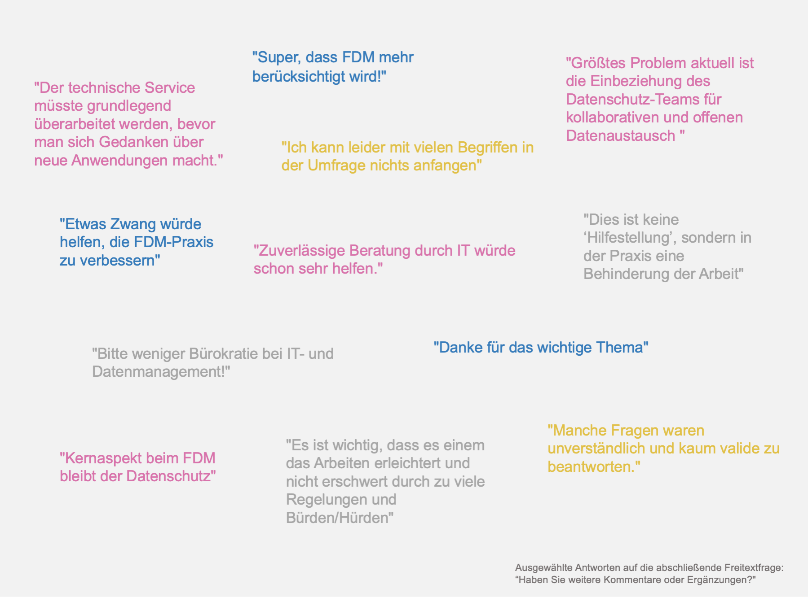
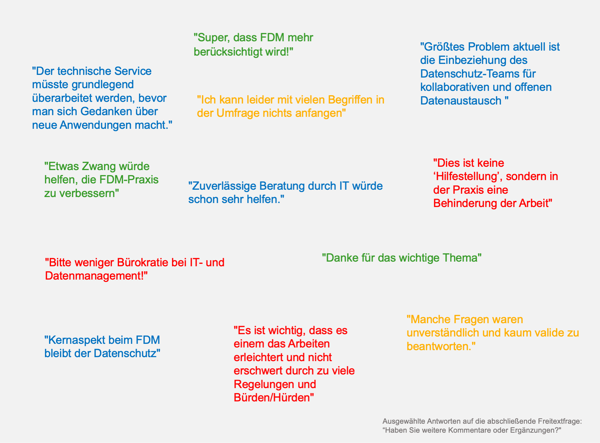

# FDM muss heterogenen Praktiken und Meinungen gerecht werden {#praktiken}

```{r, include=FALSE}
source("source.R")
```


## Große Vielfalt der Datentypen und -formate

9 von 10 abgefragten Datentypen sind für jeweils >20% der Teilnehmenden relevant (Mehrfachauswahl-Frage). Es ist zu erwarten, dass dies teilweise auch mit gänzlich verschiedenem Umgang mit Daten einhergeht. So arbeitet knapp die Hälfte der Teilnehmenden mit Datenbanken (51%), ein Viertel (24%) mit selbst entwickelter oder angepasster Software.


```{r praktiken-1, fig.cap="Forschungsdatentypen und -formate"}
formate <- data %>%
  filter(str_detect(question_id, "^DATA_([1-9]|10)$")) %>%
  select(data_id, fct_levels, value) %>%
  group_by(fct_levels, value) %>%
  count() %>%
  filter(value != "-998") %>%
  group_by(fct_levels) %>%
  mutate(nn = sum(n)) %>%
  mutate(perc = n / nn) %>%
  ungroup() %>%
  mutate(fct_levels = str_wrap(fct_levels, 35)) %>%
  mutate(fct_levels = fct_reorder(fct_levels, perc, first, .desc = TRUE)) %>%
  mutate(value = factor(value, levels = c("1", "0"), labels = c("Ja", "Nein")))

formate %>%
  plot_ly(
    x = ~perc,
    y = ~fct_levels,
    color = ~value,
    colors = col_lik[c(5, 1)], # col_2_cat,
    hoverinfo = "text",
    hovertext = ~ str_glue(
      "<b>{fct_levels}—{value}</b>
    {n} ({round(perc*100, 1)}%)"
    )
  ) %>%
  add_bars(
    text = ~ paste0(round(perc * 100, 0), "% (", n, ")"),
    textposition = "inside",
    insidetextanchor = "middle",
    textangle = 0,
    textfont = list(color = "white", size = 11)
  ) %>%
  layout_bar_flip(barmode = "stack") %>%
  layout_title(text = "Welche Forschungsdatentypen und -formate generieren Sie\nbzw. sind Gegenstand Ihrer Forschung?") %>%
  layout_caption() %>%
  layout_mode_bar()
```

Neben generischen Formaten sind zahlreiche gerätespezifische Formate gängig, die teilweise proprietär sind.

```{r praktiken-wordcloud, fig.cap="Forschungsdatentypen und -formate"}

prop <- data %>%
  filter(str_detect(question_id, "^DATA_(11|12)$")) %>%
  select(data_id, label, value) %>%
  filter(!value %in% c("-999", "-998")) %>%
  filter(str_detect(value, "^ja$|^viele$", negate = TRUE))

prop_df <- data.frame(
  format = c("stl", "FAST*", "DICOM", "NIFTI", "mrc", "TIFF", "CSV", "FCS", "BIDS", "PRT", "SLDPRT", "C3D", "IDAT", "BMP", "emi", "dm", "SCiLS Lab", "imd", "mcd", "GE-MUSE-XML", "XML-HL7", "CAD", "qPCR", "raw", "Bruker MRT", "BAM"),
  n = c(1, 2, 7, 3, 1, 2, 2, 5, 1, 1, 1, 1, 1, 1, 1, 1, 1, 1, 1, 1, 1, 1, 1, 1, 1, 1),
  type = c(rep("freies Dateiformat", 9), rep("proprietäres Datenformat", 17))
)

set.seed(42)
ggplot(prop_df, aes(label = format, size = n, color = col_2_cat[1])) + # ,color = type, x = type

  geom_text_wordcloud_area(eccentricity = 1) +
  # geom_text_wordcloud() +
  #  scale_size_area(max_size = 10) +
  scale_radius(range = c(5, 15), limits = c(0, NA)) +
  #  scale_x_discrete(breaks = NULL) +
  theme_minimal() +
  scale_color_manual(values = col_lik[c(5)]) +
  ggtitle("<b>Welche Forschungsdatentypen und -formate generieren Sie<br>bzw. sind Gegenstand Ihrer Forschung?</b>") + # <br><br>Gerätespezifische Daten in <span style='color:#21527B;'>freien Dateiformaten</span> und in <span style='color:#852557;'>proprietären Dateiformaten </span>
  theme(
    plot.title = element_markdown(family = "Arial", size = 10.5, hjust = 0.5), 
    plot.background = element_rect(fill = "#F2F2F2", linetype = 0),
    panel.border = element_blank(),
    plot.margin = margin(0.4, 0, 0, 0, "cm")
  )
```

## Ansichten zum FDM sind sehr vielfältig

FDM wird von einigen als <span style="color:#367BBA">notwendig und hilfreich</span> gesehen, von anderen als <span style="color:#A6A6A6">unnötige zusätzliche Arbeit</span>. Besserer <span style="color:#D873AB">Support durch IT und Datenschutz wird teilweise als Priorität gegenüber weitergehendem FDM gesehen</span>. Teilweise war die <span style="color:#E1C047">Umfrage zu technisch und entsprach nicht dem Informationsstand zum Thema FDM</span>.


```{r}
# Colors

# notwendig und hilfreich - #379B29
# unnötige zusätzliche Arbeit - #FF0000
# Support durch IT und Datenschutz wird teilweise als Priorität gegenüber weitergehendem FDM gesehen - #0070C0
# Umfrage zu technisch und entsprach nicht dem Informationsstand zum Thema FDM - #FFAF00 

zitate <- str_wrap(c(
  "Es ist wichtig, dass es einem das Arbeiten erleichtert und nicht erschwert durch zu viele Regelungen und Bürden/Hürden",
  "Alle arbeiten schon genug. Forschungsdatenmanagement muss einfach implementierbar oder besser von Expertinnen übernommen werden. Alles andere ist mehr Arbeit, die dann noch oder nur durch Androhung von Strafen passiert.",
  "Some of the available training is great, but it can only be general. There is a need for project-specific support and training on real cases.",
  "Etwas Zwang würde helfen, die FDM-Praxis zu verbessern",
"Bitte weniger Bürokratie bei IT- und Datenmanagement!",
"Dies ist keine „Hilfestellung“, sondern in der Praxis eine Behinderung der Arbeit",
"FDM muss einfach implementierbar sein, oder noch besser von ExpertInnen übernommen werden.",
"Zuverlässige Beratung durch IT würde schon sehr helfen.",
"Es müsste erstmal klar werden, ob das FDM auch für mich relevant wäre.",
"Der technische Service müsste grundlegend überarbeitet werden, bevor mach sich Gedanken über neue Anwendungen macht.",
"Kernaspekt beim FDM bleibt der Datenschutz",
"Ich kann leider mit vielen Begriffen in der Umfrage nichts anfangen",
"Manche Fragen waren unverständlich und kaum valide zu beantworten."), 40)

# zitate <- as.data.frame(zitate)
# 
# set.seed(5)
# p <- ggplot(data = zitate, aes(label = zitate, size = 1, color = col_2_cat[1])) + # ,color = type, x = type
# 
#   geom_text_wordcloud_area(eccentricity = 0.5, shape = "square") + # eccentricity = 1
#   #  scale_size_area(max_size = 10) +
#   scale_radius(range = c(3, 3), limits = c(0, NA)) +
#   #  scale_x_discrete(breaks = NULL) +
#   theme_minimal() +
#   scale_color_manual(values = col_lik[c(5)]) +
#   ggtitle("<b>Ansichten zum FDM</b>") + 
#   theme(
#     plot.title = element_markdown(family = "Arial", size = 10.5, hjust = 0.5),
#     plot.background = element_rect(fill = "#F2F2F2", linetype = 0),
#     panel.border = element_blank(),
#     plot.margin = margin(0.4, 0, 0, 0, "cm")
#   )
# 
# ggsave(p, filename = "zitate.png",height = 10, width = 7)
```

```{r praktiken-wordcloud3, fig.cap="Ansichten zum FDM"}


# 
```

## Kontakt zum Thema FDM

Nur 6,4% der Teilnehmenden sagten, FDM[^kontakt] sei ihnen noch gar nicht begegnet (siehe \@ref(fdm-ist-fast-allen-schon-begegnet)). Die meisten Teilnehmenden hatten über verschiedene Wege Kontakt zum FDM, wobei die eigene Forschungspraxis mit 79% mit großem Abstand der häufigste Weg war. Teilnehmende in Teamleitungspositionen gaben für fast alle angebotenen Kategorien häufiger an, über diese in Berührung mit dem FDM gekommen zu sein. Teilweise waren die Differenzen hier sehr deutlich, bei Kategorien mit Drittmittelbezug ("Forschungsförderung", "Nationale Forschungsdateninfrastruktur") lagen sie sogar bei über 200% (d.h. Teamleitungen gaben dies mehr als doppelt so oft an). Nur der Kontakt über "Lehrveranstaltungen in Studium oder Promotion" wurde von Nicht-Teamleitungen häufiger genannt.

[^kontakt]: In der Umfrage gab es hierzu den erläuternden Hinweis: "Forschungsdatenmanagement umfasst den gesamten Forschungsprozess von der Organisation und Dokumentation über die Speicherung, Sicherung und Archivierung bis zur Publikation von Daten."
```{r praktiken-kontakt, fig.cap="Kontakt zum Thema FDM"}
kontext_alle <- data %>%
  filter(str_detect(question_id, "^CON_[1-9]$")) %>%
  select(data_id, value_decoded) %>%
  drop_na(value_decoded) %>%
  mutate(nn = length(unique(data_id))) %>%
  count(value_decoded, nn) %>%
  mutate(n_group = nn,
         perc = n/nn,
         lead = "Alle")

kontext <- data %>%
  filter(str_detect(question_id, "^CON_[1-9]$")) %>%
  select(data_id, value_decoded) %>%
  drop_na(value_decoded) %>%
  mutate(nn = length(unique(data_id))) 

lead <- data %>%
  filter(question_id == "LEAD") %>%
  select(data_id, lead = value) %>%
  mutate(lead = factor(lead, levels = c("0", "1"), labels = c("Nein", "Ja")))
  

kontext_lead <- kontext %>% left_join(lead, by = "data_id") %>%
  group_by(lead) %>%
  mutate(n_group = length(unique(data_id))) %>%
  ungroup() %>%
  count(value_decoded, lead, nn, n_group) %>%
  mutate(perc = n/n_group)

kontext_zusammen <-
  bind_rows(kontext_alle, kontext_lead) %>%
  mutate(value_decoded = str_wrap(value_decoded, 40)) %>%
  mutate(value_decoded = fct_reorder(value_decoded, perc, first, .desc = TRUE))

plot_ly(
    textfont = list(color = "white", size = 11),
    textposition = "inside",
    insidetextanchor = "middle",
    textangle = 0
  ) %>%
  add_trace(
    data = kontext_zusammen %>% filter(str_detect(lead, "Alle.*")), 
    x = ~ perc,
    y = ~ value_decoded,
    text = ~ glue::glue(
      "{perc}% ({n})",
      perc = round(perc * 100),
      n = n,
      nn = nn
    ),
    name = ~ glue::glue("Alle\n(n={n_group})", n = nn),
    marker = list(color = col_lik[3]),
    type = "bar"
  ) %>%
  add_trace(
    data = kontext_zusammen %>% filter(str_detect(lead, "Ja.*")), 
    x = ~ perc,
    y = ~ value_decoded,
    text = ~ glue::glue(
      "{perc}% ({n})",
      perc = round(perc * 100),
      n = n,
      nn = nn
    ),
    name = ~ glue::glue("Ja\n(n={n_group})", n = nn),
    marker = list(color = col_lik[5]),
    type = "bar",
    visible = "legendonly"
  ) %>%
  add_trace(
        data = kontext_zusammen %>% filter(str_detect(lead, "Nein.*")), 
    x = ~ perc,
    y = ~ value_decoded,
    text = ~ glue::glue(
      "{perc}% ({n})",
      perc = round(perc * 100),
      n = n,
      nn = nn
    ),
    name = ~ glue::glue("Nein\n(n={n_group})", n = nn),
    marker = list(color = col_lik[1]),
    type = "bar",
    visible = "legendonly"
  ) %>%
  layout_bar_flip(
    autorange = "reversed",
    range = c(-0.01, 1.01),
    uniformtext = list(minsize = 8, mode = "hide"),
    legend_title = "Leiten Sie ein Team?"
  ) %>%
  layout_title(
    margin = list(t = 80),
    text = "In welchem Kontext sind Sie bereits\nmit dem Thema Forschungsdatenmanagement in Kontakt gekommen?"
  ) %>%
  layout_caption() %>%
  layout_mode_bar() 

```


## FDM-bezogene Forschungspraktiken werden je nach Statusgruppe unterschiedlich oft ausgeübt

Die drei am häufigsten genannten Praktiken trafen auf fast alle Teilnehmenden zu, so dass hier keine Differenzierung sichtbar wurde. Jeweils mindestens fünf von sechs Teilnehmenden führten **"Datenanalyse"** (90%), **"Publikation/Kommunikation von Forschungsergebnissen"** (87%) und **"Datenerhebung“"** (84%) durch. Andere Forschungspraktiken mit Bezug zum FDM wurden jedoch je nach Statusgruppe unterschiedlich oft durchgeführt. Das **Teilen von Daten** war für Professor\*innen die Regel (88%), bei anderen Statusgruppen dagegen nur jeweils für ca. die Hälfte zutreffend (44% bis 58%). Bei der **Datenveröffentlichung** war – bei jeweils niedrigeren Anteilen – das gleiche Muster zu sehen. Die **Datenaufbereitung für Dritte** wird dagegen primär von Wissenschaftlichen Mitarbeitenden (WiMis) und Anderen Mitarbeitenden gemacht. WiMis teilen ihre zudem Daten deutlich häufiger als Promovierende (Differenz von 14 Prozentpunkten) – die darüber hinausgehende Datenveröffentlichung setzen beide Gruppen aber nahezu gleich oft um.


```{r buttons-1, fig.cap="Forschungspraktiken"}
sta <- data %>%
  filter(str_detect(question_id, "^STA$")) %>%
  mutate(value_decoded = case_when(
    value_decoded == "Wissenschaftliche*r Mitarbeiter*in" ~ "Wiss. Mitarbeiter*in",
    value_decoded == "Doktorand*in" ~ "Doktorand*in",
    value_decoded == "Professor*in" ~ "Professor*in",
    value_decoded == "Technische*r Mitarbeiter*in" ~ "Andere",
    value_decoded == "Wissenschaftliche*r Support-Mitarbeiter*in (z.B. Labormanager*in,  Data Steward)" ~ "Andere",
    value_decoded == "Andere" ~ "Andere"
  )) %>%
  select(data_id, value_decoded)


aufbereiten <- data %>%
  filter(str_detect(question_id, "^PRA_[1-8]$")) %>%
  select(data_id, fct_levels, value)


sta_auf <- sta %>%
  inner_join(aufbereiten, by = "data_id") %>%
  mutate(nn = length(unique(data_id))) %>%
  group_by(value_decoded) %>%
  mutate(n_group = length(unique(data_id))) %>%
  ungroup() %>%
  count(value_decoded, fct_levels, value, nn, n_group) %>%
  mutate(perc = n / n_group) %>%
  mutate(rank = dense_rank(desc(n_group))) %>%
  mutate(value = factor(value, levels = c(1, 0), labels = c("Ja", "Nein"))) %>%
  #  mutate(fct_levels = str_wrap(fct_levels, 40)) %>%
  #  mutate(fct_levels = fct_reorder(fct_levels, perc, last )) %>%
  ungroup()

sta_auf_filter <- sta_auf %>%
  mutate(sort = case_when(
    value_decoded == "Andere" ~ 1,
    value_decoded == "Doktorand*in" ~ 2,
    value_decoded == "Wiss. Mitarbeiter*in" ~ 3,
    value_decoded == "Professor*in" ~ 4
  )) %>%
  mutate(value_decoded = paste0(value_decoded, "\nn=", n_group)) %>%
  mutate(nn = sum(unique(n_group))) %>%
  mutate(value_decoded = fct_reorder(value_decoded, sort))

plot_ly(
  data = sta_auf_filter,
  colors = col_lik[c(5, 1)],
  textposition = "inside",
  insidetextanchor = "middle",
  textangle = 0,
  textfont = list(color = "white", size = 11)
) %>%
  add_bars(
    x = ~ perc[fct_levels == "Datenaufbereitung für Dritte (z.B. Kolleg*in)"],
    y = ~ value_decoded[fct_levels == "Datenaufbereitung für Dritte (z.B. Kolleg*in)"],
    color = ~ value[fct_levels == "Datenaufbereitung für Dritte (z.B. Kolleg*in)"],
    text = ~ paste0(round(perc[fct_levels == "Datenaufbereitung für Dritte (z.B. Kolleg*in)"] * 100, 0), "% (", n[fct_levels == "Datenaufbereitung für Dritte (z.B. Kolleg*in)"], ")"),
    visible = TRUE
  ) %>%
  add_bars(
    x = ~ perc[fct_levels == "Teilen von Daten"],
    y = ~ value_decoded[fct_levels == "Teilen von Daten"],
    color = ~ value[fct_levels == "Teilen von Daten"],
    text = ~ paste0(round(perc[fct_levels == "Teilen von Daten"] * 100, 0), "% (", n[fct_levels == "Teilen von Daten"], ")"),
    visible = FALSE
  ) %>%
  add_bars(
    x = ~ perc[fct_levels == "Datenveröffentlichung (z.B. in Repositorien)"],
    y = ~ value_decoded[fct_levels == "Datenveröffentlichung (z.B. in Repositorien)"],
    color = ~ value[fct_levels == "Datenveröffentlichung (z.B. in Repositorien)"],
    text = ~ paste0(round(perc[fct_levels == "Datenveröffentlichung (z.B. in Repositorien)"] * 100, 0), "% (", n[fct_levels == "Datenveröffentlichung (z.B. in Repositorien)"], ")"),
    visible = FALSE
  ) %>%
  add_bars(
    x = ~ perc[fct_levels == "Sekundärnutzung von Daten (z.B. Krankenkassendaten, Sequenzierungsdaten)"],
    y = ~ value_decoded[fct_levels == "Sekundärnutzung von Daten (z.B. Krankenkassendaten, Sequenzierungsdaten)"],
    color = ~ value[fct_levels == "Sekundärnutzung von Daten (z.B. Krankenkassendaten, Sequenzierungsdaten)"],
    text = ~ paste0(round(perc[fct_levels == "Sekundärnutzung von Daten (z.B. Krankenkassendaten, Sequenzierungsdaten)"] * 100, 0), "% (", n[fct_levels == "Sekundärnutzung von Daten (z.B. Krankenkassendaten, Sequenzierungsdaten)"], ")"),
    visible = FALSE
  ) %>%
  layout(updatemenus = list(list(
    y = 1.13,
    x = 0.4,
    xanchor = "center",
    # type = "buttons",
    #  direction = "right",
    #  bgcolor = "white",
    bordercolor = "#A6A6A6",
    active = 0,
    buttons = list(
      list(
        method = "update",
        args = list(list(
          visible = list(TRUE, TRUE, FALSE, FALSE, FALSE, FALSE, FALSE, FALSE)
        )),
        label = "Datenaufbereitung für Dritte"
      ),
      list(
        method = "update",
        args = list(list(
          visible = list(FALSE, FALSE, TRUE, TRUE, FALSE, FALSE, FALSE, FALSE)
        )),
        label = "Teilen von Daten"
      ),
      list(
        method = "update",
        args = list(list(
          visible = list(FALSE, FALSE, FALSE, FALSE, TRUE, TRUE, FALSE, FALSE)
        )),
        label = "Datenveröffentlichung"
      ),
      list(
        method = "update",
        args = list(list(
          visible = list(FALSE, FALSE, FALSE, FALSE, FALSE, FALSE, TRUE, TRUE)
        )),
        label = "Sekundärnutzung von Daten"
      )
    )
  ))) %>%
  layout_bar_flip(barmode = "stack") %>%
  layout_title(text = "Beruflicher Status und Forschungspraktiken\nWelche der folgenden Forschungspraktiken treffen auf Sie zu?", margin = list(t = 100)) %>%
  layout_mode_bar() %>%
  layout_caption()
```
