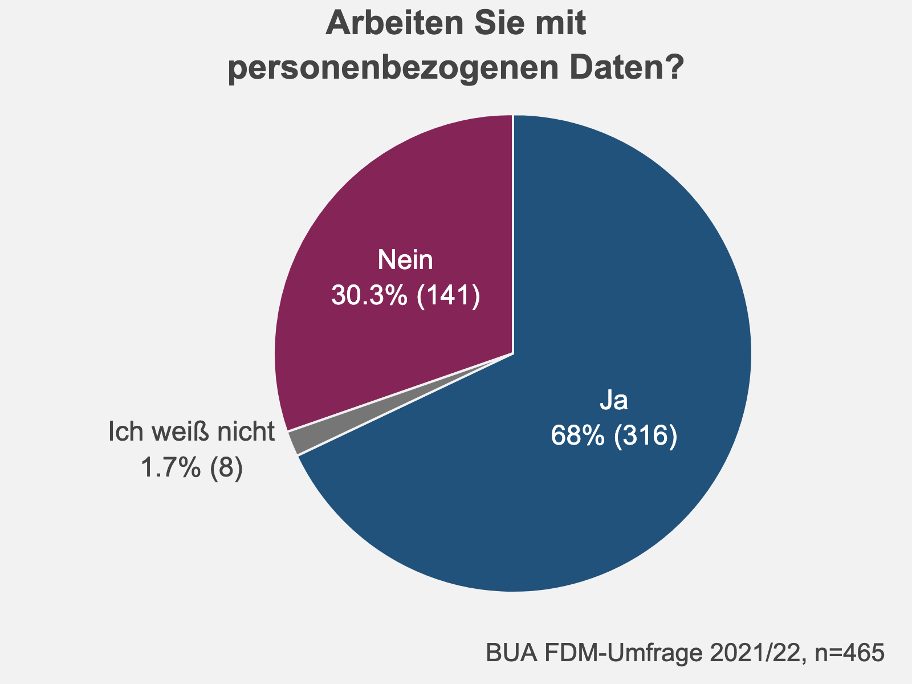
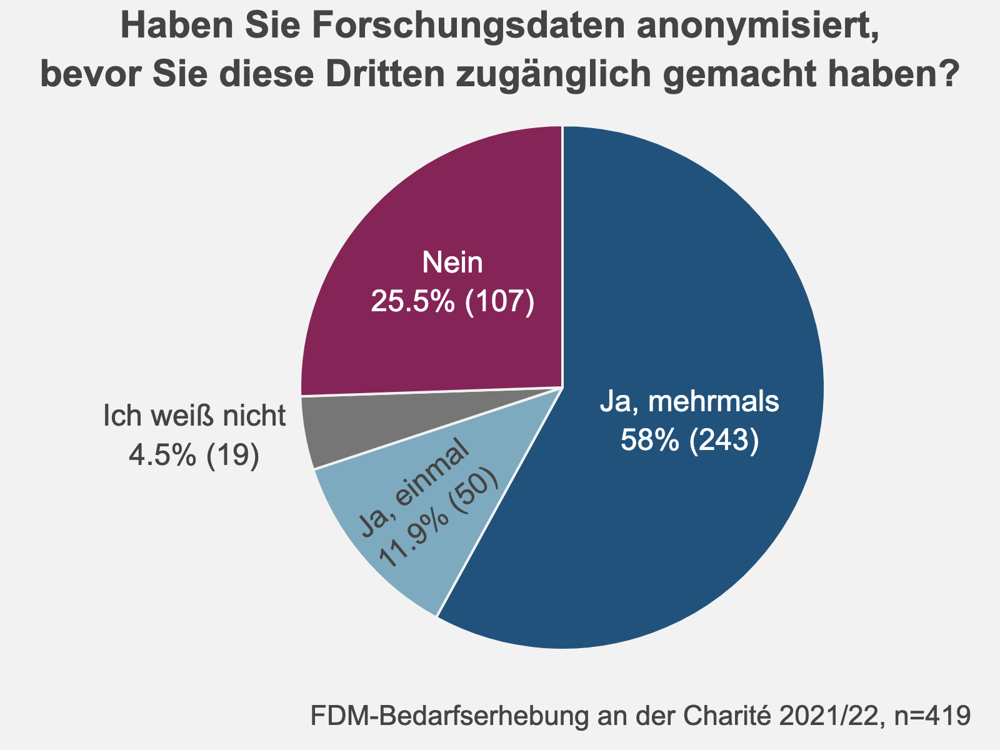

# Personenbezogene Daten werden besonders selten geteilt {#personenbezogene-daten}

```{r, include=FALSE}
source("source.R")
```

## Eine Mehrheit arbeitet (auch) mit personenbezogenen Daten


```{r pers-1, fig.cap="Personenbegzogene Daten", out.width= "350px", out.height="300px", out.extra='style="float:right; padding:10px"'}
# ird <- data %>%
#   filter(str_detect(question_id, "^IRD$")) %>%
#   filter(value %in% c("0", "1", "2")) %>%
#   group_by(value_decoded) %>%
#   count() %>%
#   ungroup() %>%
#   mutate(
#     nn = sum(n),
#     perc = n / sum(n)
#   ) %>%
#   arrange(-perc)
# 
# ird_plot <- ird %>%
#   plot_ly(
#     labels = ~value_decoded,
#     values = ~n,
#     textposition = "auto",
#     texttemplate = ~ str_glue("{value_decoded}
#     {round(perc*100, 1)}% ({n})"),
#     showlegend = FALSE,
#     marker = list(
#       colors = col_lik[c(5, 1, 3)],
#       line = list(col = "#FFFFFF", width = 1)
#     ),
#     type = "pie"
#   ) %>%
#   layout_title(
#     text = "Arbeiten Sie mit\npersonenbezogenen Daten?",
#     margin = list(t = 50)
#   ) %>%
#   layout_caption() %>%
#   layout_mode_bar()
# 
# # Save static plotly image
# library(reticulate)
# save_image(ird_plot, file = "ird_plot.png", height = 300, width = 400, scale = 4)
```

```{r out.width= "50%", out.height="50%", out.extra='style="float:right; padding:5px"'}
# 

# 
```

68% der Teilnehmenden haben an, (auch) mit personenbezogenen Daten zu arbeiten. Dabei arbeiten Professor\*innen am häufigsten mit personenbezogenen Daten (82%), was wahrscheinlich die Breite ihrer Forschungsprojekte widerspiegelt. Je fokussierter die Projekte, desto geringer der Anteil derjenigen, die mit personenbezogenen Daten arbeiten – 70% unter WiMis und 61% unter Doktorand\*innen. 

```{r pers-2, fig.cap="Anteil der Teilnehmenden, die mit personenbezogenen Daten arbeiten, aufgetrennt nach beruflicher Statusgruppe"}

pers_sta <- data %>%
  filter(str_detect(question_id, "^STA$|^IRD$")) %>%
  select(data_id, question_id, value) %>%
  pivot_wider(names_from = question_id, values_from = value) %>%
  mutate(STA = case_when(STA %in% c("4", "5", "6") ~ "4",
                         TRUE ~ STA)) %>%
  group_by(STA, IRD) %>%
  count() %>%
  filter(str_detect(IRD, "(-998|-999)", negate = TRUE)) %>%
  group_by(IRD) %>%
  group_modify(~ .x %>% adorn_totals("row", name = "0")) %>%
  bind_rows() %>%
  ungroup() %>%
  mutate(nn = sum(n) / 2) %>%
  group_by(STA) %>%
  mutate(perc = n / sum(n)) %>%
  mutate(n_group = sum(n)) %>%
  ungroup() %>%
  mutate(STA = factor(STA,
    levels = as.character(0:4),
    labels =
      str_wrap(c("Alle", "Professor*in", "Doktorand*in", "Wissenschaftliche*r Mitarbeiter*in", "Andere"), 30)
  )) %>%
  mutate(STA = paste0(STA, "\nn=", n_group)) %>%
  mutate(STA = fct_reorder(STA, perc, first, .desc = TRUE)) %>%
  mutate(STA = fct_relevel(STA, paste0("Alle\nn=", first(nn)), after = 6)) %>%
  mutate(IRD = factor(IRD, levels = c("1", "0", "2"), labels = c("Ja", "Nein", "Ich weiß\nnicht")))


test <- pers_sta %>%
  ungroup() %>%
  group_by(IRD) %>%
  group_modify(~ .x %>% adorn_totals("row")) %>%
  bind_rows()


pers_sta %>%
  plot_ly(
    x = ~perc,
    y = ~STA,
    color = ~IRD,
    colors = col_lik[c(5, 1, 3)], # col_cat[1:3],
    hoverinfo = "text",
    hovertext = ~ str_glue("<b>{STA}—{IRD}</b>
    {n} ({round(perc*100, 1)}%)")
  ) %>%
  add_bars(
    text = ~ paste0(round(perc * 100, 0), "% (", n, ")"),
    textposition = "inside",
    insidetextanchor = "middle",
    textangle = 0,
    textfont = list(color = "white", size = 11)
  ) %>%
  layout_bar_flip(
    barmode = "stack",
    legend_title = "Arbeiten Sie mit personenbez. Daten?"
  ) %>%
  layout_title(text = "Beruflicher Status\nund Arbeit mit personenbezogenen Daten") %>%
  layout(
    shapes = list(
      type = "line",
      x0 = -0.05,
      x1 = 1,
      xref = "paper",
      y0 = 3.5,
      y1 = 3.5,
      line = list(color = "black", dash = "dot")
    )
  ) %>%
  layout_caption() %>%
  layout_mode_bar()
```


## Wer mit personenbezogenen Daten arbeitet, teilt seltener Daten {#teilen-forschungsdaten}

Die Arbeit mit personenbezogenen Daten spiegelt sich in den Praktiken der Teilnehmenden wider, was das Teilen von Daten angeht. Wer (auch) mit personenbezogenen Daten arbeitet, teilt diese mit allen Gruppen von (Nach)nutzenden seltener. Besonders ausgeprägt ist dieser Unterschied beim Teilen mit allen Forschenden und/oder der Öffentlichkeit. 29% der Teilnehmenden teilen Daten offen, wenn sie ausschließlich mit nicht personenbezogenen Daten arbeiten. Wer (auch) mit personenbezogenen Daten arbeitet, tut dies nur zu 17%. 


```{r pers-3, fig.cap="Häufigkeit der Angabe, Daten zu teilen, dargestellt für unterschiedliche Adressat*innenkreise des Datenzugangs und jeweils aufgetrennt nach Teilnehmenden, die mit personenbezogenen Daten arbeiten und solchen, die es nicht tun."}

teilen <- data %>%
  filter(str_detect(question_id, "^DSH_[1-5]|^IRD$")) %>%
  filter(!value_decoded %in% c("n. geantwortet", "n. gestellt")) %>%
  select(data_id, question_id, value) %>%
  pivot_wider(names_from = question_id, values_from = c(value)) %>%
  pivot_longer(cols = starts_with("DSH")) %>%
  drop_na(IRD) %>%
  group_by(name, IRD) %>%
  summarise(n = sum(as.numeric(value)), nn = n()) %>%
  group_by(name) %>%
  group_modify(~ .x %>% adorn_totals("row", name = "Alle")) %>%
  ungroup() %>%
  mutate(perc = n / nn) %>%
  mutate(name = factor(name, levels = c("DSH_1", "DSH_2", "DSH_3", "DSH_4", "DSH_5"), labels = c("Teammitglieder", "Mitglieder der Charité", "Externe Partner", "Allen Forschenden und/\noder der Öffentlichkeit", "Niemandem")))

teilen %>%
  plot_ly(
    textposition = "inside",
    insidetextanchor = "middle",
    textangle = 0,
    textfont = list(color = "white", size = 11)
  ) %>%
  add_trace(
    x = ~ perc[teilen$IRD == "1"],
    y = ~ name[teilen$IRD == "1"],
    text = ~ glue::glue(
      "{perc}% ({n})",
      perc = round(perc[teilen$IRD == "1"] * 100),
      n = n[teilen$IRD == "1"],
      nn = nn[teilen$IRD == "1"]
    ),
    name = ~ paste0("Ja (n=", nn[teilen$IRD == "1"], ")"),
    marker = list(color = col_lik[5]),
    type = "bar"
  ) %>%
  add_trace(
    x = ~ perc[teilen$IRD == "0"],
    y = ~ name[teilen$IRD == "0"],
    text = ~ glue::glue(
      "{perc}% ({n})",
      perc = round(perc[teilen$IRD == "0"] * 100),
      n = n[teilen$IRD == "0"],
      nn = nn[teilen$IRD == "0"]
    ),
    name = ~ paste0("Nein (n=", nn[teilen$IRD == "0"], ")"),
    marker = list(color = col_lik[1]),
    type = "bar"
  ) %>%
  # add_trace(
  #   x = ~ perc[teilen$IRD == "2"],
  #   y = ~ name[teilen$IRD == "2"],
  #   text = ~ paste0(round(perc[teilen$IRD == "2"] * 100, 0), "%"),
  #   name = ~ paste0("Ich weiß nicht (n=", nn[teilen$IRD == "2"], ")"),
  #   marker = list(color = col_cat[3]),
  #   type = "bar",
  #   visible = "legendonly"
  # ) %>%
  add_trace(
    x = ~ perc[teilen$IRD == "Alle"],
    y = ~ name[teilen$IRD == "Alle"],
    text = ~ glue::glue(
      "{perc}% ({n})",
      perc = round(perc[teilen$IRD == "Alle"] * 100),
      n = n[teilen$IRD == "Alle"],
      nn = nn[teilen$IRD == "Alle"]
    ),
    name = ~ paste0("Alle (n=", nn[teilen$IRD == "Alle"], ")"),
    marker = list(color = col_lik[3]),
    type = "bar",
    visible = "legendonly"
  ) %>%
  layout_bar_flip(legend_title = "Arbeiten Sie mit personenbez. Daten?", autorange = "reversed") %>%
  layout_title(text = "Teilen von Forschungsdaten\nund Arbeit mit personenbezogenen Daten") %>%
  layout_caption() %>%
  layout_mode_bar()
```

## Datenschutzgründe sind sehr oft ein Hindernis für das Teilen von Daten

```{r}
ano <- data %>%
  filter(str_detect(question_id, "^ANO$")) %>%
  filter(!value %in% c("-998", "-999")) %>%
  select(data_id, value) %>%
  add_count(name = "nn") %>%
  count(value, nn) %>%
  mutate(perc = n/nn) %>%
  mutate(value = factor(value, levels = c("2", "1", "3", "0"), labels = c("Ja, mehrmals", "Ja, einmal", "Ich weiß nicht", "Nein"))) %>%
  arrange(value)
  
ano_plot <- ano %>%
  plot_ly(
    labels = ~value,
    values = ~n,
    textposition = "auto",
    texttemplate = ~ str_glue("{value}
    {round(perc*100, 1)}% ({n})"),
    showlegend = FALSE,
    direction = "clockwise",
    sort = FALSE,
    marker = list(
      colors = col_lik[c(5, 4, 3, 1)],
      line = list(col = "#FFFFFF", width = 1)
    ),
    type = "pie"
  ) %>%
  layout_title(
    text = "Haben Sie Forschungsdaten anonymisiert,\nbevor Sie diese Dritten zugänglich gemacht haben?",
    margin = list(t = 50)
  ) %>%
  layout_caption() %>%
  layout_mode_bar()

# Save static plotly image
library(reticulate)
save_image(ano_plot, file = "images/ano_plot.png", height = 300, width = 400, scale = 4)
```

```{r out.width= "50%", out.height="50%", out.extra='style="float:right; padding:5px"'}


# 
```


Unter den Teilnehmenden, die mit personenbezogenen Daten arbeiten, gaben 52% an, bereits mehrmals vorrangig aus Datenschutzgründen Forschungsdaten nicht geteilt zu haben. Weitere 12% gaben an, dass sie dies in einem Fall davon abgehalten habe, Forschungsdaten zu teilen. Somit sind Datenschutzgründe für fast 2/3 der Teilnehmenden (64%), die mit personenbezogenen Daten arbeiten, ein maßgebliches Hindernis beim Teilen dieser Daten (siehe unten).

58% der Teilnehmenden gaben an, bereits mehrmals Forschungsdaten anonymisiert zu haben, bevor sie diese Dritten zugänglich gemacht haben. Lediglich 25,5% haben dagegen noch nie Forschungsdaten vor dem Teilen anonymisiert (siehe rechts).


```{r teilen-2, fig.cap="Häufigkeit der Angaben zu der Frage, ob Forschungsdaten schon einmal vorrangig aus Datenschutzgründen nicht geteilt wurden"}
teilen_ds <- data %>%
  filter(str_detect(question_id, "^DSH5$")) %>%
  filter(!value_decoded %in% c("n. geantwortet", "n. gestellt", "Filtersprung")) %>%
  select(data_id, value_decoded) %>%
  add_count(name = "nn") %>%
  count(value_decoded, nn) %>%
  mutate(perc = n / nn) %>%
  mutate(value_decoded = factor(value_decoded, levels = c("Ja, mehrmals", "Ja, einmal", "Nein"))) %>%
  arrange(value_decoded)

teilen_ds %>%
  plot_ly(
    labels = ~value_decoded,
    values = ~n,
    textposition = "inside",
    texttemplate = ~ str_glue("{value_decoded}
    {round(perc*100, 1)}% ({n})"),
    showlegend = FALSE,
    direction = "clockwise",
    sort = FALSE,
    # pull = c(0, 0, 0.1, 0, 0, 0),
    marker = list(
      colors = col_lik[c(1, 2, 5)],
      line = list(col = "#FFFFFF", width = 1)
    ),
    type = "pie"
  ) %>%
  layout_title(text = "Haben Sie bereits einmal vorrangig aus\nDatenschutzgründen Forschungsdaten nicht geteilt?") %>%
  layout_caption() %>%
  layout_mode_bar()
```


Die Antworten auf die Frage "Welche Gründe sprechen aus Ihrer Sicht gegen das Teilen von Forschungsdaten über Ihre gegenwärtige Data Sharing-Praxis hinaus?" stellen Datenschutzgründe ebenfalls als maßgebliches Hindernis für das Teilen von Daten heraus. Unter insgesamt 207 Antworten nannten 157 Teilnehmende einen oder mehrere spezifische Gründe, Daten nicht weiter zu teilen, als sie es bereits tun. Dabei wurde der Datenschutz mit 88 Angaben (56%) als das mit Abstand größte Hindernis benannt. Der Wunsch, die eigene Nutzung der Daten sicherzustellen und den Vorteil des Datenzugangs zu bewahren, folgte mit großem Abstand als zweithäufigstes Hindernis (32 Einträge, 20%).


```{r}
# Wordcloud
library(readxl)

freitextanalyse <- read_excel("input/freitextanalyse-teilen-von-daten-anonym.xlsx")

# Filter for valid questionnaires
data_ids <- data %>%
  select(data_id) %>% distinct()

fta <- freitextanalyse %>%
  mutate(data_id = row_number()) %>%
#  right_join(data_ids, by = "data_id") %>%
  filter(!DSH7 %in% c("-998", "-999")) %>%
  select(-c(1, 13:15)) %>%
  pivot_longer(cols = -data_id) %>%
 # pivot_longer(cols = everything()) %>%
  drop_na(value) %>%
  mutate(nn = length(unique(data_id))) %>%
  count(name, nn) %>%
  mutate(perc = n/nn) %>%
 # mutate(name = paste0(name, " (", n, ")")) %>%
  mutate(angle = 90 * sample(c(0, 1), n(), replace = TRUE, prob = c(60, 40))) %>%
  mutate(name = str_wrap(name, 25))

nn <- 159
```

```{r wordcloud-hindernisse, fig.cap="In Freitextantworten am häufigsten genannte Gründe gegen das Teilen von Daten über die aktuelle Praxis der Teilnehmenden hinaus. Die Größe des Schriftzugs repräsentiert die Häufigkeit der Erwähnung der entsprechenden Kategorie."}
# Word Cloud

set.seed(39)
ggplot(fta, aes(
  label = name,
  size = n,
  color = n
)) + #, angle = angle
#  geom_text_wordcloud_area(eccentricity = 0.9) +
  geom_text_wordcloud() +
  #geom_text_wordcloud_area(area_corr_power = 1) +

  # scale_size_area(max_size = 10) +
  scale_radius(range = c(4, 9), limits = c(0, NA)) +
  theme_minimal() +
  scale_color_gradient(low = col_lik[3], high = col_lik[5]) +
  labs(
  title = "Welche Gründe sprechen aus Ihrer Sicht gegen das Teilen von Forschungsdaten\nüber Ihre gegenwärtige Praxis hinaus?",
  caption = glue::glue("BUA FDM-Umfrage 2021/22, n={nn}",
                             nn = nn)) +
  theme(
    plot.title = element_text(
      family = "Arial",
      size = 10.5,
      hjust = 0.5,
      face = "bold",
      lineheight = 1.25
    ), 
    plot.background = element_rect(fill = "#F2F2F2", linetype = 0),
    panel.border = element_blank(),
    plot.margin = margin(0.4, 0, 0, 0, "cm"),
    plot.caption = element_text(family = "Arial", color = "#444444", size = 7.5, hjust = 0.92, margin = margin(0, 0, 0.2, 0, "cm")) 
  )
```
