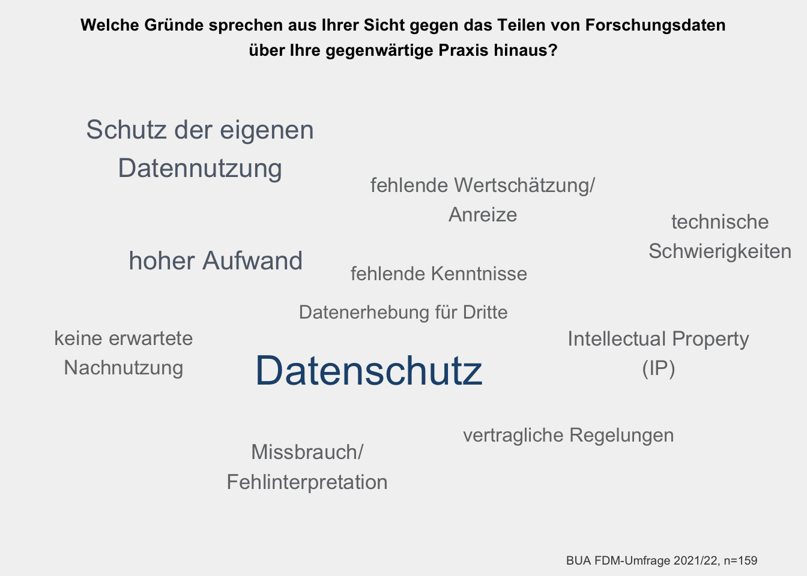

# Personenbezogene Daten werden besonders selten geteilt {#personenbezogene-daten}


## Eine Mehrheit arbeitet (auch) mit personenbezogenen Daten


68% der Teilnehmenden haben an, (auch) mit personenbezogenen Daten zu arbeiten. Dabei arbeiten Professor\*innen am häufigsten mit personenbezogenen Daten (82%), was wahrscheinlich die Breite ihrer Forschungsprojekte widerspiegelt. Je fokussierter die Projekte, desto geringer der Anteil derjenigen, die mit personenbezogenen Daten arbeiten – 70% unter WiMis und 61% unter Doktorand\*innen. 

<div class="figure">

```{=html}
<div id="htmlwidget-a8ae0e3cb55bd3dd9618" style="width:100%;height:480px;" class="plotly html-widget"></div>
<script type="application/json" data-for="htmlwidget-a8ae0e3cb55bd3dd9618">{"x":{"visdat":{"10786d834150":["function () ","plotlyVisDat"]},"cur_data":"10786d834150","attrs":{"10786d834150":{"x":{},"y":{},"hoverinfo":"text","hovertext":{},"color":{},"colors":["#21527B","#852557","#767676"],"alpha_stroke":1,"sizes":[10,100],"spans":[1,20],"type":"bar","text":{},"textposition":"inside","insidetextanchor":"middle","textangle":0,"textfont":{"color":"white","size":11},"inherit":true}},"layout":{"margin":{"b":40,"l":60,"t":80,"r":10},"barmode":"stack","bargap":0.15,"bargroupgap":0.05,"font":{"family":"Arial"},"xaxis":{"domain":[0,1],"automargin":true,"title":false,"tickformat":".0%","range":[-0.01,1.05],"zeroline":false,"dtick":0.25,"tick0":0,"tickmode":"linear","gridcolor":"#A0A0A0","tickfont":{"size":11}},"yaxis":{"domain":[0,1],"automargin":true,"title":false,"tickfont":{"size":11},"autorange":true,"type":"category","categoryorder":"array","categoryarray":["Andere<br />n=47","Doktorand*in<br />n=93","Wissenschaftliche*r<br />Mitarbeiter*in<br />n=268","Professor*in<br />n=57","Alle<br />n=465"]},"legend":{"traceorder":"normal","font":{"size":11},"title":{"text":"Arbeiten Sie mit<br />personenbez. Daten?","font":{"size":11}}},"uniformtext":{"minsize":10,"mode":"hide"},"title":{"text":"<b>Beruflicher Status<br />und Arbeit mit personenbezogenen Daten<\/b>","font":{"size":15},"x":0.5,"y":0.95,"xref":"container","yref":"container"},"paper_bgcolor":"#F2F2F2","plot_bgcolor":"#F2F2F2","shapes":[{"type":"line","x0":-0.05,"x1":1,"xref":"paper","y0":3.5,"y1":3.5,"line":{"color":"black","dash":"dot"}}],"annotations":[{"text":"FDM-Bedarfserhebung an der Charité 2021/22, n=465","x":1,"y":0,"hovertext":null,"align":"right","showarrow":false,"xref":"paper","yref":"paper","xanchor":"right","yanchor":"auto","xshift":0,"yshift":-35,"font":{"size":11}}],"hovermode":"closest","showlegend":true},"source":"A","config":{"modeBarButtonsToAdd":["hoverclosest","hovercompare"],"showSendToCloud":false,"displaylogo":false,"modeBarButtonsToRemove":["zoom","pan","select","lasso2d","zoomIn","zoomOut","autoScale","resetScale","toggleSpikelines","hoverClosest","hoverCompare"],"toImageButtonOptions":{"format":"png","scale":3}},"data":[{"x":[0.824561403508772,0.612903225806452,0.697761194029851,0.531914893617021,0.679569892473118],"y":["Professor*in<br />n=57","Doktorand*in<br />n=93","Wissenschaftliche*r<br />Mitarbeiter*in<br />n=268","Andere<br />n=47","Alle<br />n=465"],"hoverinfo":["text","text","text","text","text"],"hovertext":["<b>Professor*in<br />n=57—Ja<\/b><br />47 (82.5%)","<b>Doktorand*in<br />n=93—Ja<\/b><br />57 (61.3%)","<b>Wissenschaftliche*r<br />Mitarbeiter*in<br />n=268—Ja<\/b><br />187 (69.8%)","<b>Andere<br />n=47—Ja<\/b><br />25 (53.2%)","<b>Alle<br />n=465—Ja<\/b><br />316 (68%)"],"type":"bar","text":["82% (47)","61% (57)","70% (187)","53% (25)","68% (316)"],"textposition":["inside","inside","inside","inside","inside"],"insidetextanchor":"middle","textangle":0,"textfont":{"color":"white","size":11},"orientation":"h","name":"Ja","marker":{"color":"rgba(33,82,123,1)","line":{"color":"rgba(33,82,123,1)"}},"error_y":{"color":"rgba(33,82,123,1)"},"error_x":{"color":"rgba(33,82,123,1)"},"xaxis":"x","yaxis":"y","frame":null},{"x":[0.157894736842105,0.365591397849462,0.283582089552239,0.468085106382979,0.303225806451613],"y":["Professor*in<br />n=57","Doktorand*in<br />n=93","Wissenschaftliche*r<br />Mitarbeiter*in<br />n=268","Andere<br />n=47","Alle<br />n=465"],"hoverinfo":["text","text","text","text","text"],"hovertext":["<b>Professor*in<br />n=57—Nein<\/b><br />9 (15.8%)","<b>Doktorand*in<br />n=93—Nein<\/b><br />34 (36.6%)","<b>Wissenschaftliche*r<br />Mitarbeiter*in<br />n=268—Nein<\/b><br />76 (28.4%)","<b>Andere<br />n=47—Nein<\/b><br />22 (46.8%)","<b>Alle<br />n=465—Nein<\/b><br />141 (30.3%)"],"type":"bar","text":["16% (9)","37% (34)","28% (76)","47% (22)","30% (141)"],"textposition":["inside","inside","inside","inside","inside"],"insidetextanchor":"middle","textangle":0,"textfont":{"color":"white","size":11},"orientation":"h","name":"Nein","marker":{"color":"rgba(133,37,87,1)","line":{"color":"rgba(133,37,87,1)"}},"error_y":{"color":"rgba(133,37,87,1)"},"error_x":{"color":"rgba(133,37,87,1)"},"xaxis":"x","yaxis":"y","frame":null},{"x":[0.0175438596491228,0.021505376344086,0.0186567164179104,0.0172043010752688],"y":["Professor*in<br />n=57","Doktorand*in<br />n=93","Wissenschaftliche*r<br />Mitarbeiter*in<br />n=268","Alle<br />n=465"],"hoverinfo":["text","text","text","text"],"hovertext":["<b>Professor*in<br />n=57—Ich weiß<br />nicht<\/b><br />1 (1.8%)","<b>Doktorand*in<br />n=93—Ich weiß<br />nicht<\/b><br />2 (2.2%)","<b>Wissenschaftliche*r<br />Mitarbeiter*in<br />n=268—Ich weiß<br />nicht<\/b><br />5 (1.9%)","<b>Alle<br />n=465—Ich weiß<br />nicht<\/b><br />8 (1.7%)"],"type":"bar","text":["2% (1)","2% (2)","2% (5)","2% (8)"],"textposition":["inside","inside","inside","inside"],"insidetextanchor":"middle","textangle":0,"textfont":{"color":"white","size":11},"orientation":"h","name":"Ich weiß<br />nicht","marker":{"color":"rgba(118,118,118,1)","line":{"color":"rgba(118,118,118,1)"}},"error_y":{"color":"rgba(118,118,118,1)"},"error_x":{"color":"rgba(118,118,118,1)"},"xaxis":"x","yaxis":"y","frame":null}],"highlight":{"on":"plotly_click","persistent":false,"dynamic":false,"selectize":false,"opacityDim":0.2,"selected":{"opacity":1},"debounce":0},"shinyEvents":["plotly_hover","plotly_click","plotly_selected","plotly_relayout","plotly_brushed","plotly_brushing","plotly_clickannotation","plotly_doubleclick","plotly_deselect","plotly_afterplot","plotly_sunburstclick"],"base_url":"https://plot.ly"},"evals":[],"jsHooks":[]}</script>
```

<p class="caption">(\#fig:pers-2)Anteil der Teilnehmenden, die mit personenbezogenen Daten arbeiten, aufgetrennt nach beruflicher Statusgruppe</p>
</div>


## Wer mit personenbezogenen Daten arbeitet, teilt seltener Daten {#teilen-forschungsdaten}

Die Arbeit mit personenbezogenen Daten spiegelt sich in den Praktiken der Teilnehmenden wider, was das Teilen von Daten angeht. Wer (auch) mit personenbezogenen Daten arbeitet, teilt diese mit allen Gruppen von (Nach)nutzenden seltener. Besonders ausgeprägt ist dieser Unterschied beim Teilen mit allen Forschenden und/oder der Öffentlichkeit. 29% der Teilnehmenden teilen Daten offen, wenn sie ausschließlich mit nicht personenbezogenen Daten arbeiten. Wer (auch) mit personenbezogenen Daten arbeitet, tut dies nur zu 17%. 


<div class="figure">

```{=html}
<div id="htmlwidget-d6c6c3f4791b6d1a5816" style="width:100%;height:480px;" class="plotly html-widget"></div>
<script type="application/json" data-for="htmlwidget-d6c6c3f4791b6d1a5816">{"x":{"visdat":{"10787ca44e58":["function () ","plotlyVisDat"]},"cur_data":"10787ca44e58","attrs":{"10787ca44e58":{"textposition":"inside","insidetextanchor":"middle","textangle":0,"textfont":{"color":"white","size":11},"alpha_stroke":1,"sizes":[10,100],"spans":[1,20],"x":{},"y":{},"text":{},"name":{},"marker":{"color":"#21527B"},"type":"bar","inherit":true},"10787ca44e58.1":{"textposition":"inside","insidetextanchor":"middle","textangle":0,"textfont":{"color":"white","size":11},"alpha_stroke":1,"sizes":[10,100],"spans":[1,20],"x":{},"y":{},"text":{},"name":{},"marker":{"color":"#852557"},"type":"bar","inherit":true},"10787ca44e58.2":{"textposition":"inside","insidetextanchor":"middle","textangle":0,"textfont":{"color":"white","size":11},"alpha_stroke":1,"sizes":[10,100],"spans":[1,20],"x":{},"y":{},"text":{},"name":{},"marker":{"color":"#767676"},"type":"bar","visible":"legendonly","inherit":true}},"layout":{"margin":{"b":40,"l":60,"t":80,"r":10},"barmode":"group","bargap":0.15,"bargroupgap":0.05,"font":{"family":"Arial"},"xaxis":{"domain":[0,1],"automargin":true,"title":false,"tickformat":".0%","range":[-0.01,1.05],"zeroline":false,"dtick":0.25,"tick0":0,"tickmode":"linear","gridcolor":"#A0A0A0","tickfont":{"size":11}},"yaxis":{"domain":[0,1],"automargin":true,"title":false,"tickfont":{"size":11},"autorange":"reversed","type":"category","categoryorder":"array","categoryarray":["Teammitglieder","Mitglieder der Charité","Externe Partner","Allen Forschenden und/<br />oder der Öffentlichkeit","Niemandem"]},"legend":{"traceorder":"normal","font":{"size":11},"title":{"text":"Arbeiten Sie mit<br />personenbez. Daten?","font":{"size":11}}},"uniformtext":{"minsize":10,"mode":"hide"},"title":{"text":"<b>Teilen von Forschungsdaten<br />und Arbeit mit personenbezogenen Daten<\/b>","font":{"size":15},"x":0.5,"y":0.95,"xref":"container","yref":"container"},"paper_bgcolor":"#F2F2F2","plot_bgcolor":"#F2F2F2","annotations":[{"text":"FDM-Bedarfserhebung an der Charité 2021/22, n=465","x":1,"y":0,"hovertext":null,"align":"right","showarrow":false,"xref":"paper","yref":"paper","xanchor":"right","yanchor":"auto","xshift":0,"yshift":-35,"font":{"size":11}}],"hovermode":"closest","showlegend":true},"source":"A","config":{"modeBarButtonsToAdd":["hoverclosest","hovercompare"],"showSendToCloud":false,"displaylogo":false,"modeBarButtonsToRemove":["zoom","pan","select","lasso2d","zoomIn","zoomOut","autoScale","resetScale","toggleSpikelines","hoverClosest","hoverCompare"],"toImageButtonOptions":{"format":"png","scale":3}},"data":[{"textposition":["inside","inside","inside","inside","inside"],"insidetextanchor":"middle","textangle":0,"textfont":{"color":"white","size":11},"x":[0.943037974683544,0.54746835443038,0.537974683544304,0.174050632911392,0.00949367088607595],"y":["Teammitglieder","Mitglieder der Charité","Externe Partner","Allen Forschenden und/<br />oder der Öffentlichkeit","Niemandem"],"text":["94% (298)","55% (173)","54% (170)","17% (55)","1% (3)"],"name":"Ja (n=316)","marker":{"color":"#21527B","line":{"color":"rgba(31,119,180,1)"}},"type":"bar","orientation":"h","error_y":{"color":"rgba(31,119,180,1)"},"error_x":{"color":"rgba(31,119,180,1)"},"xaxis":"x","yaxis":"y","frame":null},{"textposition":["inside","inside","inside","inside","inside"],"insidetextanchor":"middle","textangle":0,"textfont":{"color":"white","size":11},"x":[0.978723404255319,0.617021276595745,0.546099290780142,0.290780141843972,0],"y":["Teammitglieder","Mitglieder der Charité","Externe Partner","Allen Forschenden und/<br />oder der Öffentlichkeit","Niemandem"],"text":["98% (138)","62% (87)","55% (77)","29% (41)","0% (0)"],"name":"Nein (n=141)","marker":{"color":"#852557","line":{"color":"rgba(255,127,14,1)"}},"type":"bar","orientation":"h","error_y":{"color":"rgba(255,127,14,1)"},"error_x":{"color":"rgba(255,127,14,1)"},"xaxis":"x","yaxis":"y","frame":null},{"textposition":["inside","inside","inside","inside","inside"],"insidetextanchor":"middle","textangle":0,"textfont":{"color":"white","size":11},"x":[0.954838709677419,0.565591397849462,0.533333333333333,0.208602150537634,0.00645161290322581],"y":["Teammitglieder","Mitglieder der Charité","Externe Partner","Allen Forschenden und/<br />oder der Öffentlichkeit","Niemandem"],"text":["95% (444)","57% (263)","53% (248)","21% (97)","1% (3)"],"name":"Alle (n=465)","marker":{"color":"#767676","line":{"color":"rgba(44,160,44,1)"}},"type":"bar","visible":"legendonly","orientation":"h","error_y":{"color":"rgba(44,160,44,1)"},"error_x":{"color":"rgba(44,160,44,1)"},"xaxis":"x","yaxis":"y","frame":null}],"highlight":{"on":"plotly_click","persistent":false,"dynamic":false,"selectize":false,"opacityDim":0.2,"selected":{"opacity":1},"debounce":0},"shinyEvents":["plotly_hover","plotly_click","plotly_selected","plotly_relayout","plotly_brushed","plotly_brushing","plotly_clickannotation","plotly_doubleclick","plotly_deselect","plotly_afterplot","plotly_sunburstclick"],"base_url":"https://plot.ly"},"evals":[],"jsHooks":[]}</script>
```

<p class="caption">(\#fig:pers-3)Häufigkeit der Angabe, Daten zu teilen, dargestellt für unterschiedliche Adressat*innenkreise des Datenzugangs und jeweils aufgetrennt nach Teilnehmenden, die mit personenbezogenen Daten arbeiten und solchen, die es nicht tun.</p>
</div>

## Datenschutzgründe sind sehr oft ein Hindernis für das Teilen von Daten


Unter den Teilnehmenden, die mit personenbezogenen Daten arbeiten, gaben 52% an, bereits mehrmals vorrangig aus Datenschutzgründen Forschungsdaten nicht geteilt zu haben. Weitere 12% gaben an, dass sie dies in einem Fall davon abgehalten habe, Forschungsdaten zu teilen. Somit sind Datenschutzgründe für fast 2/3 der Teilnehmenden (64%), die mit personenbezogenen Daten arbeiten, ein maßgebliches Hindernis beim Teilen dieser Daten (siehe unten).

58% der Teilnehmenden gaben an, bereits mehrmals Forschungsdaten anonymisiert zu haben, bevor sie diese Dritten zugänglich gemacht haben. Lediglich 25,5% haben dagegen noch nie Forschungsdaten vor dem Teilen anonymisiert (siehe rechts).


<div class="figure">

```{=html}
<div id="htmlwidget-ca37c40edcdc71749567" style="width:100%;height:480px;" class="plotly html-widget"></div>
<script type="application/json" data-for="htmlwidget-ca37c40edcdc71749567">{"x":{"visdat":{"10786b1c3fa2":["function () ","plotlyVisDat"]},"cur_data":"10786b1c3fa2","attrs":{"10786b1c3fa2":{"labels":{},"values":{},"textposition":"inside","texttemplate":{},"showlegend":false,"direction":"clockwise","sort":false,"marker":{"colors":["#852557","#B07E9F","#21527B"],"line":{"col":"#FFFFFF","width":1}},"alpha_stroke":1,"sizes":[10,100],"spans":[1,20],"type":"pie"}},"layout":{"margin":{"b":40,"l":60,"t":80,"r":10},"font":{"family":"Arial"},"title":{"text":"<b>Haben Sie bereits einmal vorrangig aus<br />Datenschutzgründen Forschungsdaten nicht geteilt?<\/b>","font":{"size":15},"x":0.5,"y":0.95,"xref":"container","yref":"container"},"paper_bgcolor":"#F2F2F2","plot_bgcolor":"#F2F2F2","annotations":[{"text":"FDM-Bedarfserhebung an der Charité 2021/22, n=313","x":1,"y":0,"hovertext":null,"align":"right","showarrow":false,"xref":"paper","yref":"paper","xanchor":"right","yanchor":"auto","xshift":0,"yshift":-35,"font":{"size":11}}],"hovermode":"closest","showlegend":true},"source":"A","config":{"modeBarButtonsToAdd":["hoverclosest","hovercompare"],"showSendToCloud":false,"displaylogo":false,"modeBarButtonsToRemove":["zoom","pan","select","lasso2d","zoomIn","zoomOut","autoScale","resetScale","toggleSpikelines","hoverClosest","hoverCompare"],"toImageButtonOptions":{"format":"png","scale":3}},"data":[{"labels":["Ja, mehrmals","Ja, einmal","Nein"],"values":[162,37,114],"textposition":["inside","inside","inside"],"texttemplate":["Ja, mehrmals<br />51.8% (162)","Ja, einmal<br />11.8% (37)","Nein<br />36.4% (114)"],"showlegend":false,"direction":"clockwise","sort":false,"marker":{"color":"rgba(31,119,180,1)","colors":["#852557","#B07E9F","#21527B"],"line":{"color":"rgba(242,242,242,1)","col":"#FFFFFF","width":1}},"type":"pie","frame":null}],"highlight":{"on":"plotly_click","persistent":false,"dynamic":false,"selectize":false,"opacityDim":0.2,"selected":{"opacity":1},"debounce":0},"shinyEvents":["plotly_hover","plotly_click","plotly_selected","plotly_relayout","plotly_brushed","plotly_brushing","plotly_clickannotation","plotly_doubleclick","plotly_deselect","plotly_afterplot","plotly_sunburstclick"],"base_url":"https://plot.ly"},"evals":[],"jsHooks":[]}</script>
```

<p class="caption">(\#fig:teilen-2)Häufigkeit der Angaben zu der Frage, ob Forschungsdaten schon einmal vorrangig aus Datenschutzgründen nicht geteilt wurden</p>
</div>


Die Antworten auf die Frage "Welche Gründe sprechen aus Ihrer Sicht gegen das Teilen von Forschungsdaten über Ihre gegenwärtige Data Sharing-Praxis hinaus?" stellen Datenschutzgründe ebenfalls als maßgebliches Hindernis für das Teilen von Daten heraus. Unter insgesamt 207 Antworten nannten 157 Teilnehmende einen oder mehrere spezifische Gründe, Daten nicht weiter zu teilen, als sie es bereits tun. Dabei wurde der Datenschutz mit 88 Angaben (56%) als das mit Abstand größte Hindernis benannt. Der Wunsch, die eigene Nutzung der Daten sicherzustellen und den Vorteil des Datenzugangs zu bewahren, folgte mit großem Abstand als zweithäufigstes Hindernis (32 Einträge, 20%).


<div class="figure">

<p class="caption">(\#fig:wordcloud-hindernisse)In Freitextantworten am häufigsten genannte Gründe gegen das Teilen von Daten über die aktuelle Praxis der Teilnehmenden hinaus. Die Größe des Schriftzugs repräsentiert die Häufigkeit der Erwähnung der entsprechenden Kategorie.</p>
</div>
