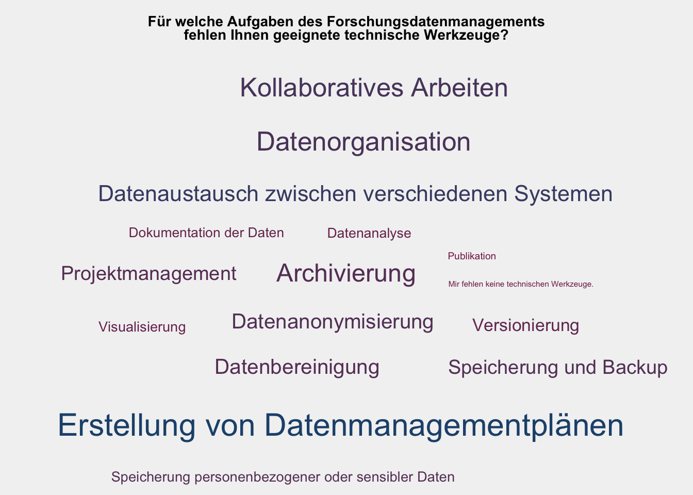
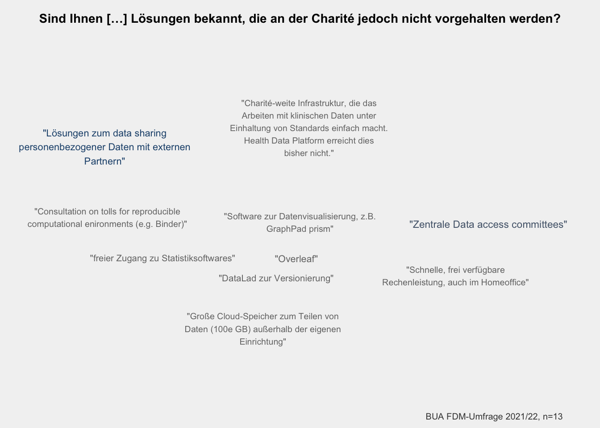

# Sandbox


## Kontakt zu FDM {#kontakt}


### Teamleitung

Für die Frage "In welchem Kontext sind sie bereits mit dem Thema FDM in Kontakt gekommen?" (CON_1 - CON_10) wurde gegenübergestellt, wie diese von TN mit und ohne Teamleitung beantwortet wurde. Die Auwahlmöglichkeiten "Mir ist das Thema Forschungsdatenmanagement bisher nicht begegnet" (CON_10) und "Sonstiges, und zwar:" (CON_11) wurden von der Analyse ausgeschlossen. 


<div class="figure">

```{=html}
<div id="htmlwidget-58eaf63385c704509267" style="width:100%;height:480px;" class="plotly html-widget"></div>
<script type="application/json" data-for="htmlwidget-58eaf63385c704509267">{"x":{"visdat":{"13b596d5f2857":["function () ","plotlyVisDat"]},"cur_data":"13b596d5f2857","attrs":{"13b596d5f2857":{"x":{},"y":{},"color":{},"colors":["#367BBA","#A6A6A6"],"alpha_stroke":1,"sizes":[10,100],"spans":[1,20],"type":"bar","hoverinfo":"text","hovertext":{},"text":{},"textfont":{"color":"black","size":10},"inherit":true}},"layout":{"margin":{"b":40,"l":60,"t":25,"r":10},"barmode":"group","font":{"family":"Arial"},"xaxis":{"domain":[0,1],"automargin":true,"title":false,"tickformat":".0%","range":[-0.01,1.05],"zeroline":true,"dtick":0.25,"tick0":0,"tickmode":"linear","gridcolor":"#A0A0A0","tickfont":{"size":11}},"yaxis":{"domain":[0,1],"automargin":true,"title":false,"autorange":[],"tickfont":{"size":11},"type":"category","categoryorder":"array","categoryarray":["Eigene Forschungspraxis","Forschungsförderung (z.B. DFG)","Services / Infrastruktur der<br />Charité (z.B. Geschäftsbereich IT,<br />Medizinische ...","Fachcommunity (z.B. Konferenz,<br />Kolleg*innen)","Lehrveranstaltungen (Studium/<br />Promotion)","Workshops oder<br />Veranstaltungen (z.B. zum<br />Forschungsdatenmanagement)","Leitlinien (z.B. Forschungsdaten-<br />Policy)","Informationskanäle der Charité<br />(z.B. Webseite)","Nationale<br />Forschungsdateninfrastruktur (NFDI)"]},"legend":{"traceorder":"normal","font":{"size":11},"title":{"text":"Teamleitung"}},"uniformtext":{"minsize":10,"mode":"hide"},"title":"In welchem Kontext sind sie bereits mit dem Thema<br />Forschungsdatenmanagement in Kontakt gekommen?","hovermode":"closest","showlegend":true},"source":"A","config":{"modeBarButtonsToAdd":["hoverclosest","hovercompare"],"showSendToCloud":false},"data":[{"x":[0.807017543859649,0.532163742690059,0.461988304093567,0.432748538011696,0.350877192982456,0.339181286549708,0.280701754385965,0.274853801169591,0.116959064327485],"y":["Eigene Forschungspraxis","Forschungsförderung (z.B. DFG)","Services / Infrastruktur der<br />Charité (z.B. Geschäftsbereich IT,<br />Medizinische ...","Fachcommunity (z.B. Konferenz,<br />Kolleg*innen)","Lehrveranstaltungen (Studium/<br />Promotion)","Workshops oder<br />Veranstaltungen (z.B. zum<br />Forschungsdatenmanagement)","Leitlinien (z.B. Forschungsdaten-<br />Policy)","Informationskanäle der Charité<br />(z.B. Webseite)","Nationale<br />Forschungsdateninfrastruktur (NFDI)"],"type":"bar","hoverinfo":["text","text","text","text","text","text","text","text","text"],"hovertext":["<b>Teamleitung—Ja<\/b><br />Eigene Forschungspraxis<br />138 (80.7%)","<b>Teamleitung—Ja<\/b><br />Forschungsförderung (z.B. DFG)<br />91 (53.2%)","<b>Teamleitung—Ja<\/b><br />Services / Infrastruktur der<br />Charité (z.B. Geschäftsbereich IT,<br />Medizinische ...<br />79 (46.2%)","<b>Teamleitung—Ja<\/b><br />Fachcommunity (z.B. Konferenz,<br />Kolleg*innen)<br />74 (43.3%)","<b>Teamleitung—Ja<\/b><br />Lehrveranstaltungen (Studium/<br />Promotion)<br />60 (35.1%)","<b>Teamleitung—Ja<\/b><br />Workshops oder<br />Veranstaltungen (z.B. zum<br />Forschungsdatenmanagement)<br />58 (33.9%)","<b>Teamleitung—Ja<\/b><br />Leitlinien (z.B. Forschungsdaten-<br />Policy)<br />48 (28.1%)","<b>Teamleitung—Ja<\/b><br />Informationskanäle der Charité<br />(z.B. Webseite)<br />47 (27.5%)","<b>Teamleitung—Ja<\/b><br />Nationale<br />Forschungsdateninfrastruktur (NFDI)<br />20 (11.7%)"],"text":["138 (81%)","91 (53%)","79 (46%)","74 (43%)","60 (35%)","58 (34%)","48 (28%)","47 (27%)","20 (12%)"],"textfont":{"color":"black","size":10},"orientation":"h","name":"Ja (n=171)","marker":{"color":"rgba(54,123,186,1)","line":{"color":"rgba(54,123,186,1)"}},"error_y":{"color":"rgba(54,123,186,1)"},"error_x":{"color":"rgba(54,123,186,1)"},"xaxis":"x","yaxis":"y","frame":null},{"x":[0.703333333333333,0.23,0.293333333333333,0.233333333333333,0.396666666666667,0.266666666666667,0.163333333333333,0.196666666666667,0.04],"y":["Eigene Forschungspraxis","Forschungsförderung (z.B. DFG)","Services / Infrastruktur der<br />Charité (z.B. Geschäftsbereich IT,<br />Medizinische ...","Fachcommunity (z.B. Konferenz,<br />Kolleg*innen)","Lehrveranstaltungen (Studium/<br />Promotion)","Workshops oder<br />Veranstaltungen (z.B. zum<br />Forschungsdatenmanagement)","Leitlinien (z.B. Forschungsdaten-<br />Policy)","Informationskanäle der Charité<br />(z.B. Webseite)","Nationale<br />Forschungsdateninfrastruktur (NFDI)"],"type":"bar","hoverinfo":["text","text","text","text","text","text","text","text","text"],"hovertext":["<b>Teamleitung—Nein<\/b><br />Eigene Forschungspraxis<br />211 (70.3%)","<b>Teamleitung—Nein<\/b><br />Forschungsförderung (z.B. DFG)<br />69 (23%)","<b>Teamleitung—Nein<\/b><br />Services / Infrastruktur der<br />Charité (z.B. Geschäftsbereich IT,<br />Medizinische ...<br />88 (29.3%)","<b>Teamleitung—Nein<\/b><br />Fachcommunity (z.B. Konferenz,<br />Kolleg*innen)<br />70 (23.3%)","<b>Teamleitung—Nein<\/b><br />Lehrveranstaltungen (Studium/<br />Promotion)<br />119 (39.7%)","<b>Teamleitung—Nein<\/b><br />Workshops oder<br />Veranstaltungen (z.B. zum<br />Forschungsdatenmanagement)<br />80 (26.7%)","<b>Teamleitung—Nein<\/b><br />Leitlinien (z.B. Forschungsdaten-<br />Policy)<br />49 (16.3%)","<b>Teamleitung—Nein<\/b><br />Informationskanäle der Charité<br />(z.B. Webseite)<br />59 (19.7%)","<b>Teamleitung—Nein<\/b><br />Nationale<br />Forschungsdateninfrastruktur (NFDI)<br />12 (4%)"],"text":["211 (70%)","69 (23%)","88 (29%)","70 (23%)","119 (40%)","80 (27%)","49 (16%)","59 (20%)","12 (4%)"],"textfont":{"color":"black","size":10},"orientation":"h","name":"Nein (n=300)","marker":{"color":"rgba(166,166,166,1)","line":{"color":"rgba(166,166,166,1)"}},"error_y":{"color":"rgba(166,166,166,1)"},"error_x":{"color":"rgba(166,166,166,1)"},"xaxis":"x","yaxis":"y","frame":null}],"highlight":{"on":"plotly_click","persistent":false,"dynamic":false,"selectize":false,"opacityDim":0.2,"selected":{"opacity":1},"debounce":0},"shinyEvents":["plotly_hover","plotly_click","plotly_selected","plotly_relayout","plotly_brushed","plotly_brushing","plotly_clickannotation","plotly_doubleclick","plotly_deselect","plotly_afterplot","plotly_sunburstclick"],"base_url":"https://plot.ly"},"evals":[],"jsHooks":[]}</script>
```

<p class="caption">(\#fig:fdm-kontakt-lead)FDM und Teamleitung</p>
</div>
Die Analyse zeigt, dass TN mit Teamleitung bei fast allen abgefragten Kontexten häufiger mit dem Thema FDM in Kontakt gekommen sind als TN ohne Teamleitung. Lediglich bei dem Kontext "Lehrveranstaltungen (Studium/Promotion)" gaben TN ohne Teamleitung häufiger an als TN mit Teamleitung, dass sie häufiger mit dem Thema FDM in Kontakt gekommen seien.

In einer weiteren Analye wurden die Unterschiede zwischen TN mit und ohne Teamleitung für jeden Kontext normalisiert. Hierdurch wird deutch, dass TN mit Teamleitung 192% häufiger mit der Nationalen Forschungsdateninfrastruktur (NFDI) in Kontakt gekommen sind als TN ohne Teamleitung.

<div class="figure">

```{=html}
<div id="htmlwidget-825f4f7e1ee4f95ceb63" style="width:100%;height:480px;" class="plotly html-widget"></div>
<script type="application/json" data-for="htmlwidget-825f4f7e1ee4f95ceb63">{"x":{"visdat":{"13b593cd5a266":["function () ","plotlyVisDat"]},"cur_data":"13b593cd5a266","attrs":{"13b593cd5a266":{"x":{},"y":{},"alpha_stroke":1,"sizes":[10,100],"spans":[1,20],"type":"scatter","mode":"lines","showlegend":false,"color":["#A6A6A6"],"inherit":true},"13b593cd5a266.1":{"x":{},"y":{},"alpha_stroke":1,"sizes":[10,100],"spans":[1,20],"type":"scatter","mode":"markers","color":["#367BBA"],"inherit":true}},"layout":{"margin":{"b":40,"l":60,"t":25,"r":10},"title":"Unterschiede zw. TN mit Teamleitung und ohne","xaxis":{"domain":[0,1],"automargin":true,"title":"Differenz","tickformat":".0%","range":[-1,2.02397660818713]},"yaxis":{"domain":[0,1],"automargin":true,"title":false,"type":"category","categoryorder":"array","categoryarray":["Lehrveranstaltungen (Studium/<br />Promotion)","Eigene Forschungspraxis","Workshops oder<br />Veranstaltungen (z.B. zum<br />Forschungsdatenmanagement)","Informationskanäle der Charité<br />(z.B. Webseite)","Services / Infrastruktur der<br />Charité (z.B. Geschäftsbereich IT,<br />Medizinische ...","Leitlinien (z.B. Forschungsdaten-<br />Policy)","Fachcommunity (z.B. Konferenz,<br />Kolleg*innen)","Forschungsförderung (z.B. DFG)","Nationale<br />Forschungsdateninfrastruktur (NFDI)"]},"hovermode":"closest","showlegend":false},"source":"A","config":{"modeBarButtonsToAdd":["hoverclosest","hovercompare"],"showSendToCloud":false},"data":[{"x":[-0.115435647943388,0.147418308805188,0.271929824561403,0.397561700862325,0.574960127591706,0.718582169709989,0.854636591478697,1.31375540300025,1.92397660818713],"y":["Lehrveranstaltungen (Studium/<br />Promotion)","Eigene Forschungspraxis","Workshops oder<br />Veranstaltungen (z.B. zum<br />Forschungsdatenmanagement)","Informationskanäle der Charité<br />(z.B. Webseite)","Services / Infrastruktur der<br />Charité (z.B. Geschäftsbereich IT,<br />Medizinische ...","Leitlinien (z.B. Forschungsdaten-<br />Policy)","Fachcommunity (z.B. Konferenz,<br />Kolleg*innen)","Forschungsförderung (z.B. DFG)","Nationale<br />Forschungsdateninfrastruktur (NFDI)"],"type":"scatter","mode":"lines","showlegend":false,"marker":{"color":"rgba(166,166,166,1)","line":{"color":"rgba(166,166,166,1)"}},"textfont":{"color":"rgba(166,166,166,1)"},"error_y":{"color":"rgba(166,166,166,1)"},"error_x":{"color":"rgba(166,166,166,1)"},"line":{"color":"rgba(166,166,166,1)"},"xaxis":"x","yaxis":"y","frame":null},{"x":[0.147418308805188,1.31375540300025,0.574960127591706,0.854636591478697,-0.115435647943388,0.271929824561403,0.718582169709989,0.397561700862325,1.92397660818713],"y":["Eigene Forschungspraxis","Forschungsförderung (z.B. DFG)","Services / Infrastruktur der<br />Charité (z.B. Geschäftsbereich IT,<br />Medizinische ...","Fachcommunity (z.B. Konferenz,<br />Kolleg*innen)","Lehrveranstaltungen (Studium/<br />Promotion)","Workshops oder<br />Veranstaltungen (z.B. zum<br />Forschungsdatenmanagement)","Leitlinien (z.B. Forschungsdaten-<br />Policy)","Informationskanäle der Charité<br />(z.B. Webseite)","Nationale<br />Forschungsdateninfrastruktur (NFDI)"],"type":"scatter","mode":"markers","marker":{"color":"rgba(54,123,186,1)","line":{"color":"rgba(54,123,186,1)"}},"textfont":{"color":"rgba(54,123,186,1)"},"error_y":{"color":"rgba(54,123,186,1)"},"error_x":{"color":"rgba(54,123,186,1)"},"line":{"color":"rgba(54,123,186,1)"},"xaxis":"x","yaxis":"y","frame":null}],"highlight":{"on":"plotly_click","persistent":false,"dynamic":false,"selectize":false,"opacityDim":0.2,"selected":{"opacity":1},"debounce":0},"shinyEvents":["plotly_hover","plotly_click","plotly_selected","plotly_relayout","plotly_brushed","plotly_brushing","plotly_clickannotation","plotly_doubleclick","plotly_deselect","plotly_afterplot","plotly_sunburstclick"],"base_url":"https://plot.ly"},"evals":[],"jsHooks":[]}</script>
```

<p class="caption">(\#fig:fdm-kontakt-diff)FDM Kontakt Diff</p>
</div>


<table class="table" style="font-size: 11px; margin-left: auto; margin-right: auto;">
<caption style="font-size: initial !important;">(\#tab:fdm-kontakt)FDM Kontakt</caption>
 <thead>
<tr>
<th style="empty-cells: hide;border-bottom:hidden;" colspan="1"></th>
<th style="border-bottom:hidden;padding-bottom:0; padding-left:3px;padding-right:3px;text-align: center; " colspan="2"><div style="border-bottom: 1px solid #ddd; padding-bottom: 5px; ">Teamleitung Ja</div></th>
<th style="border-bottom:hidden;padding-bottom:0; padding-left:3px;padding-right:3px;text-align: center; " colspan="2"><div style="border-bottom: 1px solid #ddd; padding-bottom: 5px; ">Teamleitung Nein</div></th>
<th style="empty-cells: hide;border-bottom:hidden;" colspan="1"></th>
</tr>
  <tr>
   <th style="text-align:left;"> FDM-Kontakt </th>
   <th style="text-align:right;"> n_Ja </th>
   <th style="text-align:right;"> perc_Ja </th>
   <th style="text-align:right;"> n_Nein </th>
   <th style="text-align:right;"> perc_Nein </th>
   <th style="text-align:right;"> Diff </th>
  </tr>
 </thead>
<tbody>
  <tr>
   <td style="text-align:left;"> Eigene Forschungspraxis </td>
   <td style="text-align:right;"> 138 </td>
   <td style="text-align:right;"> 0.81 </td>
   <td style="text-align:right;"> 211 </td>
   <td style="text-align:right;"> 0.70 </td>
   <td style="text-align:right;"> 0.15 </td>
  </tr>
  <tr>
   <td style="text-align:left;"> Forschungsförderung (z.B. DFG) </td>
   <td style="text-align:right;"> 91 </td>
   <td style="text-align:right;"> 0.53 </td>
   <td style="text-align:right;"> 69 </td>
   <td style="text-align:right;"> 0.23 </td>
   <td style="text-align:right;"> 1.31 </td>
  </tr>
  <tr>
   <td style="text-align:left;"> Services / Infrastruktur der
Charité (z.B. Geschäftsbereich IT,
Medizinische ... </td>
   <td style="text-align:right;"> 79 </td>
   <td style="text-align:right;"> 0.46 </td>
   <td style="text-align:right;"> 88 </td>
   <td style="text-align:right;"> 0.29 </td>
   <td style="text-align:right;"> 0.57 </td>
  </tr>
  <tr>
   <td style="text-align:left;"> Fachcommunity (z.B. Konferenz,
Kolleg*innen) </td>
   <td style="text-align:right;"> 74 </td>
   <td style="text-align:right;"> 0.43 </td>
   <td style="text-align:right;"> 70 </td>
   <td style="text-align:right;"> 0.23 </td>
   <td style="text-align:right;"> 0.85 </td>
  </tr>
  <tr>
   <td style="text-align:left;"> Lehrveranstaltungen (Studium/
Promotion) </td>
   <td style="text-align:right;"> 60 </td>
   <td style="text-align:right;"> 0.35 </td>
   <td style="text-align:right;"> 119 </td>
   <td style="text-align:right;"> 0.40 </td>
   <td style="text-align:right;"> -0.12 </td>
  </tr>
  <tr>
   <td style="text-align:left;"> Workshops oder
Veranstaltungen (z.B. zum
Forschungsdatenmanagement) </td>
   <td style="text-align:right;"> 58 </td>
   <td style="text-align:right;"> 0.34 </td>
   <td style="text-align:right;"> 80 </td>
   <td style="text-align:right;"> 0.27 </td>
   <td style="text-align:right;"> 0.27 </td>
  </tr>
  <tr>
   <td style="text-align:left;"> Leitlinien (z.B. Forschungsdaten-
Policy) </td>
   <td style="text-align:right;"> 48 </td>
   <td style="text-align:right;"> 0.28 </td>
   <td style="text-align:right;"> 49 </td>
   <td style="text-align:right;"> 0.16 </td>
   <td style="text-align:right;"> 0.72 </td>
  </tr>
  <tr>
   <td style="text-align:left;"> Informationskanäle der Charité
(z.B. Webseite) </td>
   <td style="text-align:right;"> 47 </td>
   <td style="text-align:right;"> 0.27 </td>
   <td style="text-align:right;"> 59 </td>
   <td style="text-align:right;"> 0.20 </td>
   <td style="text-align:right;"> 0.40 </td>
  </tr>
  <tr>
   <td style="text-align:left;"> Nationale
Forschungsdateninfrastruktur (NFDI) </td>
   <td style="text-align:right;"> 20 </td>
   <td style="text-align:right;"> 0.12 </td>
   <td style="text-align:right;"> 12 </td>
   <td style="text-align:right;"> 0.04 </td>
   <td style="text-align:right;"> 1.92 </td>
  </tr>
</tbody>
</table>


### Software/Code Eigennutzung

Für die Frage "In welchem Kontext sind sie bereits mit dem Thema FDM in Kontakt gekommen?" (CON_1 - CON_10) wurde gegenübergestellt, wie diese von TN beantwortet, die Eigensoftware verwenden, im Gegensatz zu denen, die Eigensoftware nicht verwenden. 

TN, die Eigensoftware verwenden, wurde definiert als TN, die auf die Frage "Mit welcher Software analysieren Sie Forschungsdaten?" (RDS_1 bis RDS_6) mit "Selbst geschriebene Codes" geantwortet haben oder auf die Frage "Welche Forschungsdatentypen und -formate generieren Sie bzw. sind Gegenstand Ihrer Forschung?" (DATA_1 bis DATA_13) mit "Selbstentwickelte oder weiterentwickelte Software" geantwortet haben.


```{=html}
<div id="htmlwidget-3c200dc7aadc53240a0c" style="width:100%;height:480px;" class="plotly html-widget"></div>
<script type="application/json" data-for="htmlwidget-3c200dc7aadc53240a0c">{"x":{"visdat":{"13b591f14b5d7":["function () ","plotlyVisDat"]},"cur_data":"13b591f14b5d7","attrs":{"13b591f14b5d7":{"x":{},"y":{},"color":{},"colors":["#367BBA","#A6A6A6"],"alpha_stroke":1,"sizes":[10,100],"spans":[1,20],"type":"bar","hoverinfo":"text","hovertext":{},"text":{},"textfont":{"color":"black","size":10},"inherit":true}},"layout":{"margin":{"b":40,"l":60,"t":25,"r":10},"barmode":"group","font":{"family":"Arial"},"xaxis":{"domain":[0,1],"automargin":true,"title":false,"tickformat":".0%","range":[-0.01,1.05],"zeroline":true,"dtick":0.25,"tick0":0,"tickmode":"linear","gridcolor":"#A0A0A0","tickfont":{"size":11}},"yaxis":{"domain":[0,1],"automargin":true,"title":false,"autorange":[],"tickfont":{"size":11},"type":"category","categoryorder":"array","categoryarray":["Eigene Forschungspraxis","Services / Infrastruktur der<br />Charité (z.B. Geschäftsbereich IT,<br />Medizinische ...","Forschungsförderung (z.B. DFG)","Lehrveranstaltungen (Studium/<br />Promotion)","Fachcommunity (z.B. Konferenz,<br />Kolleg*innen)","Workshops oder<br />Veranstaltungen (z.B. zum<br />Forschungsdatenmanagement)","Leitlinien (z.B. Forschungsdaten-<br />Policy)","Informationskanäle der Charité<br />(z.B. Webseite)","Nationale<br />Forschungsdateninfrastruktur (NFDI)"]},"legend":{"traceorder":"normal","font":{"size":11},"title":{"text":"Eigene Software"}},"uniformtext":{"minsize":10,"mode":"hide"},"title":"In welchem Kontext sind sie bereits mit dem Thema<br />Forschungsdatenmanagement in Kontakt gekommen?","hovermode":"closest","showlegend":true},"source":"A","config":{"modeBarButtonsToAdd":["hoverclosest","hovercompare"],"showSendToCloud":false},"data":[{"x":[0.82843137254902,0.392156862745098,0.25,0.377450980392157,0.102941176470588,0.392156862745098,0.338235294117647,0.220588235294118,0.42156862745098],"y":["Eigene Forschungspraxis","Forschungsförderung (z.B. DFG)","Leitlinien (z.B. Forschungsdaten-<br />Policy)","Fachcommunity (z.B. Konferenz,<br />Kolleg*innen)","Nationale<br />Forschungsdateninfrastruktur (NFDI)","Lehrveranstaltungen (Studium/<br />Promotion)","Workshops oder<br />Veranstaltungen (z.B. zum<br />Forschungsdatenmanagement)","Informationskanäle der Charité<br />(z.B. Webseite)","Services / Infrastruktur der<br />Charité (z.B. Geschäftsbereich IT,<br />Medizinische ..."],"type":"bar","hoverinfo":["text","text","text","text","text","text","text","text","text"],"hovertext":["<b>Eigene Software—Ja<\/b><br />Eigene Forschungspraxis<br />169 (82.8%)","<b>Eigene Software—Ja<\/b><br />Forschungsförderung (z.B. DFG)<br />80 (39.2%)","<b>Eigene Software—Ja<\/b><br />Leitlinien (z.B. Forschungsdaten-<br />Policy)<br />51 (25%)","<b>Eigene Software—Ja<\/b><br />Fachcommunity (z.B. Konferenz,<br />Kolleg*innen)<br />77 (37.7%)","<b>Eigene Software—Ja<\/b><br />Nationale<br />Forschungsdateninfrastruktur (NFDI)<br />21 (10.3%)","<b>Eigene Software—Ja<\/b><br />Lehrveranstaltungen (Studium/<br />Promotion)<br />80 (39.2%)","<b>Eigene Software—Ja<\/b><br />Workshops oder<br />Veranstaltungen (z.B. zum<br />Forschungsdatenmanagement)<br />69 (33.8%)","<b>Eigene Software—Ja<\/b><br />Informationskanäle der Charité<br />(z.B. Webseite)<br />45 (22.1%)","<b>Eigene Software—Ja<\/b><br />Services / Infrastruktur der<br />Charité (z.B. Geschäftsbereich IT,<br />Medizinische ...<br />86 (42.2%)"],"text":["169 (83%)","80 (39%)","51 (25%)","77 (38%)","21 (10%)","80 (39%)","69 (34%)","45 (22%)","86 (42%)"],"textfont":{"color":"black","size":10},"orientation":"h","name":"Ja","marker":{"color":"rgba(54,123,186,1)","line":{"color":"rgba(54,123,186,1)"}},"error_y":{"color":"rgba(54,123,186,1)"},"error_x":{"color":"rgba(54,123,186,1)"},"xaxis":"x","yaxis":"y","frame":null},{"x":[0.76271186440678,0.338983050847458,0.194915254237288,0.283898305084746,0.0466101694915254,0.419491525423729,0.292372881355932,0.258474576271186,0.343220338983051],"y":["Eigene Forschungspraxis","Forschungsförderung (z.B. DFG)","Leitlinien (z.B. Forschungsdaten-<br />Policy)","Fachcommunity (z.B. Konferenz,<br />Kolleg*innen)","Nationale<br />Forschungsdateninfrastruktur (NFDI)","Lehrveranstaltungen (Studium/<br />Promotion)","Workshops oder<br />Veranstaltungen (z.B. zum<br />Forschungsdatenmanagement)","Informationskanäle der Charité<br />(z.B. Webseite)","Services / Infrastruktur der<br />Charité (z.B. Geschäftsbereich IT,<br />Medizinische ..."],"type":"bar","hoverinfo":["text","text","text","text","text","text","text","text","text"],"hovertext":["<b>Eigene Software—Nein<\/b><br />Eigene Forschungspraxis<br />180 (76.3%)","<b>Eigene Software—Nein<\/b><br />Forschungsförderung (z.B. DFG)<br />80 (33.9%)","<b>Eigene Software—Nein<\/b><br />Leitlinien (z.B. Forschungsdaten-<br />Policy)<br />46 (19.5%)","<b>Eigene Software—Nein<\/b><br />Fachcommunity (z.B. Konferenz,<br />Kolleg*innen)<br />67 (28.4%)","<b>Eigene Software—Nein<\/b><br />Nationale<br />Forschungsdateninfrastruktur (NFDI)<br />11 (4.7%)","<b>Eigene Software—Nein<\/b><br />Lehrveranstaltungen (Studium/<br />Promotion)<br />99 (41.9%)","<b>Eigene Software—Nein<\/b><br />Workshops oder<br />Veranstaltungen (z.B. zum<br />Forschungsdatenmanagement)<br />69 (29.2%)","<b>Eigene Software—Nein<\/b><br />Informationskanäle der Charité<br />(z.B. Webseite)<br />61 (25.8%)","<b>Eigene Software—Nein<\/b><br />Services / Infrastruktur der<br />Charité (z.B. Geschäftsbereich IT,<br />Medizinische ...<br />81 (34.3%)"],"text":["180 (76%)","80 (34%)","46 (19%)","67 (28%)","11 (5%)","99 (42%)","69 (29%)","61 (26%)","81 (34%)"],"textfont":{"color":"black","size":10},"orientation":"h","name":"Nein","marker":{"color":"rgba(166,166,166,1)","line":{"color":"rgba(166,166,166,1)"}},"error_y":{"color":"rgba(166,166,166,1)"},"error_x":{"color":"rgba(166,166,166,1)"},"xaxis":"x","yaxis":"y","frame":null}],"highlight":{"on":"plotly_click","persistent":false,"dynamic":false,"selectize":false,"opacityDim":0.2,"selected":{"opacity":1},"debounce":0},"shinyEvents":["plotly_hover","plotly_click","plotly_selected","plotly_relayout","plotly_brushed","plotly_brushing","plotly_clickannotation","plotly_doubleclick","plotly_deselect","plotly_afterplot","plotly_sunburstclick"],"base_url":"https://plot.ly"},"evals":[],"jsHooks":[]}</script>
```

TN, die Eigensoftware verwenden, sind in den meisten Kontexten häufiger mit dem Thema FDM in Kontakt gekommen, als TN, die keine Eigensoftware verwenden.


<div class="figure">

```{=html}
<div id="htmlwidget-addb5e028f70f3039fb1" style="width:100%;height:480px;" class="plotly html-widget"></div>
<script type="application/json" data-for="htmlwidget-addb5e028f70f3039fb1">{"x":{"visdat":{"13b5969828111":["function () ","plotlyVisDat"]},"cur_data":"13b5969828111","attrs":{"13b5969828111":{"x":{},"y":{},"alpha_stroke":1,"sizes":[10,100],"spans":[1,20],"type":"scatter","mode":"lines","showlegend":false,"color":["#A6A6A6"],"inherit":true},"13b5969828111.1":{"x":{},"y":{},"alpha_stroke":1,"sizes":[10,100],"spans":[1,20],"type":"scatter","mode":"markers","color":["#367BBA"],"inherit":true}},"layout":{"margin":{"b":40,"l":60,"t":25,"r":10},"title":"Unterschiede zw. TN, die eigene Software nutzen bzw. nicht nutzen","xaxis":{"domain":[0,1],"automargin":true,"title":"Differenz","tickformat":".0%","range":[-1,1.30855614973262]},"yaxis":{"domain":[0,1],"automargin":true,"title":false,"type":"category","categoryorder":"array","categoryarray":["Informationskanäle der Charité<br />(z.B. Webseite)","Lehrveranstaltungen (Studium/<br />Promotion)","Eigene Forschungspraxis","Forschungsförderung (z.B. DFG)","Workshops oder<br />Veranstaltungen (z.B. zum<br />Forschungsdatenmanagement)","Services / Infrastruktur der<br />Charité (z.B. Geschäftsbereich IT,<br />Medizinische ...","Leitlinien (z.B. Forschungsdaten-<br />Policy)","Fachcommunity (z.B. Konferenz,<br />Kolleg*innen)","Nationale<br />Forschungsdateninfrastruktur (NFDI)"]},"hovermode":"closest","showlegend":false},"source":"A","config":{"modeBarButtonsToAdd":["hoverclosest","hovercompare"],"showSendToCloud":false},"data":[{"x":[-0.146576663452266,-0.0651614181025946,0.086165577342048,0.156862745098039,0.156862745098039,0.228274025659647,0.282608695652174,0.329528826455955,1.20855614973262],"y":["Informationskanäle der Charité<br />(z.B. Webseite)","Lehrveranstaltungen (Studium/<br />Promotion)","Eigene Forschungspraxis","Forschungsförderung (z.B. DFG)","Workshops oder<br />Veranstaltungen (z.B. zum<br />Forschungsdatenmanagement)","Services / Infrastruktur der<br />Charité (z.B. Geschäftsbereich IT,<br />Medizinische ...","Leitlinien (z.B. Forschungsdaten-<br />Policy)","Fachcommunity (z.B. Konferenz,<br />Kolleg*innen)","Nationale<br />Forschungsdateninfrastruktur (NFDI)"],"type":"scatter","mode":"lines","showlegend":false,"marker":{"color":"rgba(166,166,166,1)","line":{"color":"rgba(166,166,166,1)"}},"textfont":{"color":"rgba(166,166,166,1)"},"error_y":{"color":"rgba(166,166,166,1)"},"error_x":{"color":"rgba(166,166,166,1)"},"line":{"color":"rgba(166,166,166,1)"},"xaxis":"x","yaxis":"y","frame":null},{"x":[0.086165577342048,0.156862745098039,0.282608695652174,0.329528826455955,1.20855614973262,-0.0651614181025946,0.156862745098039,-0.146576663452266,0.228274025659647],"y":["Eigene Forschungspraxis","Forschungsförderung (z.B. DFG)","Leitlinien (z.B. Forschungsdaten-<br />Policy)","Fachcommunity (z.B. Konferenz,<br />Kolleg*innen)","Nationale<br />Forschungsdateninfrastruktur (NFDI)","Lehrveranstaltungen (Studium/<br />Promotion)","Workshops oder<br />Veranstaltungen (z.B. zum<br />Forschungsdatenmanagement)","Informationskanäle der Charité<br />(z.B. Webseite)","Services / Infrastruktur der<br />Charité (z.B. Geschäftsbereich IT,<br />Medizinische ..."],"type":"scatter","mode":"markers","marker":{"color":"rgba(54,123,186,1)","line":{"color":"rgba(54,123,186,1)"}},"textfont":{"color":"rgba(54,123,186,1)"},"error_y":{"color":"rgba(54,123,186,1)"},"error_x":{"color":"rgba(54,123,186,1)"},"line":{"color":"rgba(54,123,186,1)"},"xaxis":"x","yaxis":"y","frame":null}],"highlight":{"on":"plotly_click","persistent":false,"dynamic":false,"selectize":false,"opacityDim":0.2,"selected":{"opacity":1},"debounce":0},"shinyEvents":["plotly_hover","plotly_click","plotly_selected","plotly_relayout","plotly_brushed","plotly_brushing","plotly_clickannotation","plotly_doubleclick","plotly_deselect","plotly_afterplot","plotly_sunburstclick"],"base_url":"https://plot.ly"},"evals":[],"jsHooks":[]}</script>
```

<p class="caption">(\#fig:fdm-kontakt-eigensoftware)FDM Kontakt Eigensoftware</p>
</div>

Wie bei Figure \@ref(fig:fdm-kontakt-diff) sind TN, die Eigensoftware verwenden, deutlich häufiger mit der Nationalen Forschungsdateninfrastruktur (NFDI) in Kontakt gekommen als TN, die keine Eigensoftware verwenden.

TN, die über NFDI mit FDM in Kontakt gekommen sind (n = 32), nutzen 120% **häufiger** eigene Software, als solche TN, die nicht über NFDI mit FDM in Kontakt gekommen sind.

TN, die über Informationskanälen der Charité mit FDM in Kontakt gekommen sind (n = 66), nutzen 15% **seltener** eigene Software, als solche TN, die nicht über Informationskanälen der Charité mit FDM in Kontakt gekommen sind.

TN, die über die eigene Forschungspraxis mit FDM in Kontakt gekommen sind (n = 349), nutzen 9% **häufiger** eigene Software, als solche TN, die nicht über die eigene Forschungspraxis mit FDM in Kontakt gekommen sind.


## Forschungspraktiken {#praktiken}


### Teamleitung

Zu Frage 5.0.1.2. [Welche der folgenden Forschungspraktiken treffen auf Sie zu?] wie bei (2.) Gegenüberstellung je nach Teamleitung; 


<div class="figure">

```{=html}
<div id="htmlwidget-554d0c3781e7cc6054a5" style="width:100%;height:480px;" class="plotly html-widget"></div>
<script type="application/json" data-for="htmlwidget-554d0c3781e7cc6054a5">{"x":{"visdat":{"13b5911371b45":["function () ","plotlyVisDat"]},"cur_data":"13b5911371b45","attrs":{"13b5911371b45":{"x":{},"y":{},"color":{},"colors":["#367BBA","#A6A6A6"],"alpha_stroke":1,"sizes":[10,100],"spans":[1,20],"type":"bar","inherit":true}},"layout":{"margin":{"b":40,"l":60,"t":25,"r":10},"title":"Praktiken und Lead","legend":{"title":{"text":"Teamleitung"}},"xaxis":{"domain":[0,1],"automargin":true,"title":"Forschungspraktiken","type":"category","categoryorder":"array","categoryarray":["Publikation/Kommunikation","Datenanalyse","Datenerhebung","Teilen von Daten","Datenaufbereitung für Dritte","Datenveröffentlichung","Sekundärnutzung von Daten"]},"yaxis":{"domain":[0,1],"automargin":true,"title":"perc"},"hovermode":"closest","showlegend":true},"source":"A","config":{"modeBarButtonsToAdd":["hoverclosest","hovercompare"],"showSendToCloud":false},"data":[{"x":["Datenerhebung","Datenanalyse","Sekundärnutzung von Daten","Datenaufbereitung für Dritte","Teilen von Daten","Datenveröffentlichung","Publikation/Kommunikation"],"y":[0.912280701754386,0.941520467836257,0.432748538011696,0.625730994152047,0.754385964912281,0.538011695906433,0.95906432748538],"type":"bar","name":"Ja","marker":{"color":"rgba(54,123,186,1)","line":{"color":"rgba(54,123,186,1)"}},"textfont":{"color":"rgba(54,123,186,1)"},"error_y":{"color":"rgba(54,123,186,1)"},"error_x":{"color":"rgba(54,123,186,1)"},"xaxis":"x","yaxis":"y","frame":null},{"x":["Datenerhebung","Datenanalyse","Sekundärnutzung von Daten","Datenaufbereitung für Dritte","Teilen von Daten","Datenveröffentlichung","Publikation/Kommunikation"],"y":[0.803333333333333,0.9,0.266666666666667,0.55,0.473333333333333,0.39,0.836666666666667],"type":"bar","name":"Nein","marker":{"color":"rgba(166,166,166,1)","line":{"color":"rgba(166,166,166,1)"}},"textfont":{"color":"rgba(166,166,166,1)"},"error_y":{"color":"rgba(166,166,166,1)"},"error_x":{"color":"rgba(166,166,166,1)"},"xaxis":"x","yaxis":"y","frame":null}],"highlight":{"on":"plotly_click","persistent":false,"dynamic":false,"selectize":false,"opacityDim":0.2,"selected":{"opacity":1},"debounce":0},"shinyEvents":["plotly_hover","plotly_click","plotly_selected","plotly_relayout","plotly_brushed","plotly_brushing","plotly_clickannotation","plotly_doubleclick","plotly_deselect","plotly_afterplot","plotly_sunburstclick"],"base_url":"https://plot.ly"},"evals":[],"jsHooks":[]}</script>
```

<p class="caption">(\#fig:forschungspraktiken-1)Forschungspraktiken und Teamleitung</p>
</div>


<table class="table" style="font-size: 11px; margin-left: auto; margin-right: auto;">
<caption style="font-size: initial !important;">(\#tab:unnamed-chunk-6)Forschungspraktiken</caption>
 <thead>
<tr>
<th style="empty-cells: hide;border-bottom:hidden;" colspan="1"></th>
<th style="border-bottom:hidden;padding-bottom:0; padding-left:3px;padding-right:3px;text-align: center; " colspan="4"><div style="border-bottom: 1px solid #ddd; padding-bottom: 5px; ">Teamleitung</div></th>
</tr>
  <tr>
   <th style="text-align:left;"> value_decoded </th>
   <th style="text-align:right;"> n_Ja </th>
   <th style="text-align:left;"> perc_Ja </th>
   <th style="text-align:right;"> n_Nein </th>
   <th style="text-align:left;"> perc_Nein </th>
  </tr>
 </thead>
<tbody>
  <tr>
   <td style="text-align:left;"> Datenerhebung </td>
   <td style="text-align:right;"> 156 </td>
   <td style="text-align:left;"> 91 % </td>
   <td style="text-align:right;"> 241 </td>
   <td style="text-align:left;"> 80 % </td>
  </tr>
  <tr>
   <td style="text-align:left;"> Datenanalyse </td>
   <td style="text-align:right;"> 161 </td>
   <td style="text-align:left;"> 94 % </td>
   <td style="text-align:right;"> 270 </td>
   <td style="text-align:left;"> 90 % </td>
  </tr>
  <tr>
   <td style="text-align:left;"> Sekundärnutzung von Daten </td>
   <td style="text-align:right;"> 74 </td>
   <td style="text-align:left;"> 43 % </td>
   <td style="text-align:right;"> 80 </td>
   <td style="text-align:left;"> 27 % </td>
  </tr>
  <tr>
   <td style="text-align:left;"> Datenaufbereitung für Dritte </td>
   <td style="text-align:right;"> 107 </td>
   <td style="text-align:left;"> 63 % </td>
   <td style="text-align:right;"> 165 </td>
   <td style="text-align:left;"> 55 % </td>
  </tr>
  <tr>
   <td style="text-align:left;"> Teilen von Daten </td>
   <td style="text-align:right;"> 129 </td>
   <td style="text-align:left;"> 75 % </td>
   <td style="text-align:right;"> 142 </td>
   <td style="text-align:left;"> 47 % </td>
  </tr>
  <tr>
   <td style="text-align:left;"> Datenveröffentlichung </td>
   <td style="text-align:right;"> 92 </td>
   <td style="text-align:left;"> 54 % </td>
   <td style="text-align:right;"> 117 </td>
   <td style="text-align:left;"> 39 % </td>
  </tr>
  <tr>
   <td style="text-align:left;"> Publikation/Kommunikation </td>
   <td style="text-align:right;"> 164 </td>
   <td style="text-align:left;"> 96 % </td>
   <td style="text-align:right;"> 251 </td>
   <td style="text-align:left;"> 84 % </td>
  </tr>
</tbody>
</table>


### Datenveröffentlichung 
#### Workshops oder Veranstaltungen

Zu Frage 5.0.1.2. [Welche der folgenden Forschungspraktiken treffen auf Sie zu?] Wie ist Antwort „Datenveröffentlichung“ aufgeteilt zwischen Leuten die in 5.0.1.1. „Workshops oder Veranstaltungen“ angegeben haben und denjenigen, die des nicht angegeben haben?


<div class="figure">

```{=html}
<div id="htmlwidget-f26b8f677c74d8882c83" style="width:100%;height:480px;" class="plotly html-widget"></div>
<script type="application/json" data-for="htmlwidget-f26b8f677c74d8882c83">{"x":{"visdat":{"13b595a00073c":["function () ","plotlyVisDat"]},"cur_data":"13b595a00073c","attrs":{"13b595a00073c":{"x":{},"y":{},"color":{},"colors":["#367BBA","#A6A6A6"],"alpha_stroke":1,"sizes":[10,100],"spans":[1,20],"type":"bar","inherit":true}},"layout":{"margin":{"b":40,"l":60,"t":25,"r":10},"title":"Praktiken Datenveröffentlichung und Workshops (absolute Zahlen)","xaxis":{"domain":[0,1],"automargin":true,"title":"Workshops oder Veranstaltungen","type":"category","categoryorder":"array","categoryarray":["Ja","Nein"]},"yaxis":{"domain":[0,1],"automargin":true,"title":"n"},"hovermode":"closest","showlegend":true},"source":"A","config":{"modeBarButtonsToAdd":["hoverclosest","hovercompare"],"showSendToCloud":false},"data":[{"x":["Nein","Ja"],"y":[136,73],"type":"bar","name":"Datenveröffentlichung ja","marker":{"color":"rgba(54,123,186,1)","line":{"color":"rgba(54,123,186,1)"}},"textfont":{"color":"rgba(54,123,186,1)"},"error_y":{"color":"rgba(54,123,186,1)"},"error_x":{"color":"rgba(54,123,186,1)"},"xaxis":"x","yaxis":"y","frame":null},{"x":["Nein","Ja"],"y":[197,65],"type":"bar","name":"Datenveröffentlichung nein","marker":{"color":"rgba(166,166,166,1)","line":{"color":"rgba(166,166,166,1)"}},"textfont":{"color":"rgba(166,166,166,1)"},"error_y":{"color":"rgba(166,166,166,1)"},"error_x":{"color":"rgba(166,166,166,1)"},"xaxis":"x","yaxis":"y","frame":null}],"highlight":{"on":"plotly_click","persistent":false,"dynamic":false,"selectize":false,"opacityDim":0.2,"selected":{"opacity":1},"debounce":0},"shinyEvents":["plotly_hover","plotly_click","plotly_selected","plotly_relayout","plotly_brushed","plotly_brushing","plotly_clickannotation","plotly_doubleclick","plotly_deselect","plotly_afterplot","plotly_sunburstclick"],"base_url":"https://plot.ly"},"evals":[],"jsHooks":[]}</script>
```

<p class="caption">(\#fig:forschungspraktiken-3)Datenveröff. und Workshops</p>
</div>


#### Services und Infrastruktur

Zu Frage 5.0.1.2. [Welche der folgenden Forschungspraktiken treffen auf Sie zu?] Wie ist Antwort „Datenveröffentlichung“ aufgeteilt zwischen Leuten die in 5.0.1.1. „Services und Infrastruktur“ der Charité angegeben haben und denjenigen, die des nicht angegeben haben? 


<div class="figure">

```{=html}
<div id="htmlwidget-8c8687335c66ba0e7b74" style="width:100%;height:480px;" class="plotly html-widget"></div>
<script type="application/json" data-for="htmlwidget-8c8687335c66ba0e7b74">{"x":{"visdat":{"13b593ec79cdc":["function () ","plotlyVisDat"]},"cur_data":"13b593ec79cdc","attrs":{"13b593ec79cdc":{"x":{},"y":{},"color":{},"colors":["#367BBA","#A6A6A6"],"alpha_stroke":1,"sizes":[10,100],"spans":[1,20],"type":"bar","inherit":true}},"layout":{"margin":{"b":40,"l":60,"t":25,"r":10},"title":"Praktiken Datenveröffentlichung und Services (absolute Zahlen)","xaxis":{"domain":[0,1],"automargin":true,"title":"Nutzung Services / Infrastruktur der Charité","type":"category","categoryorder":"array","categoryarray":["Ja","Nein"]},"yaxis":{"domain":[0,1],"automargin":true,"title":"n"},"hovermode":"closest","showlegend":true},"source":"A","config":{"modeBarButtonsToAdd":["hoverclosest","hovercompare"],"showSendToCloud":false},"data":[{"x":["Nein","Ja"],"y":[118,91],"type":"bar","name":"Datenveröffentlichung ja","marker":{"color":"rgba(54,123,186,1)","line":{"color":"rgba(54,123,186,1)"}},"textfont":{"color":"rgba(54,123,186,1)"},"error_y":{"color":"rgba(54,123,186,1)"},"error_x":{"color":"rgba(54,123,186,1)"},"xaxis":"x","yaxis":"y","frame":null},{"x":["Nein","Ja"],"y":[186,76],"type":"bar","name":"Datenveröffentlichung nein","marker":{"color":"rgba(166,166,166,1)","line":{"color":"rgba(166,166,166,1)"}},"textfont":{"color":"rgba(166,166,166,1)"},"error_y":{"color":"rgba(166,166,166,1)"},"error_x":{"color":"rgba(166,166,166,1)"},"xaxis":"x","yaxis":"y","frame":null}],"highlight":{"on":"plotly_click","persistent":false,"dynamic":false,"selectize":false,"opacityDim":0.2,"selected":{"opacity":1},"debounce":0},"shinyEvents":["plotly_hover","plotly_click","plotly_selected","plotly_relayout","plotly_brushed","plotly_brushing","plotly_clickannotation","plotly_doubleclick","plotly_deselect","plotly_afterplot","plotly_sunburstclick"],"base_url":"https://plot.ly"},"evals":[],"jsHooks":[]}</script>
```

<p class="caption">(\#fig:forschungspraktiken-4)Datenveröff. und Services</p>
</div>


## Status

<div class="figure">

```{=html}
<div id="htmlwidget-ec7a8ec4b451a6da993b" style="width:100%;height:480px;" class="plotly html-widget"></div>
<script type="application/json" data-for="htmlwidget-ec7a8ec4b451a6da993b">{"x":{"visdat":{"13b593b9e895a":["function () ","plotlyVisDat"]},"cur_data":"13b593b9e895a","attrs":{"13b593b9e895a":{"labels":{},"values":{},"textposition":"auto","texttemplate":{},"showlegend":false,"marker":{"colors":["#367BBA","#A6A6A6","#D873AB","#977854","#E1C047"," #a675d7"],"line":{"col":"#FFFFFF","width":1}},"pull":[0,0,0.1,0,0,0],"direction":"clockwise","automargin":true,"alpha_stroke":1,"sizes":[10,100],"spans":[1,20],"type":"pie"}},"layout":{"margin":{"b":40,"l":60,"t":50,"r":10},"title":{"text":"<b>Was ist Ihr beruflicher Status?<br /><\/b>","font":{"size":15},"x":0.5,"y":0.95,"xref":"paper","yref":"container"},"annotations":[{"text":"BUA FDM-Umfrage 2021/22, n=471","x":1,"y":0,"hovertext":null,"align":"right","showarrow":false,"xref":"paper","yref":"paper","xanchor":"right","yanchor":"auto","xshift":0,"yshift":-35,"font":{"size":11}}],"hovermode":"closest","showlegend":true},"source":"A","config":{"modeBarButtonsToAdd":["hoverclosest","hovercompare"],"showSendToCloud":false,"displaylogo":false,"modeBarButtonsToRemove":["zoom","pan","select","lasso2d","zoomIn","zoomOut","autoScale","resetScale","toggleSpikelines","hoverClosest","hoverCompare"],"toImageButtonOptions":{"format":"png","scale":3}},"data":[{"labels":["Wissenschaftliche*r<br />Mitarbeiter*in","Doktorand*in","Professor*in","Wissenschaftliche*r Support-<br />Mitarbeit...","Andere","Technische*r Mitarbeiter*in"],"values":[270,93,57,21,20,10],"textposition":["auto","auto","auto","auto","auto","auto"],"texttemplate":["Wissenschaftliche*r<br />Mitarbeiter*in<br />57.3% (n=270)","Doktorand*in<br />19.7% (n=93)","Professor*in<br />12.1% (n=57)","Wissenschaftliche*r Support-<br />Mitarbeit...<br />4.5% (n=21)","Andere<br />4.2% (n=20)","Technische*r Mitarbeiter*in<br />2.1% (n=10)"],"showlegend":false,"marker":{"color":"rgba(31,119,180,1)","colors":["#367BBA","#A6A6A6","#D873AB","#977854","#E1C047"," #a675d7"],"line":{"color":"rgba(255,255,255,1)","col":"#FFFFFF","width":1}},"pull":[0,0,0.1,0,0,0],"direction":"clockwise","automargin":true,"type":"pie","frame":null}],"highlight":{"on":"plotly_click","persistent":false,"dynamic":false,"selectize":false,"opacityDim":0.2,"selected":{"opacity":1},"debounce":0},"shinyEvents":["plotly_hover","plotly_click","plotly_selected","plotly_relayout","plotly_brushed","plotly_brushing","plotly_clickannotation","plotly_doubleclick","plotly_deselect","plotly_afterplot","plotly_sunburstclick"],"base_url":"https://plot.ly"},"evals":[],"jsHooks":[]}</script>
```

<p class="caption">(\#fig:demo-1)Beruflicher Status</p>
</div>

>"Super, dass FDM mehr berücksichtigt wird" --- (aus: Haben Sie weitere Kommentare oder Ergänzungen?)

>"Danke für das wichtige Thema" --- (aus: Haben Sie weitere Kommentare oder Ergänzungen?)


<div class="figure">

```{=html}
<div id="htmlwidget-7397b93a2d86c5937b5a" style="width:100%;height:480px;" class="plotly html-widget"></div>
<script type="application/json" data-for="htmlwidget-7397b93a2d86c5937b5a">{"x":{"visdat":{"13b594714b67":["function () ","plotlyVisDat"]},"cur_data":"13b594714b67","attrs":{"13b594714b67":{"labels":{},"values":{},"textposition":"auto","texttemplate":{},"showlegend":false,"marker":{"colors":["#367BBA","#A6A6A6","#D873AB","#977854","#E1C047"],"line":{"col":"#FFFFFF","width":1}},"alpha_stroke":1,"sizes":[10,100],"spans":[1,20],"type":"pie"}},"layout":{"margin":{"b":40,"l":60,"t":50,"r":10},"title":{"text":"<b>Arbeiten Sie mit personenbezogenen Daten?<\/b>","font":{"size":15},"x":0.5,"y":0.95,"xref":"paper","yref":"container"},"annotations":[{"text":"BUA FDM-Umfrage 2021/22, n=465","x":1,"y":0,"hovertext":null,"align":"right","showarrow":false,"xref":"paper","yref":"paper","xanchor":"right","yanchor":"auto","xshift":0,"yshift":-35,"font":{"size":11}}],"hovermode":"closest","showlegend":true},"source":"A","config":{"modeBarButtonsToAdd":["hoverclosest","hovercompare"],"showSendToCloud":false,"displaylogo":false,"modeBarButtonsToRemove":["zoom","pan","select","lasso2d","zoomIn","zoomOut","autoScale","resetScale","toggleSpikelines","hoverClosest","hoverCompare"],"toImageButtonOptions":{"format":"png","scale":3}},"data":[{"labels":["Ja","Nein","Ich weiß nicht"],"values":[316,141,8],"textposition":["auto","auto","auto"],"texttemplate":["Ja<br />68% (n=316)","Nein<br />30.3% (n=141)","Ich weiß nicht<br />1.7% (n=8)"],"showlegend":false,"marker":{"color":"rgba(31,119,180,1)","colors":["#367BBA","#A6A6A6","#D873AB","#977854","#E1C047"],"line":{"color":"rgba(255,255,255,1)","col":"#FFFFFF","width":1}},"type":"pie","frame":null}],"highlight":{"on":"plotly_click","persistent":false,"dynamic":false,"selectize":false,"opacityDim":0.2,"selected":{"opacity":1},"debounce":0},"shinyEvents":["plotly_hover","plotly_click","plotly_selected","plotly_relayout","plotly_brushed","plotly_brushing","plotly_clickannotation","plotly_doubleclick","plotly_deselect","plotly_afterplot","plotly_sunburstclick"],"base_url":"https://plot.ly"},"evals":[],"jsHooks":[]}</script>
```

<p class="caption">(\#fig:demo-3)Personenbegzogene Daten</p>
</div>
### Teamleitung

und insg. 171 Teamleitungen 

<div class="figure">

```{=html}
<div id="htmlwidget-6f8fe273bc51eeaffe07" style="width:100%;height:480px;" class="plotly html-widget"></div>
<script type="application/json" data-for="htmlwidget-6f8fe273bc51eeaffe07">{"x":{"visdat":{"13b59526cead9":["function () ","plotlyVisDat"]},"cur_data":"13b59526cead9","attrs":{"13b59526cead9":{"labels":{},"values":{},"sort":false,"pull":[0.1,0],"textposition":"auto","texttemplate":{},"showlegend":false,"marker":{"colors":["#367BBA","#A6A6A6","#D873AB","#977854","#E1C047"],"line":{"col":"#FFFFFF","width":1}},"alpha_stroke":1,"sizes":[10,100],"spans":[1,20],"type":"pie"}},"layout":{"margin":{"b":40,"l":60,"t":80,"r":10},"font":{"family":"Arial"},"title":{"text":"<b>Leiten Sie ein Team?<\/b>","font":{"size":15},"x":0.5,"y":0.95,"xref":"container","yref":"container"},"paper_bgcolor":"#F2F2F2","plot_bgcolor":"#F2F2F2","annotations":[{"text":"BUA FDM-Umfrage 2021/22, n=471","x":1,"y":0,"hovertext":null,"align":"right","showarrow":false,"xref":"paper","yref":"paper","xanchor":"right","yanchor":"auto","xshift":0,"yshift":-35,"font":{"size":11}}],"hovermode":"closest","showlegend":true},"source":"A","config":{"modeBarButtonsToAdd":["hoverclosest","hovercompare"],"showSendToCloud":false,"displaylogo":false,"modeBarButtonsToRemove":["zoom","pan","select","lasso2d","zoomIn","zoomOut","autoScale","resetScale","toggleSpikelines","hoverClosest","hoverCompare"],"toImageButtonOptions":{"format":"png","scale":3}},"data":[{"labels":["Ja","Nein"],"values":[171,300],"sort":false,"pull":[0.1,0],"textposition":["auto","auto"],"texttemplate":["Ja<br />36.3% (n=171)","Nein<br />63.7% (n=300)"],"showlegend":false,"marker":{"color":"rgba(31,119,180,1)","colors":["#367BBA","#A6A6A6","#D873AB","#977854","#E1C047"],"line":{"color":"rgba(242,242,242,1)","col":"#FFFFFF","width":1}},"type":"pie","frame":null}],"highlight":{"on":"plotly_click","persistent":false,"dynamic":false,"selectize":false,"opacityDim":0.2,"selected":{"opacity":1},"debounce":0},"shinyEvents":["plotly_hover","plotly_click","plotly_selected","plotly_relayout","plotly_brushed","plotly_brushing","plotly_clickannotation","plotly_doubleclick","plotly_deselect","plotly_afterplot","plotly_sunburstclick"],"base_url":"https://plot.ly"},"evals":[],"jsHooks":[]}</script>
```

<p class="caption">(\#fig:demo-2)Teamleitung</p>
</div>

### Beruflicher Status und Teamleitung (alternative Darstellung)

[Anm JT: In dieser Darstellung werden zwei Charts in einem Plot-Container angezeigt. Hierduch werden zwei Charts in direkten Zusammenhang gebracht und es wird Platz gespart. Durch die Pull-Funktionen können einzelne Pie-Stücke (Professor\*in bzw. Teamleitung Ja) hervorgehoben werden.]

Insgesamt haben 471 Teilnehmer\*innen den Fragebogen komplett ausgefüllt. Hiervon gaben 12,1% (57 von 471) an, den beruflichen Status Professor\*in zu haben. 

Von den Befragten leiten 36,3% (171 von 471) ein Team.

<div class="figure">

```{=html}
<div id="htmlwidget-a1321e8e1dd46b47f344" style="width:100%;height:480px;" class="plotly html-widget"></div>
<script type="application/json" data-for="htmlwidget-a1321e8e1dd46b47f344">{"x":{"visdat":{"13b5931fbd1b1":["function () ","plotlyVisDat"],"13b59b83d51a":["function () ","data"],"13b597c1ba3dd":["function () ","data"]},"cur_data":"13b597c1ba3dd","attrs":{"13b59b83d51a":{"alpha_stroke":1,"sizes":[10,100],"spans":[1,20],"values":{},"labels":{},"type":"pie","textposition":"inside","texttemplate":{},"showlegend":false,"automargin":true,"direction":"clockwise","pull":[0,0,0.1,0,0,0],"marker":{"colors":["#367BBA","#A6A6A6","#D873AB","#977854","#E1C047"," #a675d7"],"line":{"col":"#FFFFFF","width":1}},"domain":{"x":[0,0.5],"y":[0,1]},"inherit":true},"13b597c1ba3dd":{"alpha_stroke":1,"sizes":[10,100],"spans":[1,20],"values":{},"labels":{},"type":"pie","sort":false,"textposition":"auto","texttemplate":{},"showlegend":false,"direction":"clockwise","pull":[0.1,0],"marker":{"colors":["#367BBA","#A6A6A6","#D873AB","#977854","#E1C047"],"line":{"col":"#FFFFFF","width":1}},"domain":{"x":[0.5,1],"y":[0,1]},"inherit":true}},"layout":{"margin":{"b":40,"l":60,"t":25,"r":10},"uniformtext":{"minsize":11,"mode":"hide"},"annotations":[{"text":"BUA FDM-Umfrage 2021/22, n=471","x":1,"y":0,"hovertext":null,"align":"right","showarrow":false,"xref":"paper","yref":"paper","xanchor":"right","yanchor":"auto","xshift":0,"yshift":-35,"font":{"size":11}},{"text":"<b>Was ist Ihr beruflicher Status?<\/b>","x":0.25,"y":1,"align":"left","showarrow":false,"xref":"paper","yref":"paper","xanchor":"center","yanchor":"auto","xshift":0,"yshift":0,"font":{"size":15}},{"text":"<b>Leiten Sie ein Team?<\/b>","x":0.75,"y":1,"align":"left","showarrow":false,"xref":"paper","yref":"paper","xanchor":"center","yanchor":"auto","xshift":0,"yshift":0,"font":{"size":15}}],"hovermode":"closest","showlegend":false},"source":"A","config":{"modeBarButtonsToAdd":["hoverclosest","hovercompare"],"showSendToCloud":false,"displaylogo":false,"modeBarButtonsToRemove":["zoom","pan","select","lasso2d","zoomIn","zoomOut","autoScale","resetScale","toggleSpikelines","hoverClosest","hoverCompare"],"toImageButtonOptions":{"format":"png","scale":3}},"data":[{"values":[270,93,57,21,20,10],"labels":["Wissenschaftliche*r<br />Mitarbeiter*in","Doktorand*in","Professor*in","Wissenschaftliche*r Support-<br />Mitarbeit...","Andere","Technische*r Mitarbeiter*in"],"type":"pie","textposition":["inside","inside","inside","inside","inside","inside"],"texttemplate":["Wissenschaftliche*r<br />Mitarbeiter*in<br />57.3% (n=270)","Doktorand*in<br />19.7% (n=93)","Professor*in<br />12.1% (n=57)","Wissenschaftliche*r Support-<br />Mitarbeit...<br />4.5% (n=21)","Andere<br />4.2% (n=20)","Technische*r Mitarbeiter*in<br />2.1% (n=10)"],"showlegend":false,"automargin":true,"direction":"clockwise","pull":[0,0,0.1,0,0,0],"marker":{"color":"rgba(31,119,180,1)","colors":["#367BBA","#A6A6A6","#D873AB","#977854","#E1C047"," #a675d7"],"line":{"color":"rgba(255,255,255,1)","col":"#FFFFFF","width":1}},"domain":{"x":[0,0.5],"y":[0,1]},"frame":null},{"values":[171,300],"labels":["Ja","Nein"],"type":"pie","sort":false,"textposition":["auto","auto"],"texttemplate":["Ja<br />36.3% (n=171)","Nein<br />63.7% (n=300)"],"showlegend":false,"direction":"clockwise","pull":[0.1,0],"marker":{"color":"rgba(255,127,14,1)","colors":["#367BBA","#A6A6A6","#D873AB","#977854","#E1C047"],"line":{"color":"rgba(255,255,255,1)","col":"#FFFFFF","width":1}},"domain":{"x":[0.5,1],"y":[0,1]},"frame":null}],"highlight":{"on":"plotly_click","persistent":false,"dynamic":false,"selectize":false,"opacityDim":0.2,"selected":{"opacity":1},"debounce":0},"shinyEvents":["plotly_hover","plotly_click","plotly_selected","plotly_relayout","plotly_brushed","plotly_brushing","plotly_clickannotation","plotly_doubleclick","plotly_deselect","plotly_afterplot","plotly_sunburstclick"],"base_url":"https://plot.ly"},"evals":[],"jsHooks":[]}</script>
```

<p class="caption">(\#fig:demo-4)Beruflicher Status und Teamleitung</p>
</div>


## Forschungsdatentypen und -formate

Praktiken, Bedarfe und Meinungen sind höchst heterogen, so dass das FDM insg. Auch sehr vielfältig und fachspezifisch sein muss: 

Riesige Diversität u.a. der Plattformen und Dateiformate (u.a. 5.0.1.4)

Frage JT: Was soll hier geschehen mit den Freitextfeldern "Gerätespezifische Daten in proprietären Dateiformaten" und "Gerätespezifische Daten in freien Dateiformaten"? Sollen diese in die Analyse integriert werden?


<div class="figure">

```{=html}
<div id="htmlwidget-a4c3494ca58a1a2cc486" style="width:100%;height:480px;" class="plotly html-widget"></div>
<script type="application/json" data-for="htmlwidget-a4c3494ca58a1a2cc486">{"x":{"visdat":{"13b59743680e4":["function () ","plotlyVisDat"]},"cur_data":"13b59743680e4","attrs":{"13b59743680e4":{"x":{},"y":{},"hoverinfo":"text","hovertext":{},"color":{},"colors":["#367BBA","#A6A6A6"],"alpha_stroke":1,"sizes":[10,100],"spans":[1,20],"type":"bar","text":{},"textposition":"inside","insidetextanchor":"middle","textangle":0,"textfont":{"color":"white","size":11},"inherit":true}},"layout":{"margin":{"b":40,"l":60,"t":80,"r":10},"barmode":"stack","font":{"family":"Arial"},"xaxis":{"domain":[0,1],"automargin":true,"title":false,"tickformat":".0%","range":[-0.01,1.05],"zeroline":true,"dtick":0.25,"tick0":0,"tickmode":"linear","gridcolor":"#A0A0A0","tickfont":{"size":11}},"yaxis":{"domain":[0,1],"automargin":true,"title":false,"tickfont":{"size":11},"type":"category","categoryorder":"array","categoryarray":["Geo-Daten (GIS-Daten /<br />Topographische Daten)","Audio / Filme / Videos","Selbstentwickelte oder<br />weiterentwickelte Software","Modellierung / Visualisierungen","Datenbanken","Messdaten / Messreihen","Texte","Bilder / Grafiken","Statistische Daten","Tabellen"]},"legend":{"traceorder":"normal","font":{"size":11}},"uniformtext":{"minsize":10,"mode":"hide"},"title":"Welche Forschungsdatentypen und -formate generieren Sie<br />bzw. sind Gegenstand Ihrer Forschung?","annotations":[{"x":1,"y":-0.1,"text":"BUA FDM-Umfrage 2021/22, n=466","align":"left","showarrow":false,"xref":"paper","yref":"paper","xanchor":"auto","yanchor":"auto","xshift":0,"yshift":0,"font":{"size":11}}],"hovermode":"closest","showlegend":true},"source":"A","config":{"modeBarButtonsToAdd":["hoverclosest","hovercompare"],"showSendToCloud":false},"data":[{"x":[0.218884120171674,0.815450643776824,0.510729613733906,0.0278969957081545,0.562231759656652,0.296137339055794,0.236051502145923,0.817596566523605,0.912017167381974,0.740343347639485],"y":["Audio / Filme / Videos","Bilder / Grafiken","Datenbanken","Geo-Daten (GIS-Daten /<br />Topographische Daten)","Messdaten / Messreihen","Modellierung / Visualisierungen","Selbstentwickelte oder<br />weiterentwickelte Software","Statistische Daten","Tabellen","Texte"],"hoverinfo":["text","text","text","text","text","text","text","text","text","text"],"hovertext":["<b>Audio / Filme / Videos—Ja<\/b><br />102 (21.9%)","<b>Bilder / Grafiken—Ja<\/b><br />380 (81.5%)","<b>Datenbanken—Ja<\/b><br />238 (51.1%)","<b>Geo-Daten (GIS-Daten /<br />Topographische Daten)—Ja<\/b><br />13 (2.8%)","<b>Messdaten / Messreihen—Ja<\/b><br />262 (56.2%)","<b>Modellierung / Visualisierungen—Ja<\/b><br />138 (29.6%)","<b>Selbstentwickelte oder<br />weiterentwickelte Software—Ja<\/b><br />110 (23.6%)","<b>Statistische Daten—Ja<\/b><br />381 (81.8%)","<b>Tabellen—Ja<\/b><br />425 (91.2%)","<b>Texte—Ja<\/b><br />345 (74%)"],"type":"bar","text":["22% (102)","82% (380)","51% (238)","3% (13)","56% (262)","30% (138)","24% (110)","82% (381)","91% (425)","74% (345)"],"textposition":["inside","inside","inside","inside","inside","inside","inside","inside","inside","inside"],"insidetextanchor":"middle","textangle":0,"textfont":{"color":"white","size":11},"orientation":"h","name":"Ja","marker":{"color":"rgba(54,123,186,1)","line":{"color":"rgba(54,123,186,1)"}},"error_y":{"color":"rgba(54,123,186,1)"},"error_x":{"color":"rgba(54,123,186,1)"},"xaxis":"x","yaxis":"y","frame":null},{"x":[0.781115879828326,0.184549356223176,0.489270386266094,0.972103004291845,0.437768240343348,0.703862660944206,0.763948497854077,0.182403433476395,0.0879828326180258,0.259656652360515],"y":["Audio / Filme / Videos","Bilder / Grafiken","Datenbanken","Geo-Daten (GIS-Daten /<br />Topographische Daten)","Messdaten / Messreihen","Modellierung / Visualisierungen","Selbstentwickelte oder<br />weiterentwickelte Software","Statistische Daten","Tabellen","Texte"],"hoverinfo":["text","text","text","text","text","text","text","text","text","text"],"hovertext":["<b>Audio / Filme / Videos—Nein<\/b><br />364 (78.1%)","<b>Bilder / Grafiken—Nein<\/b><br />86 (18.5%)","<b>Datenbanken—Nein<\/b><br />228 (48.9%)","<b>Geo-Daten (GIS-Daten /<br />Topographische Daten)—Nein<\/b><br />453 (97.2%)","<b>Messdaten / Messreihen—Nein<\/b><br />204 (43.8%)","<b>Modellierung / Visualisierungen—Nein<\/b><br />328 (70.4%)","<b>Selbstentwickelte oder<br />weiterentwickelte Software—Nein<\/b><br />356 (76.4%)","<b>Statistische Daten—Nein<\/b><br />85 (18.2%)","<b>Tabellen—Nein<\/b><br />41 (8.8%)","<b>Texte—Nein<\/b><br />121 (26%)"],"type":"bar","text":["78% (364)","18% (86)","49% (228)","97% (453)","44% (204)","70% (328)","76% (356)","18% (85)","9% (41)","26% (121)"],"textposition":["inside","inside","inside","inside","inside","inside","inside","inside","inside","inside"],"insidetextanchor":"middle","textangle":0,"textfont":{"color":"white","size":11},"orientation":"h","name":"Nein","marker":{"color":"rgba(166,166,166,1)","line":{"color":"rgba(166,166,166,1)"}},"error_y":{"color":"rgba(166,166,166,1)"},"error_x":{"color":"rgba(166,166,166,1)"},"xaxis":"x","yaxis":"y","frame":null}],"highlight":{"on":"plotly_click","persistent":false,"dynamic":false,"selectize":false,"opacityDim":0.2,"selected":{"opacity":1},"debounce":0},"shinyEvents":["plotly_hover","plotly_click","plotly_selected","plotly_relayout","plotly_brushed","plotly_brushing","plotly_clickannotation","plotly_doubleclick","plotly_deselect","plotly_afterplot","plotly_sunburstclick"],"base_url":"https://plot.ly"},"evals":[],"jsHooks":[]}</script>
```

<p class="caption">(\#fig:fdm-typen-formate-1)Forschungsdatentypen und -formate</p>
</div>

## Personenbezogene Daten

### Beruflicher Status

<div class="figure">

```{=html}
<div id="htmlwidget-cd389311271394b237cf" style="width:100%;height:480px;" class="plotly html-widget"></div>
<script type="application/json" data-for="htmlwidget-cd389311271394b237cf">{"x":{"visdat":{"13b594e644f63":["function () ","plotlyVisDat"]},"cur_data":"13b594e644f63","attrs":{"13b594e644f63":{"x":{},"y":{},"hoverinfo":"text","hovertext":{},"color":{},"colors":["#367BBA","#A6A6A6","#D873AB"],"alpha_stroke":1,"sizes":[10,100],"spans":[1,20],"type":"bar","text":{},"textposition":"inside","insidetextanchor":"middle","textangle":0,"textfont":{"color":"white","size":11},"inherit":true}},"layout":{"margin":{"b":40,"l":60,"t":80,"r":10},"barmode":"stack","font":{"family":"Arial"},"xaxis":{"domain":[0,1],"automargin":true,"title":false,"tickformat":".0%","range":[-0.01,1.05],"zeroline":true,"dtick":0.25,"tick0":0,"tickmode":"linear","gridcolor":"#A0A0A0","tickfont":{"size":11}},"yaxis":{"domain":[0,1],"automargin":true,"title":false,"tickfont":{"size":11},"type":"category","categoryorder":"array","categoryarray":["Wissenschaftliche*r Support-<br />Mitarbeiter*in (z.B.<br />Labormanager*in, Data Steward)<br />n=19","Technische*r Mitarbeiter*in<br />n=10","Doktorand*in<br />n=93","Wissenschaftliche*r<br />Mitarbeiter*in<br />n=268","Andere<br />n=18","Professor*in<br />n=57","Alle<br />n=465"]},"legend":{"traceorder":"normal","font":{"size":11},"title":{"text":"<b>Arbeiten<br />Sie mit<br />personenbez.<br />Daten?<\/b>","font":{"size":11}}},"uniformtext":{"minsize":10,"mode":"hide"},"title":"Beruflicher Status<br />und Arbeit mit personenbezogenen Daten","shapes":[{"type":"line","x0":-0.05,"x1":1,"xref":"paper","y0":5.5,"y1":5.5,"line":{"color":"black","dash":"dot"}}],"hovermode":"closest","showlegend":true},"source":"A","config":{"modeBarButtonsToAdd":["hoverclosest","hovercompare"],"showSendToCloud":false},"data":[{"x":[0.824561403508772,0.612903225806452,0.697761194029851,0.368421052631579,0.5,0.722222222222222,0.679569892473118],"y":["Professor*in<br />n=57","Doktorand*in<br />n=93","Wissenschaftliche*r<br />Mitarbeiter*in<br />n=268","Wissenschaftliche*r Support-<br />Mitarbeiter*in (z.B.<br />Labormanager*in, Data Steward)<br />n=19","Technische*r Mitarbeiter*in<br />n=10","Andere<br />n=18","Alle<br />n=465"],"hoverinfo":["text","text","text","text","text","text","text"],"hovertext":["<b>Professor*in<br />n=57—Ja<\/b><br />47 (82.5%)","<b>Doktorand*in<br />n=93—Ja<\/b><br />57 (61.3%)","<b>Wissenschaftliche*r<br />Mitarbeiter*in<br />n=268—Ja<\/b><br />187 (69.8%)","<b>Wissenschaftliche*r Support-<br />Mitarbeiter*in (z.B.<br />Labormanager*in, Data Steward)<br />n=19—Ja<\/b><br />7 (36.8%)","<b>Technische*r Mitarbeiter*in<br />n=10—Ja<\/b><br />5 (50%)","<b>Andere<br />n=18—Ja<\/b><br />13 (72.2%)","<b>Alle<br />n=465—Ja<\/b><br />316 (68%)"],"type":"bar","text":["82% (47)","61% (57)","70% (187)","37% (7)","50% (5)","72% (13)","68% (316)"],"textposition":["inside","inside","inside","inside","inside","inside","inside"],"insidetextanchor":"middle","textangle":0,"textfont":{"color":"white","size":11},"orientation":"h","name":"Ja","marker":{"color":"rgba(54,123,186,1)","line":{"color":"rgba(54,123,186,1)"}},"error_y":{"color":"rgba(54,123,186,1)"},"error_x":{"color":"rgba(54,123,186,1)"},"xaxis":"x","yaxis":"y","frame":null},{"x":[0.157894736842105,0.365591397849462,0.283582089552239,0.631578947368421,0.5,0.277777777777778,0.303225806451613],"y":["Professor*in<br />n=57","Doktorand*in<br />n=93","Wissenschaftliche*r<br />Mitarbeiter*in<br />n=268","Wissenschaftliche*r Support-<br />Mitarbeiter*in (z.B.<br />Labormanager*in, Data Steward)<br />n=19","Technische*r Mitarbeiter*in<br />n=10","Andere<br />n=18","Alle<br />n=465"],"hoverinfo":["text","text","text","text","text","text","text"],"hovertext":["<b>Professor*in<br />n=57—Nein<\/b><br />9 (15.8%)","<b>Doktorand*in<br />n=93—Nein<\/b><br />34 (36.6%)","<b>Wissenschaftliche*r<br />Mitarbeiter*in<br />n=268—Nein<\/b><br />76 (28.4%)","<b>Wissenschaftliche*r Support-<br />Mitarbeiter*in (z.B.<br />Labormanager*in, Data Steward)<br />n=19—Nein<\/b><br />12 (63.2%)","<b>Technische*r Mitarbeiter*in<br />n=10—Nein<\/b><br />5 (50%)","<b>Andere<br />n=18—Nein<\/b><br />5 (27.8%)","<b>Alle<br />n=465—Nein<\/b><br />141 (30.3%)"],"type":"bar","text":["16% (9)","37% (34)","28% (76)","63% (12)","50% (5)","28% (5)","30% (141)"],"textposition":["inside","inside","inside","inside","inside","inside","inside"],"insidetextanchor":"middle","textangle":0,"textfont":{"color":"white","size":11},"orientation":"h","name":"Nein","marker":{"color":"rgba(166,166,166,1)","line":{"color":"rgba(166,166,166,1)"}},"error_y":{"color":"rgba(166,166,166,1)"},"error_x":{"color":"rgba(166,166,166,1)"},"xaxis":"x","yaxis":"y","frame":null},{"x":[0.0175438596491228,0.021505376344086,0.0186567164179104,0.0172043010752688],"y":["Professor*in<br />n=57","Doktorand*in<br />n=93","Wissenschaftliche*r<br />Mitarbeiter*in<br />n=268","Alle<br />n=465"],"hoverinfo":["text","text","text","text"],"hovertext":["<b>Professor*in<br />n=57—Ich weiß<br />nicht<\/b><br />1 (1.8%)","<b>Doktorand*in<br />n=93—Ich weiß<br />nicht<\/b><br />2 (2.2%)","<b>Wissenschaftliche*r<br />Mitarbeiter*in<br />n=268—Ich weiß<br />nicht<\/b><br />5 (1.9%)","<b>Alle<br />n=465—Ich weiß<br />nicht<\/b><br />8 (1.7%)"],"type":"bar","text":["2% (1)","2% (2)","2% (5)","2% (8)"],"textposition":["inside","inside","inside","inside"],"insidetextanchor":"middle","textangle":0,"textfont":{"color":"white","size":11},"orientation":"h","name":"Ich weiß<br />nicht","marker":{"color":"rgba(216,115,171,1)","line":{"color":"rgba(216,115,171,1)"}},"error_y":{"color":"rgba(216,115,171,1)"},"error_x":{"color":"rgba(216,115,171,1)"},"xaxis":"x","yaxis":"y","frame":null}],"highlight":{"on":"plotly_click","persistent":false,"dynamic":false,"selectize":false,"opacityDim":0.2,"selected":{"opacity":1},"debounce":0},"shinyEvents":["plotly_hover","plotly_click","plotly_selected","plotly_relayout","plotly_brushed","plotly_brushing","plotly_clickannotation","plotly_doubleclick","plotly_deselect","plotly_afterplot","plotly_sunburstclick"],"base_url":"https://plot.ly"},"evals":[],"jsHooks":[]}</script>
```

<p class="caption">(\#fig:fdm-pers-1)Personenbezogene Daten</p>
</div>

### Teilen von Daten


### Dokumentation von FDM


Auf der X-Achse ist die unabhängige Variable, deren Ausprägung mit den abhängigen Variablen der Y-Achse erklärt werden.

Lesebeispiel: Von allen Befragten, die mit SecuTrial arbeiten (n=43), nutzen 86% auch REDCap. Von allen Befragte, die mit REDCap arbeiten (n=144), nutzen 25,7% auch SecuTrial.

Frage: Sollen Nichts davon und Sonstiges (Freitextantwort) auch angezeigt werden? Oder sollen sie anders sortiert werden, Sonstiges vor Nichts davon?

<div class="figure">

```{=html}
<div id="htmlwidget-23d36827078db3e71009" style="width:100%;height:480px;" class="plotly html-widget"></div>
<script type="application/json" data-for="htmlwidget-23d36827078db3e71009">{"x":{"visdat":{"13b594320ff82":["function () ","plotlyVisDat"]},"cur_data":"13b594320ff82","attrs":{"13b594320ff82":{"x":["Papier-Laborbuch<br />n=153","Elektronisches<br />Laborbuch<br />n=149","REDCap<br />n=144","SecuTrial<br />n=43","PACS-System<br />n=40","GitHub<br />n=103"],"y":["Papier-Laborbuch<br />n=153","Elektronisches<br />Laborbuch<br />n=149","REDCap<br />n=144","SecuTrial<br />n=43","PACS-System<br />n=40","GitHub<br />n=103"],"z":[[1,0.51006711409396,0.256944444444444,0.255813953488372,0.1,0.194174757281553],[0.496732026143791,1,0.229166666666667,0.0930232558139535,0.125,0.300970873786408],[0.241830065359477,0.221476510067114,1,0.86046511627907,0.55,0.349514563106796],[0.0718954248366013,0.0268456375838926,0.256944444444444,1,0.15,0.087378640776699],[0.0261437908496732,0.0335570469798658,0.152777777777778,0.13953488372093,1,0.145631067961165],[0.130718954248366,0.208053691275168,0.25,0.209302325581395,0.375,1]],"showscale":false,"colors":["#FAF9F6","#D873AB","#367BBA"],"alpha_stroke":1,"sizes":[10,100],"spans":[1,20],"type":"heatmap"}},"layout":{"margin":{"b":40,"l":60,"t":110,"r":10},"title":{"text":"<b>Verwenden Sie eines der folgenden Werkzeuge,<br />um Forschungsdaten zu erfassen und/oder zu dokumentieren?<br /><\/b>","font":{"size":15},"x":0,"y":0.95,"xref":"paper","yref":"container"},"yaxis":{"domain":[0,1],"automargin":true,"autorange":"reversed","tickfont":{"size":11},"title":[]},"xaxis":{"domain":[0,1],"automargin":true,"side":"top","tickfont":{"size":11},"title":[]},"annotations":[{"x":1,"y":-0.1,"text":"BUA FDM-Umfrage 2021/22, n=367","align":"left","showarrow":false,"xref":"paper","yref":"paper","xanchor":"auto","yanchor":"auto","xshift":0,"yshift":0,"font":{"size":11}},{"text":"100%","x":0,"y":0,"xref":"x","yref":"y","showarrow":false,"font":{"size":11}},{"text":"49.7%","x":0,"y":1,"xref":"x","yref":"y","showarrow":false,"font":{"size":11}},{"text":"24.2%","x":0,"y":2,"xref":"x","yref":"y","showarrow":false,"font":{"size":11}},{"text":"7.2%","x":0,"y":3,"xref":"x","yref":"y","showarrow":false,"font":{"size":11}},{"text":"2.6%","x":0,"y":4,"xref":"x","yref":"y","showarrow":false,"font":{"size":11}},{"text":"13.1%","x":0,"y":5,"xref":"x","yref":"y","showarrow":false,"font":{"size":11}},{"text":"51%","x":1,"y":0,"xref":"x","yref":"y","showarrow":false,"font":{"size":11}},{"text":"100%","x":1,"y":1,"xref":"x","yref":"y","showarrow":false,"font":{"size":11}},{"text":"22.1%","x":1,"y":2,"xref":"x","yref":"y","showarrow":false,"font":{"size":11}},{"text":"2.7%","x":1,"y":3,"xref":"x","yref":"y","showarrow":false,"font":{"size":11}},{"text":"3.4%","x":1,"y":4,"xref":"x","yref":"y","showarrow":false,"font":{"size":11}},{"text":"20.8%","x":1,"y":5,"xref":"x","yref":"y","showarrow":false,"font":{"size":11}},{"text":"25.7%","x":2,"y":0,"xref":"x","yref":"y","showarrow":false,"font":{"size":11}},{"text":"22.9%","x":2,"y":1,"xref":"x","yref":"y","showarrow":false,"font":{"size":11}},{"text":"100%","x":2,"y":2,"xref":"x","yref":"y","showarrow":false,"font":{"size":11}},{"text":"25.7%","x":2,"y":3,"xref":"x","yref":"y","showarrow":false,"font":{"size":11}},{"text":"15.3%","x":2,"y":4,"xref":"x","yref":"y","showarrow":false,"font":{"size":11}},{"text":"25%","x":2,"y":5,"xref":"x","yref":"y","showarrow":false,"font":{"size":11}},{"text":"25.6%","x":3,"y":0,"xref":"x","yref":"y","showarrow":false,"font":{"size":11}},{"text":"9.3%","x":3,"y":1,"xref":"x","yref":"y","showarrow":false,"font":{"size":11}},{"text":"86%","x":3,"y":2,"xref":"x","yref":"y","showarrow":false,"font":{"size":11}},{"text":"100%","x":3,"y":3,"xref":"x","yref":"y","showarrow":false,"font":{"size":11}},{"text":"14%","x":3,"y":4,"xref":"x","yref":"y","showarrow":false,"font":{"size":11}},{"text":"20.9%","x":3,"y":5,"xref":"x","yref":"y","showarrow":false,"font":{"size":11}},{"text":"10%","x":4,"y":0,"xref":"x","yref":"y","showarrow":false,"font":{"size":11}},{"text":"12.5%","x":4,"y":1,"xref":"x","yref":"y","showarrow":false,"font":{"size":11}},{"text":"55%","x":4,"y":2,"xref":"x","yref":"y","showarrow":false,"font":{"size":11}},{"text":"15%","x":4,"y":3,"xref":"x","yref":"y","showarrow":false,"font":{"size":11}},{"text":"100%","x":4,"y":4,"xref":"x","yref":"y","showarrow":false,"font":{"size":11}},{"text":"37.5%","x":4,"y":5,"xref":"x","yref":"y","showarrow":false,"font":{"size":11}},{"text":"19.4%","x":5,"y":0,"xref":"x","yref":"y","showarrow":false,"font":{"size":11}},{"text":"30.1%","x":5,"y":1,"xref":"x","yref":"y","showarrow":false,"font":{"size":11}},{"text":"35%","x":5,"y":2,"xref":"x","yref":"y","showarrow":false,"font":{"size":11}},{"text":"8.7%","x":5,"y":3,"xref":"x","yref":"y","showarrow":false,"font":{"size":11}},{"text":"14.6%","x":5,"y":4,"xref":"x","yref":"y","showarrow":false,"font":{"size":11}},{"text":"100%","x":5,"y":5,"xref":"x","yref":"y","showarrow":false,"font":{"size":11}}],"scene":{"zaxis":{"title":[]}},"hovermode":"closest","showlegend":false},"source":"A","config":{"modeBarButtonsToAdd":["hoverclosest","hovercompare"],"showSendToCloud":false,"displaylogo":false,"modeBarButtonsToRemove":["zoom","pan","select","lasso2d","zoomIn","zoomOut","autoScale","resetScale","toggleSpikelines","hoverClosestCartesian","hoverCompareCartesian"],"toImageButtonOptions":{"format":"png","scale":3}},"data":[{"colorbar":{"title":"","ticklen":2},"colorscale":[["0","rgba(250,249,246,1)"],["0.0416666666666667","rgba(248,238,240,1)"],["0.0833333333333333","rgba(246,227,233,1)"],["0.125","rgba(244,216,227,1)"],["0.166666666666667","rgba(241,205,221,1)"],["0.208333333333333","rgba(239,194,214,1)"],["0.25","rgba(236,183,208,1)"],["0.291666666666667","rgba(233,172,202,1)"],["0.333333333333333","rgba(230,161,196,1)"],["0.375","rgba(227,149,189,1)"],["0.416666666666667","rgba(223,138,183,1)"],["0.458333333333333","rgba(220,127,177,1)"],["0.5","rgba(216,115,171,1)"],["0.541666666666667","rgba(206,117,172,1)"],["0.583333333333333","rgba(196,118,174,1)"],["0.625","rgba(185,119,175,1)"],["0.666666666666667","rgba(174,120,176,1)"],["0.708333333333333","rgba(163,121,177,1)"],["0.75","rgba(152,122,179,1)"],["0.791666666666667","rgba(139,122,180,1)"],["0.833333333333333","rgba(127,123,181,1)"],["0.875","rgba(112,123,182,1)"],["0.916666666666667","rgba(97,123,184,1)"],["0.958333333333333","rgba(78,123,185,1)"],["1","rgba(54,123,186,1)"]],"showscale":false,"x":["Papier-Laborbuch<br />n=153","Elektronisches<br />Laborbuch<br />n=149","REDCap<br />n=144","SecuTrial<br />n=43","PACS-System<br />n=40","GitHub<br />n=103"],"y":["Papier-Laborbuch<br />n=153","Elektronisches<br />Laborbuch<br />n=149","REDCap<br />n=144","SecuTrial<br />n=43","PACS-System<br />n=40","GitHub<br />n=103"],"z":[[1,0.51006711409396,0.256944444444444,0.255813953488372,0.1,0.194174757281553],[0.496732026143791,1,0.229166666666667,0.0930232558139535,0.125,0.300970873786408],[0.241830065359477,0.221476510067114,1,0.86046511627907,0.55,0.349514563106796],[0.0718954248366013,0.0268456375838926,0.256944444444444,1,0.15,0.087378640776699],[0.0261437908496732,0.0335570469798658,0.152777777777778,0.13953488372093,1,0.145631067961165],[0.130718954248366,0.208053691275168,0.25,0.209302325581395,0.375,1]],"type":"heatmap","xaxis":"x","yaxis":"y","frame":null}],"highlight":{"on":"plotly_click","persistent":false,"dynamic":false,"selectize":false,"opacityDim":0.2,"selected":{"opacity":1},"debounce":0},"shinyEvents":["plotly_hover","plotly_click","plotly_selected","plotly_relayout","plotly_brushed","plotly_brushing","plotly_clickannotation","plotly_doubleclick","plotly_deselect","plotly_afterplot","plotly_sunburstclick"],"base_url":"https://plot.ly"},"evals":[],"jsHooks":[]}</script>
```

<p class="caption">(\#fig:heatmap-1)Dokumentation FDM</p>
</div>

### Stärkster Anreiz


```{=html}
<div id="htmlwidget-823cdde54ec184607caf" style="width:100%;height:480px;" class="plotly html-widget"></div>
<script type="application/json" data-for="htmlwidget-823cdde54ec184607caf">{"x":{"visdat":{"13b596b747766":["function () ","plotlyVisDat"]},"cur_data":"13b596b747766","attrs":{"13b596b747766":{"x":{},"y":{},"alpha_stroke":1,"sizes":[10,100],"spans":[1,20],"type":"bar","marker":{"color":"#367BBA"},"text":{},"textposition":"inside","insidetextanchor":"middle","textangle":0,"textfont":{"color":"white","size":12},"inherit":true}},"layout":{"margin":{"b":40,"l":60,"t":25,"r":10},"barmode":"group","font":{"family":"Arial"},"xaxis":{"domain":[0,1],"automargin":true,"title":false,"tickformat":".0%","zeroline":true,"dtick":0.25,"tick0":0,"tickmode":"linear","gridcolor":"black","tickfont":{"size":11}},"yaxis":{"domain":[0,1],"automargin":true,"title":false,"autorange":[],"tickfont":{"size":11},"type":"category","categoryorder":"array","categoryarray":["Personalressourcen für FDM-Aufgaben (z.B. Data<br />Stewards, technisches Personal)","Förderung der Sichtbarkeit von Datenpublikationen<br />(Impact)","Förderung von FDM-Projekten in der Charité (z.B.<br />im Rahmen der grundfinanzierten Forschung)","Berücksichtigung des Engagements im<br />Datenmanagement (z.B. Data Sharing) bei der<br />leistungsorientierten Mittelvergabe","Keine der genannten Antwortmöglichkeiten","Berücksichtigung des Engagements im FDM in<br />Einstellungs-/Berufungsverfahren","Preise (z.B. durch Drittmittelgeber,<br />Fachgesellschaften oder Stiftungen)"]},"legend":{"traceorder":"normal","font":{"size":11}},"uniformtext":{"minsize":12,"mode":"hide"},"title":"Was wäre für Sie der größte Anreiz,<br />stärker in das Forschungsdatenmanagement zu investieren?","annotations":[{"text":"BUA FDM-Umfrage 2021/22, n=429","x":1,"y":0,"hovertext":null,"align":"right","showarrow":false,"xref":"paper","yref":"paper","xanchor":"right","yanchor":"auto","xshift":0,"yshift":-35,"font":{"size":11}}],"hovermode":"closest","showlegend":false},"source":"A","config":{"modeBarButtonsToAdd":["hoverclosest","hovercompare"],"showSendToCloud":false},"data":[{"x":[0.10955710955711,0.0396270396270396,0.195804195804196,0.116550116550117,0.0932400932400932,0.407925407925408,0.0372960372960373],"y":["Berücksichtigung des Engagements im<br />Datenmanagement (z.B. Data Sharing) bei der<br />leistungsorientierten Mittelvergabe","Berücksichtigung des Engagements im FDM in<br />Einstellungs-/Berufungsverfahren","Förderung der Sichtbarkeit von Datenpublikationen<br />(Impact)","Förderung von FDM-Projekten in der Charité (z.B.<br />im Rahmen der grundfinanzierten Forschung)","Keine der genannten Antwortmöglichkeiten","Personalressourcen für FDM-Aufgaben (z.B. Data<br />Stewards, technisches Personal)","Preise (z.B. durch Drittmittelgeber,<br />Fachgesellschaften oder Stiftungen)"],"type":"bar","marker":{"color":"#367BBA","line":{"color":"rgba(31,119,180,1)"}},"text":["11% (47)","4% (17)","20% (84)","12% (50)","9% (40)","41% (175)","4% (16)"],"textposition":["inside","inside","inside","inside","inside","inside","inside"],"insidetextanchor":"middle","textangle":0,"textfont":{"color":"white","size":12},"orientation":"h","error_y":{"color":"rgba(31,119,180,1)"},"error_x":{"color":"rgba(31,119,180,1)"},"xaxis":"x","yaxis":"y","frame":null}],"highlight":{"on":"plotly_click","persistent":false,"dynamic":false,"selectize":false,"opacityDim":0.2,"selected":{"opacity":1},"debounce":0},"shinyEvents":["plotly_hover","plotly_click","plotly_selected","plotly_relayout","plotly_brushed","plotly_brushing","plotly_clickannotation","plotly_doubleclick","plotly_deselect","plotly_afterplot","plotly_sunburstclick"],"base_url":"https://plot.ly"},"evals":[],"jsHooks":[]}</script>
```

## Förderstruktur {-}

Da bei der Frage nach der Organisationseinheit bzw. Förderstruktur eine Mehrfach-Auswahl möglich ist, kann es zu Überschneidungen kommen. (Ein TN gehört sowohl einem Exzellenzcluster als auch einem EU-Verbundprojekt an.) Mit einem Venn-Diagramm werden die Überschneidungen der einzelnen Gruppen visualisiert.


<div class="figure">

```{=html}
<div id="htmlwidget-7c7f2106ace5655c87cf" style="width:100%;height:480px;" class="plotly html-widget"></div>
<script type="application/json" data-for="htmlwidget-7c7f2106ace5655c87cf">{"x":{"data":[{"x":[0.333333333333333,0.331320009805218,0.325288146164129,0.31526203059604,0.30128203472969,0.283404451074279,0.261701266349406,0.236259871619955,0.207182710403118,0.174586866164515,0.138603590864392,0.0993777764523114,0.0570673714384036,0.0118427448904656,-0.0361139995821441,-0.0866097570954685,-0.139441199056164,-0.194395591893984,-0.25125165366478,-0.309780445074795,-0.369746291338392,-0.430907731157239,-0.493018488999736,-0.555828466765656,-0.619084750842924,-0.682532630501475,-0.745916623523455,-0.808981504939952,-0.871473334731857,-0.933140480356702,-0.993734629984088,-1.0530117923598,-1.11073327927244,-1.16666666666667,-1.22058673053278,-1.27227635380433,-1.32152740061195,-1.36814155437299,-1.41193111634242,-1.45271976140945,-1.4903432480965,-1.52465007990164,-1.55550211532159,-1.58277512409874,-1.60635928745257,-1.62615964028116,-1.64209645355207,-1.65410555534306,-1.66213858923975,-1.66616320904985,-1.66616320904985,-1.66213858923975,-1.65410555534306,-1.64209645355207,-1.62615964028116,-1.60635928745257,-1.58277512409874,-1.55550211532159,-1.52465007990164,-1.4903432480965,-1.45271976140945,-1.41193111634242,-1.36814155437299,-1.32152740061195,-1.27227635380433,-1.22058673053278,-1.16666666666667,-1.11073327927244,-1.0530117923598,-0.993734629984089,-0.933140480356701,-0.871473334731857,-0.808981504939952,-0.745916623523455,-0.682532630501474,-0.619084750842924,-0.555828466765656,-0.493018488999737,-0.430907731157239,-0.369746291338392,-0.309780445074795,-0.25125165366478,-0.194395591893984,-0.139441199056164,-0.0866097570954687,-0.0361139995821438,0.0118427448904657,0.0570673714384035,0.0993777764523112,0.138603590864392,0.174586866164515,0.207182710403118,0.236259871619954,0.261701266349406,0.283404451074279,0.30128203472969,0.31526203059604,0.325288146164129,0.331320009805218,0.333333333333333,0.333333333333333],"y":[0.622008467928146,0.685432387584711,0.748600921501895,0.811259712288556,0.873156455109225,0.934041913626633,0.993670923588474,1.05180338001732,1.10820520402861,1.16264928538374,1.21491639698279,1.26479607761469,1.31208747941026,1.35660017658568,1.3981549322199,1.43658441997848,1.47173389787766,1.50346183137573,1.53164046328266,1.55615632819325,1.57691070937222,1.59382003625169,1.60681622094035,1.6158469323894,1.62087580711115,1.62188259560202,1.61886324388009,1.61182990980908,1.60081091414292,1.58585062648809,1.56700928664281,1.54436276203273,1.51800224221948,1.48803387171258,1.45457832256292,1.41777030845898,1.3777580422824,1.33470263930701,1.28877746844444,1.24016745414875,1.18906833179092,1.13568585950155,1.08023498965556,1.02293900333476,0.964028611253815,0.903741024769576,0.842319000714687,0.780009863901496,0.717064511232329,0.653736401426214,0.590280534430078,0.526952424623964,0.464007071954796,0.401697935141606,0.340275911086716,0.279988324602478,0.221077932521532,0.163781946200736,0.10833107635474,0.0549486040653756,0.00384948170754096,-0.0447605325881453,-0.0906857034507167,-0.133741106426112,-0.173753372602686,-0.210561386706625,-0.244016935856293,-0.27398530636319,-0.300345826176435,-0.322992350786522,-0.341833690631796,-0.356793978286633,-0.367812973952786,-0.374846308023796,-0.377865659745729,-0.376858871254862,-0.371829996533108,-0.362799285084062,-0.349803100395395,-0.332893773515928,-0.312139392336961,-0.287623527426372,-0.259444895519436,-0.227716962021368,-0.19256748412219,-0.15413799636361,-0.112583240729387,-0.0680705435539658,-0.0207791417583933,0.0291005388735061,0.0813676504725487,0.135811731827677,0.192213555838974,0.250346012267819,0.309975022229659,0.370860480747067,0.432757223567736,0.495416014354397,0.558584548271582,0.622008467928146,0.622008467928146],"text":"","type":"scatter","mode":"lines","line":{"width":1.88976377952756,"color":"transparent","dash":"solid"},"fill":"toself","fillcolor":"rgba(54,123,186,0.5)","hoveron":"fills","name":"A","legendgroup":"A","showlegend":true,"xaxis":"x","yaxis":"y","hoverinfo":"text","frame":null},{"x":[1.66666666666667,1.66465334313855,1.65862147949746,1.64859536392937,1.63461536806302,1.61673778440761,1.59503459968274,1.56959320495329,1.54051604373645,1.50792019949785,1.47193692419773,1.43271110978564,1.39040070477174,1.3451760782238,1.29721933375119,1.24672357623786,1.19389213427717,1.13893774143935,1.08208167966855,1.02355288825854,0.963587041994941,0.902425602176094,0.840314844333597,0.777504866567678,0.714248582490409,0.650800702831859,0.587416709809878,0.524351828393381,0.461859998601476,0.400192852976632,0.339598703349245,0.280321540973538,0.222600054060893,0.166666666666666,0.112746602800556,0.0610569795289998,0.0118059327213815,-0.0348082210396548,-0.078597783009088,-0.119386428076121,-0.157009914763166,-0.19131674656831,-0.222168781988257,-0.249441790765403,-0.273025954119242,-0.292826306947831,-0.30876312021874,-0.320772222009728,-0.328805255906418,-0.332829875716518,-0.332829875716518,-0.328805255906418,-0.320772222009728,-0.30876312021874,-0.292826306947831,-0.273025954119242,-0.249441790765403,-0.222168781988257,-0.19131674656831,-0.157009914763166,-0.119386428076121,-0.0785977830090882,-0.0348082210396546,0.0118059327213814,0.061056979529,0.112746602800556,0.166666666666667,0.222600054060893,0.280321540973538,0.339598703349245,0.400192852976632,0.461859998601476,0.524351828393381,0.587416709809878,0.650800702831859,0.714248582490409,0.777504866567677,0.840314844333597,0.902425602176094,0.963587041994941,1.02355288825854,1.08208167966855,1.13893774143935,1.19389213427717,1.24672357623786,1.29721933375119,1.3451760782238,1.39040070477174,1.43271110978564,1.47193692419773,1.50792019949785,1.54051604373645,1.56959320495329,1.59503459968274,1.61673778440761,1.63461536806302,1.64859536392937,1.65862147949746,1.66465334313855,1.66666666666667,1.66666666666667],"y":[0.622008467928146,0.685432387584711,0.748600921501895,0.811259712288556,0.873156455109225,0.934041913626633,0.993670923588474,1.05180338001732,1.10820520402861,1.16264928538374,1.21491639698279,1.26479607761469,1.31208747941026,1.35660017658568,1.3981549322199,1.43658441997848,1.47173389787766,1.50346183137573,1.53164046328266,1.55615632819325,1.57691070937222,1.59382003625169,1.60681622094035,1.6158469323894,1.62087580711115,1.62188259560202,1.61886324388009,1.61182990980908,1.60081091414292,1.58585062648809,1.56700928664281,1.54436276203273,1.51800224221948,1.48803387171258,1.45457832256292,1.41777030845898,1.3777580422824,1.33470263930701,1.28877746844444,1.24016745414875,1.18906833179092,1.13568585950155,1.08023498965556,1.02293900333476,0.964028611253815,0.903741024769576,0.842319000714687,0.780009863901496,0.717064511232329,0.653736401426214,0.590280534430078,0.526952424623964,0.464007071954796,0.401697935141606,0.340275911086716,0.279988324602478,0.221077932521532,0.163781946200736,0.10833107635474,0.0549486040653756,0.00384948170754096,-0.0447605325881453,-0.0906857034507167,-0.133741106426112,-0.173753372602686,-0.210561386706625,-0.244016935856293,-0.27398530636319,-0.300345826176435,-0.322992350786522,-0.341833690631796,-0.356793978286633,-0.367812973952786,-0.374846308023796,-0.377865659745729,-0.376858871254862,-0.371829996533108,-0.362799285084062,-0.349803100395395,-0.332893773515928,-0.312139392336961,-0.287623527426372,-0.259444895519436,-0.227716962021368,-0.19256748412219,-0.15413799636361,-0.112583240729387,-0.0680705435539658,-0.0207791417583933,0.0291005388735061,0.0813676504725487,0.135811731827677,0.192213555838974,0.250346012267819,0.309975022229659,0.370860480747067,0.432757223567736,0.495416014354397,0.558584548271582,0.622008467928146,0.622008467928146],"text":"","type":"scatter","mode":"lines","line":{"width":1.88976377952756,"color":"transparent","dash":"solid"},"fill":"toself","fillcolor":"rgba(216,115,171,0.5)","hoveron":"fills","name":"B","legendgroup":"B","showlegend":true,"xaxis":"x","yaxis":"y","hoverinfo":"text","frame":null},{"x":[1,0.997986676471884,0.991954812830795,0.981928697262707,0.967948701396356,0.950071117740945,0.928367933016073,0.902926538286621,0.873849377069785,0.841253532831181,0.805270257531059,0.766044443118978,0.72373403810507,0.678509411557132,0.630552667084523,0.580056909571198,0.527225467610502,0.472271074772683,0.415415013001886,0.356886221591872,0.296920375328275,0.235758935509427,0.17364817766693,0.110838199901011,0.0475819158237422,-0.015865963834808,-0.0792499568567885,-0.142314838273285,-0.204806668065191,-0.266473813690035,-0.327067963317422,-0.386345125693129,-0.444066612605774,-0.5,-0.55392006386611,-0.605609687137667,-0.654860733945285,-0.701474887706321,-0.745264449675755,-0.786053094742788,-0.823676581429833,-0.857983413234977,-0.888835448654923,-0.91610845743207,-0.939692620785908,-0.959492973614497,-0.975429786885407,-0.987438888676394,-0.995471922573085,-0.999496542383185,-0.999496542383185,-0.995471922573085,-0.987438888676394,-0.975429786885407,-0.959492973614497,-0.939692620785908,-0.91610845743207,-0.888835448654923,-0.857983413234977,-0.823676581429833,-0.786053094742787,-0.745264449675755,-0.701474887706321,-0.654860733945285,-0.605609687137667,-0.55392006386611,-0.5,-0.444066612605774,-0.386345125693129,-0.327067963317422,-0.266473813690035,-0.204806668065191,-0.142314838273285,-0.0792499568567888,-0.0158659638348076,0.0475819158237424,0.110838199901011,0.17364817766693,0.235758935509427,0.296920375328275,0.356886221591872,0.415415013001887,0.472271074772683,0.527225467610502,0.580056909571198,0.630552667084523,0.678509411557132,0.72373403810507,0.766044443118978,0.805270257531059,0.841253532831181,0.873849377069785,0.902926538286621,0.928367933016073,0.950071117740945,0.967948701396356,0.981928697262707,0.991954812830795,0.997986676471884,1,1],"y":[-0.622008467928146,-0.558584548271582,-0.495416014354397,-0.432757223567736,-0.370860480747067,-0.309975022229659,-0.250346012267819,-0.192213555838975,-0.135811731827678,-0.0813676504725487,-0.0291005388735058,0.020779141758393,0.0680705435539658,0.112583240729387,0.154137996363611,0.192567484122189,0.227716962021368,0.259444895519436,0.287623527426372,0.31213939233696,0.332893773515928,0.349803100395395,0.362799285084062,0.371829996533108,0.376858871254862,0.377865659745729,0.374846308023796,0.367812973952786,0.356793978286633,0.341833690631796,0.322992350786522,0.300345826176435,0.27398530636319,0.244016935856292,0.210561386706625,0.173753372602686,0.133741106426112,0.0906857034507166,0.0447605325881454,-0.00384948170754107,-0.0549486040653754,-0.10833107635474,-0.163781946200736,-0.221077932521533,-0.279988324602477,-0.340275911086717,-0.401697935141605,-0.464007071954796,-0.526952424623964,-0.590280534430079,-0.653736401426214,-0.717064511232329,-0.780009863901496,-0.842319000714687,-0.903741024769576,-0.964028611253815,-1.02293900333476,-1.08023498965556,-1.13568585950155,-1.18906833179092,-1.24016745414875,-1.28877746844444,-1.33470263930701,-1.3777580422824,-1.41777030845898,-1.45457832256292,-1.48803387171258,-1.51800224221948,-1.54436276203273,-1.56700928664281,-1.58585062648809,-1.60081091414292,-1.61182990980908,-1.61886324388009,-1.62188259560202,-1.62087580711115,-1.6158469323894,-1.60681622094035,-1.59382003625169,-1.57691070937222,-1.55615632819325,-1.53164046328266,-1.50346183137573,-1.47173389787766,-1.43658441997848,-1.3981549322199,-1.35660017658568,-1.31208747941026,-1.26479607761469,-1.21491639698279,-1.16264928538374,-1.10820520402861,-1.05180338001732,-0.993670923588474,-0.934041913626633,-0.873156455109226,-0.811259712288556,-0.748600921501895,-0.685432387584711,-0.622008467928146,-0.622008467928146],"text":"","type":"scatter","mode":"lines","line":{"width":1.88976377952756,"color":"transparent","dash":"solid"},"fill":"toself","fillcolor":"rgba(166,166,166,0.5)","hoveron":"fills","name":"C","legendgroup":"C","showlegend":true,"xaxis":"x","yaxis":"y","hoverinfo":"text","frame":null},{"x":[0.333333333333333,0.331320009805218,0.325288146164129,0.31526203059604,0.30128203472969,0.283404451074279,0.261701266349406,0.236259871619955,0.207182710403118,0.174586866164515,0.138603590864392,0.0993777764523114,0.0570673714384036,0.0118427448904656,-0.0361139995821441,-0.0866097570954685,-0.139441199056164,-0.194395591893984,-0.25125165366478,-0.309780445074795,-0.369746291338392,-0.430907731157239,-0.493018488999736,-0.555828466765656,-0.619084750842924,-0.682532630501475,-0.745916623523455,-0.808981504939952,-0.871473334731857,-0.933140480356702,-0.993734629984088,-1.0530117923598,-1.11073327927244,-1.16666666666667,-1.22058673053278,-1.27227635380433,-1.32152740061195,-1.36814155437299,-1.41193111634242,-1.45271976140945,-1.4903432480965,-1.52465007990164,-1.55550211532159,-1.58277512409874,-1.60635928745257,-1.62615964028116,-1.64209645355207,-1.65410555534306,-1.66213858923975,-1.66616320904985,-1.66616320904985,-1.66213858923975,-1.65410555534306,-1.64209645355207,-1.62615964028116,-1.60635928745257,-1.58277512409874,-1.55550211532159,-1.52465007990164,-1.4903432480965,-1.45271976140945,-1.41193111634242,-1.36814155437299,-1.32152740061195,-1.27227635380433,-1.22058673053278,-1.16666666666667,-1.11073327927244,-1.0530117923598,-0.993734629984089,-0.933140480356701,-0.871473334731857,-0.808981504939952,-0.745916623523455,-0.682532630501474,-0.619084750842924,-0.555828466765656,-0.493018488999737,-0.430907731157239,-0.369746291338392,-0.309780445074795,-0.25125165366478,-0.194395591893984,-0.139441199056164,-0.0866097570954687,-0.0361139995821438,0.0118427448904657,0.0570673714384035,0.0993777764523112,0.138603590864392,0.174586866164515,0.207182710403118,0.236259871619954,0.261701266349406,0.283404451074279,0.30128203472969,0.31526203059604,0.325288146164129,0.331320009805218,0.333333333333333,0.333333333333333,null,1.66666666666667,1.66465334313855,1.65862147949746,1.64859536392937,1.63461536806302,1.61673778440761,1.59503459968274,1.56959320495329,1.54051604373645,1.50792019949785,1.47193692419773,1.43271110978564,1.39040070477174,1.3451760782238,1.29721933375119,1.24672357623786,1.19389213427717,1.13893774143935,1.08208167966855,1.02355288825854,0.963587041994941,0.902425602176094,0.840314844333597,0.777504866567678,0.714248582490409,0.650800702831859,0.587416709809878,0.524351828393381,0.461859998601476,0.400192852976632,0.339598703349245,0.280321540973538,0.222600054060893,0.166666666666666,0.112746602800556,0.0610569795289998,0.0118059327213815,-0.0348082210396548,-0.078597783009088,-0.119386428076121,-0.157009914763166,-0.19131674656831,-0.222168781988257,-0.249441790765403,-0.273025954119242,-0.292826306947831,-0.30876312021874,-0.320772222009728,-0.328805255906418,-0.332829875716518,-0.332829875716518,-0.328805255906418,-0.320772222009728,-0.30876312021874,-0.292826306947831,-0.273025954119242,-0.249441790765403,-0.222168781988257,-0.19131674656831,-0.157009914763166,-0.119386428076121,-0.0785977830090882,-0.0348082210396546,0.0118059327213814,0.061056979529,0.112746602800556,0.166666666666667,0.222600054060893,0.280321540973538,0.339598703349245,0.400192852976632,0.461859998601476,0.524351828393381,0.587416709809878,0.650800702831859,0.714248582490409,0.777504866567677,0.840314844333597,0.902425602176094,0.963587041994941,1.02355288825854,1.08208167966855,1.13893774143935,1.19389213427717,1.24672357623786,1.29721933375119,1.3451760782238,1.39040070477174,1.43271110978564,1.47193692419773,1.50792019949785,1.54051604373645,1.56959320495329,1.59503459968274,1.61673778440761,1.63461536806302,1.64859536392937,1.65862147949746,1.66465334313855,1.66666666666667,1.66666666666667,null,1,0.997986676471884,0.991954812830795,0.981928697262707,0.967948701396356,0.950071117740945,0.928367933016073,0.902926538286621,0.873849377069785,0.841253532831181,0.805270257531059,0.766044443118978,0.72373403810507,0.678509411557132,0.630552667084523,0.580056909571198,0.527225467610502,0.472271074772683,0.415415013001886,0.356886221591872,0.296920375328275,0.235758935509427,0.17364817766693,0.110838199901011,0.0475819158237422,-0.015865963834808,-0.0792499568567885,-0.142314838273285,-0.204806668065191,-0.266473813690035,-0.327067963317422,-0.386345125693129,-0.444066612605774,-0.5,-0.55392006386611,-0.605609687137667,-0.654860733945285,-0.701474887706321,-0.745264449675755,-0.786053094742788,-0.823676581429833,-0.857983413234977,-0.888835448654923,-0.91610845743207,-0.939692620785908,-0.959492973614497,-0.975429786885407,-0.987438888676394,-0.995471922573085,-0.999496542383185,-0.999496542383185,-0.995471922573085,-0.987438888676394,-0.975429786885407,-0.959492973614497,-0.939692620785908,-0.91610845743207,-0.888835448654923,-0.857983413234977,-0.823676581429833,-0.786053094742787,-0.745264449675755,-0.701474887706321,-0.654860733945285,-0.605609687137667,-0.55392006386611,-0.5,-0.444066612605774,-0.386345125693129,-0.327067963317422,-0.266473813690035,-0.204806668065191,-0.142314838273285,-0.0792499568567888,-0.0158659638348076,0.0475819158237424,0.110838199901011,0.17364817766693,0.235758935509427,0.296920375328275,0.356886221591872,0.415415013001887,0.472271074772683,0.527225467610502,0.580056909571198,0.630552667084523,0.678509411557132,0.72373403810507,0.766044443118978,0.805270257531059,0.841253532831181,0.873849377069785,0.902926538286621,0.928367933016073,0.950071117740945,0.967948701396356,0.981928697262707,0.991954812830795,0.997986676471884,1,1],"y":[0.622008467928146,0.685432387584711,0.748600921501895,0.811259712288556,0.873156455109225,0.934041913626633,0.993670923588474,1.05180338001732,1.10820520402861,1.16264928538374,1.21491639698279,1.26479607761469,1.31208747941026,1.35660017658568,1.3981549322199,1.43658441997848,1.47173389787766,1.50346183137573,1.53164046328266,1.55615632819325,1.57691070937222,1.59382003625169,1.60681622094035,1.6158469323894,1.62087580711115,1.62188259560202,1.61886324388009,1.61182990980908,1.60081091414292,1.58585062648809,1.56700928664281,1.54436276203273,1.51800224221948,1.48803387171258,1.45457832256292,1.41777030845898,1.3777580422824,1.33470263930701,1.28877746844444,1.24016745414875,1.18906833179092,1.13568585950155,1.08023498965556,1.02293900333476,0.964028611253815,0.903741024769576,0.842319000714687,0.780009863901496,0.717064511232329,0.653736401426214,0.590280534430078,0.526952424623964,0.464007071954796,0.401697935141606,0.340275911086716,0.279988324602478,0.221077932521532,0.163781946200736,0.10833107635474,0.0549486040653756,0.00384948170754096,-0.0447605325881453,-0.0906857034507167,-0.133741106426112,-0.173753372602686,-0.210561386706625,-0.244016935856293,-0.27398530636319,-0.300345826176435,-0.322992350786522,-0.341833690631796,-0.356793978286633,-0.367812973952786,-0.374846308023796,-0.377865659745729,-0.376858871254862,-0.371829996533108,-0.362799285084062,-0.349803100395395,-0.332893773515928,-0.312139392336961,-0.287623527426372,-0.259444895519436,-0.227716962021368,-0.19256748412219,-0.15413799636361,-0.112583240729387,-0.0680705435539658,-0.0207791417583933,0.0291005388735061,0.0813676504725487,0.135811731827677,0.192213555838974,0.250346012267819,0.309975022229659,0.370860480747067,0.432757223567736,0.495416014354397,0.558584548271582,0.622008467928146,0.622008467928146,null,0.622008467928146,0.685432387584711,0.748600921501895,0.811259712288556,0.873156455109225,0.934041913626633,0.993670923588474,1.05180338001732,1.10820520402861,1.16264928538374,1.21491639698279,1.26479607761469,1.31208747941026,1.35660017658568,1.3981549322199,1.43658441997848,1.47173389787766,1.50346183137573,1.53164046328266,1.55615632819325,1.57691070937222,1.59382003625169,1.60681622094035,1.6158469323894,1.62087580711115,1.62188259560202,1.61886324388009,1.61182990980908,1.60081091414292,1.58585062648809,1.56700928664281,1.54436276203273,1.51800224221948,1.48803387171258,1.45457832256292,1.41777030845898,1.3777580422824,1.33470263930701,1.28877746844444,1.24016745414875,1.18906833179092,1.13568585950155,1.08023498965556,1.02293900333476,0.964028611253815,0.903741024769576,0.842319000714687,0.780009863901496,0.717064511232329,0.653736401426214,0.590280534430078,0.526952424623964,0.464007071954796,0.401697935141606,0.340275911086716,0.279988324602478,0.221077932521532,0.163781946200736,0.10833107635474,0.0549486040653756,0.00384948170754096,-0.0447605325881453,-0.0906857034507167,-0.133741106426112,-0.173753372602686,-0.210561386706625,-0.244016935856293,-0.27398530636319,-0.300345826176435,-0.322992350786522,-0.341833690631796,-0.356793978286633,-0.367812973952786,-0.374846308023796,-0.377865659745729,-0.376858871254862,-0.371829996533108,-0.362799285084062,-0.349803100395395,-0.332893773515928,-0.312139392336961,-0.287623527426372,-0.259444895519436,-0.227716962021368,-0.19256748412219,-0.15413799636361,-0.112583240729387,-0.0680705435539658,-0.0207791417583933,0.0291005388735061,0.0813676504725487,0.135811731827677,0.192213555838974,0.250346012267819,0.309975022229659,0.370860480747067,0.432757223567736,0.495416014354397,0.558584548271582,0.622008467928146,0.622008467928146,null,-0.622008467928146,-0.558584548271582,-0.495416014354397,-0.432757223567736,-0.370860480747067,-0.309975022229659,-0.250346012267819,-0.192213555838975,-0.135811731827678,-0.0813676504725487,-0.0291005388735058,0.020779141758393,0.0680705435539658,0.112583240729387,0.154137996363611,0.192567484122189,0.227716962021368,0.259444895519436,0.287623527426372,0.31213939233696,0.332893773515928,0.349803100395395,0.362799285084062,0.371829996533108,0.376858871254862,0.377865659745729,0.374846308023796,0.367812973952786,0.356793978286633,0.341833690631796,0.322992350786522,0.300345826176435,0.27398530636319,0.244016935856292,0.210561386706625,0.173753372602686,0.133741106426112,0.0906857034507166,0.0447605325881454,-0.00384948170754107,-0.0549486040653754,-0.10833107635474,-0.163781946200736,-0.221077932521533,-0.279988324602477,-0.340275911086717,-0.401697935141605,-0.464007071954796,-0.526952424623964,-0.590280534430079,-0.653736401426214,-0.717064511232329,-0.780009863901496,-0.842319000714687,-0.903741024769576,-0.964028611253815,-1.02293900333476,-1.08023498965556,-1.13568585950155,-1.18906833179092,-1.24016745414875,-1.28877746844444,-1.33470263930701,-1.3777580422824,-1.41777030845898,-1.45457832256292,-1.48803387171258,-1.51800224221948,-1.54436276203273,-1.56700928664281,-1.58585062648809,-1.60081091414292,-1.61182990980908,-1.61886324388009,-1.62188259560202,-1.62087580711115,-1.6158469323894,-1.60681622094035,-1.59382003625169,-1.57691070937222,-1.55615632819325,-1.53164046328266,-1.50346183137573,-1.47173389787766,-1.43658441997848,-1.3981549322199,-1.35660017658568,-1.31208747941026,-1.26479607761469,-1.21491639698279,-1.16264928538374,-1.10820520402861,-1.05180338001732,-0.993670923588474,-0.934041913626633,-0.873156455109226,-0.811259712288556,-0.748600921501895,-0.685432387584711,-0.622008467928146,-0.622008467928146],"text":"","type":"scatter","mode":"lines","line":{"width":1.88976377952756,"color":"rgba(0,0,0,1)","dash":"solid"},"fill":"toself","fillcolor":"transparent","hoveron":"fills","showlegend":false,"xaxis":"x","yaxis":"y","hoverinfo":"text","frame":null},{"x":[-0.8,0.8,0],"y":[1.8,1.8,-1.8],"text":["nationale Verbundprojekte","europ. Förderung","andere oder keine Förderstruktur"],"hovertext":["x: -0.8<br />y:  1.8<br />text: nationale Verbundprojekte<br />hjust: 0.5<br />vjust: 0","x:  0.8<br />y:  1.8<br />text: europ. Förderung<br />hjust: 0.5<br />vjust: 0","x:  0.0<br />y: -1.8<br />text: andere oder keine Förderstruktur<br />hjust: 0.5<br />vjust: 1"],"textfont":{"size":11.3385826771654,"color":"rgba(0,0,0,1)"},"type":"scatter","mode":"text","hoveron":"points","showlegend":false,"xaxis":"x","yaxis":"y","hoverinfo":"text","frame":null},{"x":[-0.8,0.8,0,0,-0.5,0.5,0],"y":[0.62,0.62,-0.62,0.8,0,0,0.2],"text":["133<br />(29.9%)","32<br />(7.2%)","244<br />(54.8%)","35<br />(7.9%)","1<br />(0.2%)","0<br />(0.0%)","0<br />(0.0%)"],"hovertext":["x: -0.8<br />y:  0.62<br />text: 133<br />(29.9%)<br />hjust: 0.5<br />vjust: 0.5","x:  0.8<br />y:  0.62<br />text: 32<br />(7.2%)<br />hjust: 0.5<br />vjust: 0.5","x:  0.0<br />y: -0.62<br />text: 244<br />(54.8%)<br />hjust: 0.5<br />vjust: 0.5","x:  0.0<br />y:  0.80<br />text: 35<br />(7.9%)<br />hjust: 0.5<br />vjust: 0.5","x: -0.5<br />y:  0.00<br />text: 1<br />(0.2%)<br />hjust: 0.5<br />vjust: 0.5","x:  0.5<br />y:  0.00<br />text: 0<br />(0.0%)<br />hjust: 0.5<br />vjust: 0.5","x:  0.0<br />y:  0.20<br />text: 0<br />(0.0%)<br />hjust: 0.5<br />vjust: 0.5"],"textfont":{"size":15.1181102362205,"color":"rgba(0,0,0,1)"},"type":"scatter","mode":"text","hoveron":"points","showlegend":false,"xaxis":"x","yaxis":"y","hoverinfo":"text","frame":null}],"layout":{"margin":{"t":50,"r":0,"b":40,"l":0},"font":{"color":"rgba(0,0,0,1)","family":"Arial","size":14.6118721461187},"xaxis":{"domain":[0,1],"automargin":true,"type":"linear","autorange":false,"range":[-1.83280470283568,1.83330816045249],"tickmode":"array","ticktext":["-1","0","1"],"tickvals":[-1,0,1],"categoryorder":"array","categoryarray":["-1","0","1"],"nticks":null,"ticks":"outside","tickcolor":null,"ticklen":0,"tickwidth":0,"showticklabels":false,"tickfont":{"color":null,"family":null,"size":0},"tickangle":-0,"showline":false,"linecolor":null,"linewidth":0,"showgrid":false,"gridcolor":null,"gridwidth":0,"zeroline":false,"anchor":"y","title":"","scaleanchor":"y","scaleratio":1,"hoverformat":".2f"},"yaxis":{"domain":[0,1],"automargin":true,"type":"linear","autorange":false,"range":[-1.98,1.98],"tickmode":"array","ticktext":["-1","0","1"],"tickvals":[-1,0,1],"categoryorder":"array","categoryarray":["-1","0","1"],"nticks":null,"ticks":"outside","tickcolor":null,"ticklen":0,"tickwidth":0,"showticklabels":false,"tickfont":{"color":null,"family":null,"size":0},"tickangle":-0,"showline":false,"linecolor":null,"linewidth":0,"showgrid":false,"gridcolor":null,"gridwidth":0,"zeroline":false,"anchor":"x","title":"","scaleanchor":"x","scaleratio":1,"hoverformat":".2f"},"shapes":[{"type":"rect","fillcolor":null,"line":{"color":null,"width":0,"linetype":[]},"yref":"paper","xref":"paper","x0":0,"x1":1,"y0":0,"y1":1}],"showlegend":false,"legend":{"bgcolor":null,"bordercolor":null,"borderwidth":0,"font":{"color":"rgba(0,0,0,1)","family":"","size":11.689497716895},"title":{"text":"","font":{"color":"rgba(0,0,0,1)","family":"","size":14.6118721461187}}},"hovermode":"closest","barmode":"relative","title":{"text":"<b>Overlap Förderung<\/b>","font":{"size":15},"x":0.5,"y":0.95,"xref":"container","yref":"container"},"paper_bgcolor":"#F2F2F2","plot_bgcolor":"#F2F2F2","annotations":[{"text":"BUA FDM-Umfrage 2021/22, n=471","x":1,"y":0,"hovertext":null,"align":"right","showarrow":false,"xref":"paper","yref":"paper","xanchor":"right","yanchor":"auto","xshift":0,"yshift":-35,"font":{"size":11}}]},"config":{"doubleClick":"reset","modeBarButtonsToAdd":["hoverclosest","hovercompare"],"showSendToCloud":false,"displaylogo":false,"modeBarButtonsToRemove":["zoom","pan","select","lasso2d","zoomIn","zoomOut","autoScale","resetScale","toggleSpikelines","hoverClosest","hoverCompare"],"toImageButtonOptions":{"format":"png","scale":3}},"source":"A","attrs":{"13b59643760b2":{"x":{},"y":{},"fill":{},"type":"scatter"},"13b596fad7984":{"x":{},"y":{}},"13b5966050263":{"x":{},"y":{},"label":{},"hjust":{},"vjust":{}},"13b5952dfe5e8":{"x":{},"y":{},"label":{},"hjust":{},"vjust":{}}},"cur_data":"13b59643760b2","visdat":{"13b59643760b2":["function (y) ","x"],"13b596fad7984":["function (y) ","x"],"13b5966050263":["function (y) ","x"],"13b5952dfe5e8":["function (y) ","x"]},"highlight":{"on":"plotly_click","persistent":false,"dynamic":false,"selectize":false,"opacityDim":0.2,"selected":{"opacity":1},"debounce":0},"shinyEvents":["plotly_hover","plotly_click","plotly_selected","plotly_relayout","plotly_brushed","plotly_brushing","plotly_clickannotation","plotly_doubleclick","plotly_deselect","plotly_afterplot","plotly_sunburstclick"],"base_url":"https://plot.ly"},"evals":[],"jsHooks":[]}</script>
```

<p class="caption">(\#fig:plotly-foerderstruktur)Förderstruktur</p>
</div>

35 (7,9%) derjenigen, die die Frage nach der Organisationseinheit/Förderstruktur beantwortet haben, gehören sowohl einem "nationalen Verbundprojekt" als auch einem Projekt mit "europäischer Förderung" an.


## Teilen von Forschungsdaten


<div class="figure">

```{=html}
<div id="htmlwidget-899201373a2e7514c13c" style="width:100%;height:480px;" class="plotly html-widget"></div>
<script type="application/json" data-for="htmlwidget-899201373a2e7514c13c">{"x":{"visdat":{"13b5945b89a1a":["function () ","plotlyVisDat"]},"cur_data":"13b5945b89a1a","attrs":{"13b5945b89a1a":{"y":{},"x":{},"colors":["#367BBA","#A6A6A6","#D873AB","#977854","#E1C047"],"alpha_stroke":1,"sizes":[10,100],"spans":[1,20],"type":"bar","text":{},"textposition":"auto","insidetextanchor":"middle","textangle":0,"textfont":{"color":"black","size":14},"inherit":true}},"layout":{"margin":{"b":40,"l":60,"t":50,"r":10},"title":"Mit wem teilen Sie Forschungsdaten?<br /><span style='font-size:10pt'>nur Teilnehmende, die mit personenbezogenen Daten arbeiten, n = 316<\/span>","xaxis":{"domain":[0,1],"automargin":true,"title":false,"type":"category","categoryorder":"array","categoryarray":["Teammitglieder","Mitglieder der Charité","Externe Partner","Allen Forschenden und/oder der Öffentlichkeit","Niemandem"]},"yaxis":{"domain":[0,1],"automargin":true,"title":false,"tickformat":".0%"},"legend":{"orientation":"h","traceorder":"normal"},"uniformtext":{"minsize":12,"mode":"hide"},"hovermode":"closest","showlegend":false},"source":"A","config":{"modeBarButtonsToAdd":["hoverclosest","hovercompare"],"showSendToCloud":false},"data":[{"y":[0.943037974683544,0.54746835443038,0.537974683544304,0.174050632911392,0.00949367088607595],"x":["Teammitglieder","Mitglieder der Charité","Externe Partner","Allen Forschenden und/oder der Öffentlichkeit","Niemandem"],"type":"bar","text":["94%","55%","54%","17%","1%"],"textposition":["auto","auto","auto","auto","auto"],"insidetextanchor":"middle","textangle":0,"textfont":{"color":"black","size":14},"marker":{"color":"rgba(31,119,180,1)","line":{"color":"rgba(31,119,180,1)"}},"error_y":{"color":"rgba(31,119,180,1)"},"error_x":{"color":"rgba(31,119,180,1)"},"xaxis":"x","yaxis":"y","frame":null}],"highlight":{"on":"plotly_click","persistent":false,"dynamic":false,"selectize":false,"opacityDim":0.2,"selected":{"opacity":1},"debounce":0},"shinyEvents":["plotly_hover","plotly_click","plotly_selected","plotly_relayout","plotly_brushed","plotly_brushing","plotly_clickannotation","plotly_doubleclick","plotly_deselect","plotly_afterplot","plotly_sunburstclick"],"base_url":"https://plot.ly"},"evals":[],"jsHooks":[]}</script>
```

<p class="caption">(\#fig:teilen-1)Teilen von Forschunsgdaten</p>
</div>


```{=html}
<div id="htmlwidget-df90bf56cec4aaee1229" style="width:100%;height:480px;" class="plotly html-widget"></div>
<script type="application/json" data-for="htmlwidget-df90bf56cec4aaee1229">{"x":{"visdat":{"13b59709aba79":["function () ","plotlyVisDat"],"13b593e4897b0":["function () ","data"],"13b59fdec3c2":["function () ","data"],"13b596a05fdb1":["function () ","data"],"13b592f52a5d8":["function () ","data"]},"cur_data":"13b592f52a5d8","attrs":{"13b593e4897b0":{"x":{},"y":{},"text":{},"textposition":"auto","insidetextanchor":"auto","textangle":0,"textfont":{"color":"black","size":14},"alpha_stroke":1,"sizes":[10,100],"spans":[1,20],"type":"bar","name":"Ja (n=316)","marker":{"color":"#367BBA"},"inherit":true},"13b59fdec3c2":{"x":{},"y":{},"text":{},"textposition":"auto","insidetextanchor":"auto","textangle":0,"textfont":{"color":"black","size":14},"alpha_stroke":1,"sizes":[10,100],"spans":[1,20],"type":"bar","name":"Nein (n=141)","marker":{"color":"#A6A6A6"},"inherit":true},"13b596a05fdb1":{"x":{},"y":{},"text":{},"textposition":"auto","insidetextanchor":"auto","textangle":0,"textfont":{"color":"black","size":14},"alpha_stroke":1,"sizes":[10,100],"spans":[1,20],"type":"bar","name":"Ich weiß nicht (n=8)","marker":{"color":"#D873AB"},"visible":"legendonly","inherit":true},"13b592f52a5d8":{"x":{},"y":{},"text":{},"textposition":"auto","insidetextanchor":"auto","textangle":0,"textfont":{"color":"black","size":14},"alpha_stroke":1,"sizes":[10,100],"spans":[1,20],"type":"bar","name":"Alle (n=466)","marker":{"color":"#E1C047"},"visible":"legendonly","inherit":true}},"layout":{"margin":{"b":40,"l":60,"t":50,"r":10},"title":"Mit wem teilen Sie Forschungsdaten?","xaxis":{"domain":[0,1],"automargin":true,"title":false,"type":"category","categoryorder":"array","categoryarray":["Teammitglieder","Mitglieder der Charité","Externe Partner","Allen Forschenden und/oder der Öffentlichkeit","Niemandem"]},"yaxis":{"domain":[0,1],"automargin":true,"title":false,"tickformat":".0%"},"legend":{"traceorder":"normal","font":{"size":10},"title":{"text":"Arbeiten Sie mit<br />personenbezog. Daten?","font":{"size":11}}},"uniformtext":{"minsize":12,"mode":"hide"},"hovermode":"closest","showlegend":true},"source":"A","config":{"modeBarButtonsToAdd":["hoverclosest","hovercompare"],"showSendToCloud":false},"data":[{"x":["Teammitglieder","Mitglieder der Charité","Externe Partner","Allen Forschenden und/oder der Öffentlichkeit","Niemandem"],"y":[0.943037974683544,0.54746835443038,0.537974683544304,0.174050632911392,0.00949367088607595],"text":["94%","55%","54%","17%","1%"],"textposition":["auto","auto","auto","auto","auto"],"insidetextanchor":"auto","textangle":0,"textfont":{"color":"black","size":14},"type":"bar","name":"Ja (n=316)","marker":{"color":"#367BBA","line":{"color":"rgba(31,119,180,1)"}},"error_y":{"color":"rgba(31,119,180,1)"},"error_x":{"color":"rgba(31,119,180,1)"},"xaxis":"x","yaxis":"y","frame":null},{"x":["Teammitglieder","Mitglieder der Charité","Externe Partner","Allen Forschenden und/oder der Öffentlichkeit"],"y":[0.978723404255319,0.617021276595745,0.546099290780142,0.290780141843972],"text":["98%","62%","55%","29%"],"textposition":["auto","auto","auto","auto"],"insidetextanchor":"auto","textangle":0,"textfont":{"color":"black","size":14},"type":"bar","name":"Nein (n=141)","marker":{"color":"#A6A6A6","line":{"color":"rgba(255,127,14,1)"}},"error_y":{"color":"rgba(255,127,14,1)"},"error_x":{"color":"rgba(255,127,14,1)"},"xaxis":"x","yaxis":"y","frame":null},{"x":["Teammitglieder","Mitglieder der Charité","Externe Partner","Allen Forschenden und/oder der Öffentlichkeit"],"y":[1,0.375,0.125,0.125],"text":["100%","38%","12%","12%"],"textposition":["auto","auto","auto","auto"],"insidetextanchor":"auto","textangle":0,"textfont":{"color":"black","size":14},"type":"bar","name":"Ich weiß nicht (n=8)","marker":{"color":"#D873AB","line":{"color":"rgba(44,160,44,1)"}},"visible":"legendonly","error_y":{"color":"rgba(44,160,44,1)"},"error_x":{"color":"rgba(44,160,44,1)"},"xaxis":"x","yaxis":"y","frame":null},{"x":["Teammitglieder","Mitglieder der Charité","Externe Partner","Allen Forschenden und/oder der Öffentlichkeit","Niemandem"],"y":[0.942675159235669,0.558386411889597,0.526539278131635,0.205944798301486,0.00636942675159236],"text":["94%","56%","53%","21%","1%"],"textposition":["auto","auto","auto","auto","auto"],"insidetextanchor":"auto","textangle":0,"textfont":{"color":"black","size":14},"type":"bar","name":"Alle (n=466)","marker":{"color":"#E1C047","line":{"color":"rgba(214,39,40,1)"}},"visible":"legendonly","error_y":{"color":"rgba(214,39,40,1)"},"error_x":{"color":"rgba(214,39,40,1)"},"xaxis":"x","yaxis":"y","frame":null}],"highlight":{"on":"plotly_click","persistent":false,"dynamic":false,"selectize":false,"opacityDim":0.2,"selected":{"opacity":1},"debounce":0},"shinyEvents":["plotly_hover","plotly_click","plotly_selected","plotly_relayout","plotly_brushed","plotly_brushing","plotly_clickannotation","plotly_doubleclick","plotly_deselect","plotly_afterplot","plotly_sunburstclick"],"base_url":"https://plot.ly"},"evals":[],"jsHooks":[]}</script>
```


```{=html}
<div id="htmlwidget-b4e51e724b0a7c9d6847" style="width:100%;height:480px;" class="plotly html-widget"></div>
<script type="application/json" data-for="htmlwidget-b4e51e724b0a7c9d6847">{"x":{"visdat":{"13b596f2a990a":["function () ","plotlyVisDat"]},"cur_data":"13b596f2a990a","attrs":{"13b596f2a990a":{"x":{},"y":{},"marker":{"color":"#367BBA"},"alpha_stroke":1,"sizes":[10,100],"spans":[1,20],"type":"bar","text":{},"textposition":"auto","insidetextanchor":"auto","textangle":0,"textfont":{"color":"black","size":14},"inherit":true}},"layout":{"margin":{"b":40,"l":60,"t":25,"r":10},"title":"Test Dropdown","updatemenus":[{"y":1,"x":1,"buttons":[{"method":"restyle","args":["marker",{"color":"#367BBA"}],"label":"Ich arbeite mit pers.bez. Daten"},{"method":"restyle","args":["marker",{"color":"#A6A6A6"}],"label":"Ich arbeite nicht mit pers.bez. Daten"}]}],"xaxis":{"domain":[0,1],"automargin":true,"title":"value_decoded","type":"category","categoryorder":"array","categoryarray":["Teammitglieder","Mitglieder der Charité","Externe Partner","Allen Forschenden und/oder der Öffentlichkeit","Niemandem"]},"yaxis":{"domain":[0,1],"automargin":true,"title":"perc.x"},"hovermode":"closest","showlegend":false},"source":"A","config":{"modeBarButtonsToAdd":["hoverclosest","hovercompare"],"showSendToCloud":false},"data":[{"x":["Teammitglieder","Mitglieder der Charité","Externe Partner","Allen Forschenden und/oder der Öffentlichkeit","Niemandem"],"y":[0.943037974683544,0.54746835443038,0.537974683544304,0.174050632911392,0.00949367088607595],"marker":{"color":"#367BBA","line":{"color":"rgba(31,119,180,1)"}},"type":"bar","text":["94%","55%","54%","17%","1%"],"textposition":["auto","auto","auto","auto","auto"],"insidetextanchor":"auto","textangle":0,"textfont":{"color":"black","size":14},"error_y":{"color":"rgba(31,119,180,1)"},"error_x":{"color":"rgba(31,119,180,1)"},"xaxis":"x","yaxis":"y","frame":null}],"highlight":{"on":"plotly_click","persistent":false,"dynamic":false,"selectize":false,"opacityDim":0.2,"selected":{"opacity":1},"debounce":0},"shinyEvents":["plotly_hover","plotly_click","plotly_selected","plotly_relayout","plotly_brushed","plotly_brushing","plotly_clickannotation","plotly_doubleclick","plotly_deselect","plotly_afterplot","plotly_sunburstclick"],"base_url":"https://plot.ly"},"evals":[],"jsHooks":[]}</script>
```

## Regelungen zum Datenmanagement im Team

Teaminterne Regelungen zum Datenmanagement sind nicht durch fachliche Unterstützung durch Expert*innen zu Datenmanagement-Themen beeinflusst.

```{=html}
<div id="htmlwidget-30faf54e496d8c848461" style="width:100%;height:480px;" class="plotly html-widget"></div>
<script type="application/json" data-for="htmlwidget-30faf54e496d8c848461">{"x":{"visdat":{"13b596ac1b7f3":["function () ","plotlyVisDat"]},"cur_data":"13b596ac1b7f3","attrs":{"13b596ac1b7f3":{"x":{},"y":{},"color":{},"colors":["#21527B","#7DAABE","#B07E9F","#852557","#767676"],"alpha_stroke":1,"sizes":[10,100],"spans":[1,20],"type":"bar","text":{},"textangle":0,"textfont":{"color":"white","size":11},"textposition":"inside","insidetextanchor":"middle","inherit":true}},"layout":{"margin":{"b":40,"l":60,"t":80,"r":10},"barmode":"stack","font":{"family":"Arial"},"xaxis":{"domain":[0,1],"automargin":true,"title":false,"tickformat":".0%","range":[-0.01,1.05],"zeroline":false,"dtick":0.25,"tick0":0,"tickmode":"linear","gridcolor":"#A0A0A0","tickfont":{"size":11}},"yaxis":{"domain":[0,1],"automargin":true,"title":false,"tickfont":{"size":11},"autorange":true,"type":"category","categoryorder":"array","categoryarray":["Ja<br />n=172","Bin mir nicht sicher<br />n=37","Nein<br />n=246"]},"legend":{"traceorder":"normal","font":{"size":11},"title":{"text":"<b>Inwieweit<br />ist FDM-<br />Praxis durch<br />Regelungen<br />im Team<br />beeinflusst<\/b>","font":{"size":11}}},"uniformtext":{"minsize":10,"mode":"hide"},"title":{"text":"<b>Haben Sie bereits einmal fachliche Unterstützung<br />durch Expert*innen zu Datenmanagement-Themen in Anspruch genommen?<\/b>","font":{"size":15},"x":0.5,"y":0.95,"xref":"container","yref":"container"},"paper_bgcolor":"#F2F2F2","plot_bgcolor":"#F2F2F2","annotations":[{"text":"BUA FDM-Umfrage 2021/22, n=455","x":1,"y":0,"hovertext":null,"align":"right","showarrow":false,"xref":"paper","yref":"paper","xanchor":"right","yanchor":"auto","xshift":0,"yshift":-35,"font":{"size":11}}],"hovermode":"closest","showlegend":true},"source":"A","config":{"modeBarButtonsToAdd":["hoverclosest","hovercompare"],"showSendToCloud":false,"displaylogo":false,"modeBarButtonsToRemove":["zoom","pan","select","lasso2d","zoomIn","zoomOut","autoScale","resetScale","toggleSpikelines","hoverClosest","hoverCompare"],"toImageButtonOptions":{"format":"png","scale":3}},"data":[{"x":[0.513513513513513,0.494186046511628,0.540650406504065],"y":["Bin mir nicht sicher<br />n=37","Ja<br />n=172","Nein<br />n=246"],"type":"bar","text":["51% (19)","49% (85)","54% (133)"],"textangle":0,"textfont":{"color":"white","size":11},"textposition":["inside","inside","inside"],"insidetextanchor":"middle","orientation":"h","name":"stark beeinflusst","marker":{"color":"rgba(33,82,123,1)","line":{"color":"rgba(33,82,123,1)"}},"error_y":{"color":"rgba(33,82,123,1)"},"error_x":{"color":"rgba(33,82,123,1)"},"xaxis":"x","yaxis":"y","frame":null},{"x":[0.0697674418604651,0.040650406504065],"y":["Ja<br />n=172","Nein<br />n=246"],"type":"bar","text":["7% (12)","4% (10)"],"textangle":0,"textfont":{"color":"white","size":11},"textposition":["inside","inside"],"insidetextanchor":"middle","orientation":"h","name":"2","marker":{"color":"rgba(108,151,176,1)","line":{"color":"rgba(108,151,176,1)"}},"error_y":{"color":"rgba(108,151,176,1)"},"error_x":{"color":"rgba(108,151,176,1)"},"xaxis":"x","yaxis":"y","frame":null},{"x":[0.108108108108108,0.145348837209302,0.117886178861789],"y":["Bin mir nicht sicher<br />n=37","Ja<br />n=172","Nein<br />n=246"],"type":"bar","text":["11% (4)","15% (25)","12% (29)"],"textangle":0,"textfont":{"color":"white","size":11},"textposition":["inside","inside","inside"],"insidetextanchor":"middle","orientation":"h","name":"3","marker":{"color":"rgba(160,144,171,1)","line":{"color":"rgba(160,144,171,1)"}},"error_y":{"color":"rgba(160,144,171,1)"},"error_x":{"color":"rgba(160,144,171,1)"},"xaxis":"x","yaxis":"y","frame":null},{"x":[0.216216216216216,0.197674418604651,0.211382113821138],"y":["Bin mir nicht sicher<br />n=37","Ja<br />n=172","Nein<br />n=246"],"type":"bar","text":["22% (8)","20% (34)","21% (52)"],"textangle":0,"textfont":{"color":"white","size":11},"textposition":["inside","inside","inside"],"insidetextanchor":"middle","orientation":"h","name":"4","marker":{"color":"rgba(160,92,129,1)","line":{"color":"rgba(160,92,129,1)"}},"error_y":{"color":"rgba(160,92,129,1)"},"error_x":{"color":"rgba(160,92,129,1)"},"xaxis":"x","yaxis":"y","frame":null},{"x":[0.0540540540540541,0.0465116279069767,0.0447154471544715],"y":["Bin mir nicht sicher<br />n=37","Ja<br />n=172","Nein<br />n=246"],"type":"bar","text":["5% (2)","5% (8)","4% (11)"],"textangle":0,"textfont":{"color":"white","size":11},"textposition":["inside","inside","inside"],"insidetextanchor":"middle","orientation":"h","name":"gar nicht beeinflusst","marker":{"color":"rgba(132,58,93,1)","line":{"color":"rgba(132,58,93,1)"}},"error_y":{"color":"rgba(132,58,93,1)"},"error_x":{"color":"rgba(132,58,93,1)"},"xaxis":"x","yaxis":"y","frame":null},{"x":[0.108108108108108,0.0465116279069767,0.0447154471544715],"y":["Bin mir nicht sicher<br />n=37","Ja<br />n=172","Nein<br />n=246"],"type":"bar","text":["11% (4)","5% (8)","4% (11)"],"textangle":0,"textfont":{"color":"white","size":11},"textposition":["inside","inside","inside"],"insidetextanchor":"middle","orientation":"h","name":"nicht zutreffend","marker":{"color":"rgba(118,118,118,1)","line":{"color":"rgba(118,118,118,1)"}},"error_y":{"color":"rgba(118,118,118,1)"},"error_x":{"color":"rgba(118,118,118,1)"},"xaxis":"x","yaxis":"y","frame":null}],"highlight":{"on":"plotly_click","persistent":false,"dynamic":false,"selectize":false,"opacityDim":0.2,"selected":{"opacity":1},"debounce":0},"shinyEvents":["plotly_hover","plotly_click","plotly_selected","plotly_relayout","plotly_brushed","plotly_brushing","plotly_clickannotation","plotly_doubleclick","plotly_deselect","plotly_afterplot","plotly_sunburstclick"],"base_url":"https://plot.ly"},"evals":[],"jsHooks":[]}</script>
```


### Heatmap Forschungsdatentypen und -formate


Auf der X-Achse ist die unabhängige Variable, deren Ausprägung mit den abhängigen Variablen der Y-Achse erklärt werden.

Lesebeispiel: Von allen Befragten, die Tabellen generieren (n=425), generieren 3,1% auch Geo-Daten. Von allen Befragten, die Geo-Daten generieren (n=13), generieren 100% auch Tabellen.

<div class="figure">

```{=html}
<div id="htmlwidget-b18ad9c25afa1a6b5958" style="width:100%;height:480px;" class="plotly html-widget"></div>
<script type="application/json" data-for="htmlwidget-b18ad9c25afa1a6b5958">{"x":{"visdat":{"13b59152bac10":["function () ","plotlyVisDat"]},"cur_data":"13b59152bac10","attrs":{"13b59152bac10":{"x":["Tabellen n=425","Statistische Daten n=381","Bilder/Grafiken n=380","Texte n=345","Messdaten/Messreihen n=262","Datenbanken n=238","Modellierung/Visualisierungen n=138","Selbstentwickelte oder<br />weiterentwickelte Software n=110","Audio/Filme/Videos n=102","Geo-Daten (GIS-Daten/Topographische<br />Daten) n=13"],"y":["Tabellen n=425","Statistische Daten n=381","Bilder/Grafiken n=380","Texte n=345","Messdaten/Messreihen n=262","Datenbanken n=238","Modellierung/Visualisierungen n=138","Selbstentwickelte oder<br />weiterentwickelte Software n=110","Audio/Filme/Videos n=102","Geo-Daten (GIS-Daten/Topographische<br />Daten) n=13"],"z":[[1,0.950131233595801,0.976315789473684,0.976811594202899,0.919847328244275,0.928571428571429,0.905797101449275,0.918181818181818,0.96078431372549,1],[0.851764705882353,1,0.844736842105263,0.87536231884058,0.83969465648855,0.869747899159664,0.855072463768116,0.872727272727273,0.833333333333333,1],[0.872941176470588,0.84251968503937,1,0.889855072463768,0.854961832061069,0.798319327731092,0.847826086956522,0.8,0.911764705882353,0.923076923076923],[0.792941176470588,0.792650918635171,0.807894736842105,1,0.717557251908397,0.764705882352941,0.77536231884058,0.690909090909091,0.803921568627451,0.846153846153846],[0.567058823529412,0.57742782152231,0.589473684210526,0.544927536231884,1,0.563025210084034,0.695652173913043,0.663636363636364,0.676470588235294,0.692307692307692],[0.52,0.543307086614173,0.5,0.527536231884058,0.511450381679389,1,0.550724637681159,0.654545454545455,0.598039215686274,0.692307692307692],[0.294117647058824,0.309711286089239,0.307894736842105,0.310144927536232,0.366412213740458,0.319327731092437,1,0.563636363636364,0.431372549019608,0.307692307692308],[0.237647058823529,0.251968503937008,0.231578947368421,0.220289855072464,0.278625954198473,0.302521008403361,0.449275362318841,1,0.362745098039216,0.461538461538462],[0.230588235294118,0.223097112860892,0.244736842105263,0.23768115942029,0.263358778625954,0.256302521008403,0.318840579710145,0.336363636363636,1,0.538461538461538],[0.0305882352941176,0.0341207349081365,0.0315789473684211,0.0318840579710145,0.0343511450381679,0.0378151260504202,0.0289855072463768,0.0545454545454545,0.0686274509803922,1]],"showscale":false,"colors":["#FAF9F6","#D873AB","#367BBA"],"alpha_stroke":1,"sizes":[10,100],"spans":[1,20],"type":"heatmap"}},"layout":{"margin":{"b":40,"l":60,"t":160,"r":10},"barmode":"group","font":{"family":"Arial"},"xaxis":{"domain":[0,1],"automargin":true,"side":"top","tickfont":{"size":9},"title":[]},"yaxis":{"domain":[0,1],"automargin":true,"autorange":"reversed","tickfont":{"size":9},"title":[]},"legend":{"traceorder":"normal","font":{"size":11},"title":{"text":"<b><\/b>","font":{"size":11}}},"uniformtext":{"minsize":10,"mode":"hide"},"title":{"text":"<b>Welche Forschungsdatentypen und -formate generieren Sie<br />bzw. sind Gegenstand Ihrer Forschung?<\/b>","font":{"size":15},"x":0.5,"y":0.95,"xref":"container","yref":"container"},"paper_bgcolor":"#F2F2F2","plot_bgcolor":"#F2F2F2","annotations":[{"text":"BUA FDM-Umfrage 2021/22, n=466","x":1,"y":0,"hovertext":null,"align":"right","showarrow":false,"xref":"paper","yref":"paper","xanchor":"right","yanchor":"auto","xshift":0,"yshift":-35,"font":{"size":11}},{"text":"100%","x":0,"y":0,"xref":"x","yref":"y","showarrow":false,"font":{"size":10}},{"text":"85.2%","x":0,"y":1,"xref":"x","yref":"y","showarrow":false,"font":{"size":10}},{"text":"87.3%","x":0,"y":2,"xref":"x","yref":"y","showarrow":false,"font":{"size":10}},{"text":"79.3%","x":0,"y":3,"xref":"x","yref":"y","showarrow":false,"font":{"size":10}},{"text":"56.7%","x":0,"y":4,"xref":"x","yref":"y","showarrow":false,"font":{"size":10}},{"text":"52%","x":0,"y":5,"xref":"x","yref":"y","showarrow":false,"font":{"size":10}},{"text":"29.4%","x":0,"y":6,"xref":"x","yref":"y","showarrow":false,"font":{"size":10}},{"text":"23.8%","x":0,"y":7,"xref":"x","yref":"y","showarrow":false,"font":{"size":10}},{"text":"23.1%","x":0,"y":8,"xref":"x","yref":"y","showarrow":false,"font":{"size":10}},{"text":"3.1%","x":0,"y":9,"xref":"x","yref":"y","showarrow":false,"font":{"size":10}},{"text":"95%","x":1,"y":0,"xref":"x","yref":"y","showarrow":false,"font":{"size":10}},{"text":"100%","x":1,"y":1,"xref":"x","yref":"y","showarrow":false,"font":{"size":10}},{"text":"84.3%","x":1,"y":2,"xref":"x","yref":"y","showarrow":false,"font":{"size":10}},{"text":"79.3%","x":1,"y":3,"xref":"x","yref":"y","showarrow":false,"font":{"size":10}},{"text":"57.7%","x":1,"y":4,"xref":"x","yref":"y","showarrow":false,"font":{"size":10}},{"text":"54.3%","x":1,"y":5,"xref":"x","yref":"y","showarrow":false,"font":{"size":10}},{"text":"31%","x":1,"y":6,"xref":"x","yref":"y","showarrow":false,"font":{"size":10}},{"text":"25.2%","x":1,"y":7,"xref":"x","yref":"y","showarrow":false,"font":{"size":10}},{"text":"22.3%","x":1,"y":8,"xref":"x","yref":"y","showarrow":false,"font":{"size":10}},{"text":"3.4%","x":1,"y":9,"xref":"x","yref":"y","showarrow":false,"font":{"size":10}},{"text":"97.6%","x":2,"y":0,"xref":"x","yref":"y","showarrow":false,"font":{"size":10}},{"text":"84.5%","x":2,"y":1,"xref":"x","yref":"y","showarrow":false,"font":{"size":10}},{"text":"100%","x":2,"y":2,"xref":"x","yref":"y","showarrow":false,"font":{"size":10}},{"text":"80.8%","x":2,"y":3,"xref":"x","yref":"y","showarrow":false,"font":{"size":10}},{"text":"58.9%","x":2,"y":4,"xref":"x","yref":"y","showarrow":false,"font":{"size":10}},{"text":"50%","x":2,"y":5,"xref":"x","yref":"y","showarrow":false,"font":{"size":10}},{"text":"30.8%","x":2,"y":6,"xref":"x","yref":"y","showarrow":false,"font":{"size":10}},{"text":"23.2%","x":2,"y":7,"xref":"x","yref":"y","showarrow":false,"font":{"size":10}},{"text":"24.5%","x":2,"y":8,"xref":"x","yref":"y","showarrow":false,"font":{"size":10}},{"text":"3.2%","x":2,"y":9,"xref":"x","yref":"y","showarrow":false,"font":{"size":10}},{"text":"97.7%","x":3,"y":0,"xref":"x","yref":"y","showarrow":false,"font":{"size":10}},{"text":"87.5%","x":3,"y":1,"xref":"x","yref":"y","showarrow":false,"font":{"size":10}},{"text":"89%","x":3,"y":2,"xref":"x","yref":"y","showarrow":false,"font":{"size":10}},{"text":"100%","x":3,"y":3,"xref":"x","yref":"y","showarrow":false,"font":{"size":10}},{"text":"54.5%","x":3,"y":4,"xref":"x","yref":"y","showarrow":false,"font":{"size":10}},{"text":"52.8%","x":3,"y":5,"xref":"x","yref":"y","showarrow":false,"font":{"size":10}},{"text":"31%","x":3,"y":6,"xref":"x","yref":"y","showarrow":false,"font":{"size":10}},{"text":"22%","x":3,"y":7,"xref":"x","yref":"y","showarrow":false,"font":{"size":10}},{"text":"23.8%","x":3,"y":8,"xref":"x","yref":"y","showarrow":false,"font":{"size":10}},{"text":"3.2%","x":3,"y":9,"xref":"x","yref":"y","showarrow":false,"font":{"size":10}},{"text":"92%","x":4,"y":0,"xref":"x","yref":"y","showarrow":false,"font":{"size":10}},{"text":"84%","x":4,"y":1,"xref":"x","yref":"y","showarrow":false,"font":{"size":10}},{"text":"85.5%","x":4,"y":2,"xref":"x","yref":"y","showarrow":false,"font":{"size":10}},{"text":"71.8%","x":4,"y":3,"xref":"x","yref":"y","showarrow":false,"font":{"size":10}},{"text":"100%","x":4,"y":4,"xref":"x","yref":"y","showarrow":false,"font":{"size":10}},{"text":"51.1%","x":4,"y":5,"xref":"x","yref":"y","showarrow":false,"font":{"size":10}},{"text":"36.6%","x":4,"y":6,"xref":"x","yref":"y","showarrow":false,"font":{"size":10}},{"text":"27.9%","x":4,"y":7,"xref":"x","yref":"y","showarrow":false,"font":{"size":10}},{"text":"26.3%","x":4,"y":8,"xref":"x","yref":"y","showarrow":false,"font":{"size":10}},{"text":"3.4%","x":4,"y":9,"xref":"x","yref":"y","showarrow":false,"font":{"size":10}},{"text":"92.9%","x":5,"y":0,"xref":"x","yref":"y","showarrow":false,"font":{"size":10}},{"text":"87%","x":5,"y":1,"xref":"x","yref":"y","showarrow":false,"font":{"size":10}},{"text":"79.8%","x":5,"y":2,"xref":"x","yref":"y","showarrow":false,"font":{"size":10}},{"text":"76.5%","x":5,"y":3,"xref":"x","yref":"y","showarrow":false,"font":{"size":10}},{"text":"56.3%","x":5,"y":4,"xref":"x","yref":"y","showarrow":false,"font":{"size":10}},{"text":"100%","x":5,"y":5,"xref":"x","yref":"y","showarrow":false,"font":{"size":10}},{"text":"31.9%","x":5,"y":6,"xref":"x","yref":"y","showarrow":false,"font":{"size":10}},{"text":"30.3%","x":5,"y":7,"xref":"x","yref":"y","showarrow":false,"font":{"size":10}},{"text":"25.6%","x":5,"y":8,"xref":"x","yref":"y","showarrow":false,"font":{"size":10}},{"text":"3.8%","x":5,"y":9,"xref":"x","yref":"y","showarrow":false,"font":{"size":10}},{"text":"90.6%","x":6,"y":0,"xref":"x","yref":"y","showarrow":false,"font":{"size":10}},{"text":"85.5%","x":6,"y":1,"xref":"x","yref":"y","showarrow":false,"font":{"size":10}},{"text":"84.8%","x":6,"y":2,"xref":"x","yref":"y","showarrow":false,"font":{"size":10}},{"text":"77.5%","x":6,"y":3,"xref":"x","yref":"y","showarrow":false,"font":{"size":10}},{"text":"69.6%","x":6,"y":4,"xref":"x","yref":"y","showarrow":false,"font":{"size":10}},{"text":"55.1%","x":6,"y":5,"xref":"x","yref":"y","showarrow":false,"font":{"size":10}},{"text":"100%","x":6,"y":6,"xref":"x","yref":"y","showarrow":false,"font":{"size":10}},{"text":"44.9%","x":6,"y":7,"xref":"x","yref":"y","showarrow":false,"font":{"size":10}},{"text":"31.9%","x":6,"y":8,"xref":"x","yref":"y","showarrow":false,"font":{"size":10}},{"text":"2.9%","x":6,"y":9,"xref":"x","yref":"y","showarrow":false,"font":{"size":10}},{"text":"91.8%","x":7,"y":0,"xref":"x","yref":"y","showarrow":false,"font":{"size":10}},{"text":"87.3%","x":7,"y":1,"xref":"x","yref":"y","showarrow":false,"font":{"size":10}},{"text":"80%","x":7,"y":2,"xref":"x","yref":"y","showarrow":false,"font":{"size":10}},{"text":"69.1%","x":7,"y":3,"xref":"x","yref":"y","showarrow":false,"font":{"size":10}},{"text":"66.4%","x":7,"y":4,"xref":"x","yref":"y","showarrow":false,"font":{"size":10}},{"text":"65.5%","x":7,"y":5,"xref":"x","yref":"y","showarrow":false,"font":{"size":10}},{"text":"56.4%","x":7,"y":6,"xref":"x","yref":"y","showarrow":false,"font":{"size":10}},{"text":"100%","x":7,"y":7,"xref":"x","yref":"y","showarrow":false,"font":{"size":10}},{"text":"33.6%","x":7,"y":8,"xref":"x","yref":"y","showarrow":false,"font":{"size":10}},{"text":"5.5%","x":7,"y":9,"xref":"x","yref":"y","showarrow":false,"font":{"size":10}},{"text":"96.1%","x":8,"y":0,"xref":"x","yref":"y","showarrow":false,"font":{"size":10}},{"text":"83.3%","x":8,"y":1,"xref":"x","yref":"y","showarrow":false,"font":{"size":10}},{"text":"91.2%","x":8,"y":2,"xref":"x","yref":"y","showarrow":false,"font":{"size":10}},{"text":"80.4%","x":8,"y":3,"xref":"x","yref":"y","showarrow":false,"font":{"size":10}},{"text":"67.6%","x":8,"y":4,"xref":"x","yref":"y","showarrow":false,"font":{"size":10}},{"text":"59.8%","x":8,"y":5,"xref":"x","yref":"y","showarrow":false,"font":{"size":10}},{"text":"43.1%","x":8,"y":6,"xref":"x","yref":"y","showarrow":false,"font":{"size":10}},{"text":"36.3%","x":8,"y":7,"xref":"x","yref":"y","showarrow":false,"font":{"size":10}},{"text":"100%","x":8,"y":8,"xref":"x","yref":"y","showarrow":false,"font":{"size":10}},{"text":"6.9%","x":8,"y":9,"xref":"x","yref":"y","showarrow":false,"font":{"size":10}},{"text":"100%","x":9,"y":0,"xref":"x","yref":"y","showarrow":false,"font":{"size":10}},{"text":"100%","x":9,"y":1,"xref":"x","yref":"y","showarrow":false,"font":{"size":10}},{"text":"92.3%","x":9,"y":2,"xref":"x","yref":"y","showarrow":false,"font":{"size":10}},{"text":"84.6%","x":9,"y":3,"xref":"x","yref":"y","showarrow":false,"font":{"size":10}},{"text":"69.2%","x":9,"y":4,"xref":"x","yref":"y","showarrow":false,"font":{"size":10}},{"text":"69.2%","x":9,"y":5,"xref":"x","yref":"y","showarrow":false,"font":{"size":10}},{"text":"30.8%","x":9,"y":6,"xref":"x","yref":"y","showarrow":false,"font":{"size":10}},{"text":"46.2%","x":9,"y":7,"xref":"x","yref":"y","showarrow":false,"font":{"size":10}},{"text":"53.8%","x":9,"y":8,"xref":"x","yref":"y","showarrow":false,"font":{"size":10}},{"text":"100%","x":9,"y":9,"xref":"x","yref":"y","showarrow":false,"font":{"size":10}}],"scene":{"zaxis":{"title":[]}},"hovermode":"closest","showlegend":false},"source":"A","config":{"modeBarButtonsToAdd":["hoverclosest","hovercompare"],"showSendToCloud":false,"displaylogo":false,"modeBarButtonsToRemove":["zoom","pan","select","lasso2d","zoomIn","zoomOut","autoScale","resetScale","toggleSpikelines","hoverClosest","hoverCompare"],"toImageButtonOptions":{"format":"png","scale":3}},"data":[{"colorbar":{"title":"","ticklen":2},"colorscale":[["0","rgba(250,249,246,1)"],["0.0416666666666667","rgba(248,238,240,1)"],["0.0833333333333333","rgba(246,227,233,1)"],["0.125","rgba(244,216,227,1)"],["0.166666666666667","rgba(241,205,221,1)"],["0.208333333333333","rgba(239,194,214,1)"],["0.25","rgba(236,183,208,1)"],["0.291666666666667","rgba(233,172,202,1)"],["0.333333333333333","rgba(230,161,196,1)"],["0.375","rgba(227,149,189,1)"],["0.416666666666667","rgba(223,138,183,1)"],["0.458333333333333","rgba(220,127,177,1)"],["0.5","rgba(216,115,171,1)"],["0.541666666666667","rgba(206,117,172,1)"],["0.583333333333333","rgba(196,118,174,1)"],["0.625","rgba(185,119,175,1)"],["0.666666666666667","rgba(174,120,176,1)"],["0.708333333333333","rgba(163,121,177,1)"],["0.75","rgba(152,122,179,1)"],["0.791666666666667","rgba(139,122,180,1)"],["0.833333333333333","rgba(127,123,181,1)"],["0.875","rgba(112,123,182,1)"],["0.916666666666667","rgba(97,123,184,1)"],["0.958333333333333","rgba(78,123,185,1)"],["1","rgba(54,123,186,1)"]],"showscale":false,"x":["Tabellen n=425","Statistische Daten n=381","Bilder/Grafiken n=380","Texte n=345","Messdaten/Messreihen n=262","Datenbanken n=238","Modellierung/Visualisierungen n=138","Selbstentwickelte oder<br />weiterentwickelte Software n=110","Audio/Filme/Videos n=102","Geo-Daten (GIS-Daten/Topographische<br />Daten) n=13"],"y":["Tabellen n=425","Statistische Daten n=381","Bilder/Grafiken n=380","Texte n=345","Messdaten/Messreihen n=262","Datenbanken n=238","Modellierung/Visualisierungen n=138","Selbstentwickelte oder<br />weiterentwickelte Software n=110","Audio/Filme/Videos n=102","Geo-Daten (GIS-Daten/Topographische<br />Daten) n=13"],"z":[[1,0.950131233595801,0.976315789473684,0.976811594202899,0.919847328244275,0.928571428571429,0.905797101449275,0.918181818181818,0.96078431372549,1],[0.851764705882353,1,0.844736842105263,0.87536231884058,0.83969465648855,0.869747899159664,0.855072463768116,0.872727272727273,0.833333333333333,1],[0.872941176470588,0.84251968503937,1,0.889855072463768,0.854961832061069,0.798319327731092,0.847826086956522,0.8,0.911764705882353,0.923076923076923],[0.792941176470588,0.792650918635171,0.807894736842105,1,0.717557251908397,0.764705882352941,0.77536231884058,0.690909090909091,0.803921568627451,0.846153846153846],[0.567058823529412,0.57742782152231,0.589473684210526,0.544927536231884,1,0.563025210084034,0.695652173913043,0.663636363636364,0.676470588235294,0.692307692307692],[0.52,0.543307086614173,0.5,0.527536231884058,0.511450381679389,1,0.550724637681159,0.654545454545455,0.598039215686274,0.692307692307692],[0.294117647058824,0.309711286089239,0.307894736842105,0.310144927536232,0.366412213740458,0.319327731092437,1,0.563636363636364,0.431372549019608,0.307692307692308],[0.237647058823529,0.251968503937008,0.231578947368421,0.220289855072464,0.278625954198473,0.302521008403361,0.449275362318841,1,0.362745098039216,0.461538461538462],[0.230588235294118,0.223097112860892,0.244736842105263,0.23768115942029,0.263358778625954,0.256302521008403,0.318840579710145,0.336363636363636,1,0.538461538461538],[0.0305882352941176,0.0341207349081365,0.0315789473684211,0.0318840579710145,0.0343511450381679,0.0378151260504202,0.0289855072463768,0.0545454545454545,0.0686274509803922,1]],"type":"heatmap","xaxis":"x","yaxis":"y","frame":null}],"highlight":{"on":"plotly_click","persistent":false,"dynamic":false,"selectize":false,"opacityDim":0.2,"selected":{"opacity":1},"debounce":0},"shinyEvents":["plotly_hover","plotly_click","plotly_selected","plotly_relayout","plotly_brushed","plotly_brushing","plotly_clickannotation","plotly_doubleclick","plotly_deselect","plotly_afterplot","plotly_sunburstclick"],"base_url":"https://plot.ly"},"evals":[],"jsHooks":[]}</script>
```

<p class="caption">(\#fig:heatmap-2)Forschungsdatentypen und -formate</p>
</div>


<div class="figure">

<p class="caption">(\#fig:wordcloud-2)Technische Werkzeuge</p>
</div>

Die Frage "Was wäre für Sie der größte Anreiz, stärker in das Forschungsdatenmanagement zu investieren?" (Einfach-Auswahl) wurde sehr unterschiedliche von Umfrageteilnehmenden mit und ohne Teamleitung beantwortet. Die Unterschiede in den Antworten dieser beiden Gruppen werden in der nächsten Analyse betont. Es wird jeweils der Unterschied zum Mittelwert abgebildet. 

Umfrageteilnehmende mit Teamleitung geben so 31% häufiger als der Durchschnitt an, dass Personalressourcen für FDM-Aufgaben für sie der größte Anreiz wäre, stärker in das FDM zu investieren. Umfrageteilnehmende ohne Teamleitung wählten hingegen 18% seltener als der Durchschnitt Personalressourcen als den größten Anreiz aus. 

Auch bei den anderen Antwortmöglichkeiten wurde ein deutlicher Unterschied zwischen den beiden Gruppen deutlich. Einzig bei der Antwortmöglichkeit "Förderung von FDM-Projekten in der Charité" zeigte sich kein deutlicher Unterschiedlich in der Bedeutung bei Befragten mit und ohne Teamleitung.

Diese Analyse ist der Einschränkung unterworfen, dass durch die vorgegebene Einfach-Auswahl der Frage die Befragten eine eindeutige Präferenz angeben mussten und so teilweise nur kleine Beobachtungszahlen zu verzeichnen waren, beispielsweise bei der Antwortmöglichkeit Preise oder Berücksichtung des Engagements im FDM in Einstellungs-/Berufungsverfahren.

<div class="figure">

```{=html}
<div id="htmlwidget-7d50251e8ecb40220550" style="width:100%;height:480px;" class="plotly html-widget"></div>
<script type="application/json" data-for="htmlwidget-7d50251e8ecb40220550">{"x":{"visdat":{"13b59ebb760f":["function () ","plotlyVisDat"]},"cur_data":"13b59ebb760f","attrs":{"13b59ebb760f":{"x":{},"y":{},"name":{},"color":{},"colors":["#21527B","#852557"],"alpha_stroke":1,"sizes":[10,100],"spans":[1,20],"type":"bar","text":{},"textfont":{"color":"white","size":11},"insidetextanchor":"middle","textangle":0,"textposition":"inside","inherit":true}},"layout":{"margin":{"b":60,"l":60,"t":100,"r":10},"barmode":"overlay","font":{"family":"Arial"},"xaxis":{"domain":[0,1],"automargin":true,"title":{"text":"Unterschied zum Durchschnitt in %","font":{"size":12}},"tickformat":".0%","range":[],"zeroline":false,"dtick":0.25,"tick0":0,"tickmode":"linear","gridcolor":"#A0A0A0","tickfont":{"size":10}},"yaxis":{"domain":[0,1],"automargin":true,"title":false,"tickfont":{"size":11},"autorange":true,"type":"category","categoryorder":"array","categoryarray":["Keine der genannten Antwortmöglichkeiten","Berücksichtigung des Engagements im FDM in<br />Einstellungs-/Berufungsverfahren","Förderung der Sichtbarkeit von Datenpublikationen<br />(Impact)","Berücksichtigung des Engagements im<br />Datenmanagement (z.B. Data Sharing) bei der<br />leistungsorientierten Mittelvergabe","Preise (z.B. durch Drittmittelgeber,<br />Fachgesellschaften oder Stiftungen)","Förderung von FDM-Projekten in der Charité (z.B.<br />im Rahmen der grundfinanzierten Forschung)","Personalressourcen für FDM-Aufgaben (z.B. Data<br />Stewards, technisches Personal)"]},"legend":{"traceorder":"normal","font":{"size":11},"title":{"text":"<b>Leiten Sie<br />ein Team?<\/b>","font":{"size":11}}},"uniformtext":{"minsize":10,"mode":"hide"},"title":{"text":"<b>Umfrageteilnehmende MIT und OHNE Teamleitung im Vergleich:<br />Was wäre für Sie der größte Anreiz,<br />stärker in das Forschungsdatenmanagement zu investieren?<\/b>","font":{"size":15},"x":0.5,"y":0.95,"xref":"container","yref":"container"},"paper_bgcolor":"#F2F2F2","plot_bgcolor":"#F2F2F2","hovermode":"closest","showlegend":true},"source":"A","config":{"modeBarButtonsToAdd":["hoverclosest","hovercompare"],"showSendToCloud":false,"displaylogo":false,"modeBarButtonsToRemove":["zoom","pan","select","lasso2d","zoomIn","zoomOut","autoScale","resetScale","toggleSpikelines","hoverClosest","hoverCompare"],"toImageButtonOptions":{"format":"png","scale":3}},"data":[{"x":[-0.175566231983528,-0.34876660341556,-0.242165898617512,0.0517419354838711,-0.515645161290323,0.312700460829493,-0.13508064516129],"y":["Berücksichtigung des Engagements im<br />Datenmanagement (z.B. Data Sharing) bei der<br />leistungsorientierten Mittelvergabe","Berücksichtigung des Engagements im FDM in<br />Einstellungs-/Berufungsverfahren","Förderung der Sichtbarkeit von Datenpublikationen<br />(Impact)","Förderung von FDM-Projekten in der Charité (z.B.<br />im Rahmen der grundfinanzierten Forschung)","Keine der genannten Antwortmöglichkeiten","Personalressourcen für FDM-Aufgaben (z.B. Data<br />Stewards, technisches Personal)","Preise (z.B. durch Drittmittelgeber,<br />Fachgesellschaften oder Stiftungen)"],"name":"Ja<br />(n=155)","type":"bar","text":["-18% (14)","-35% (4)","-24% (23)","5% (19)","-52% (7)","31% (83)","-14% (5)"],"textfont":{"color":"white","size":11},"insidetextanchor":"middle","textangle":0,"textposition":["inside","inside","inside","inside","inside","inside","inside"],"orientation":"h","marker":{"color":"rgba(33,82,123,1)","line":{"color":"rgba(33,82,123,1)"}},"error_y":{"color":"rgba(33,82,123,1)"},"error_x":{"color":"rgba(33,82,123,1)"},"xaxis":"x","yaxis":"y","frame":null},{"x":[0.0993166640782732,0.197294976384714,0.136991657977059,-0.0292700729927007,0.291697080291971,-0.17689259645464,0.0764142335766422],"y":["Berücksichtigung des Engagements im<br />Datenmanagement (z.B. Data Sharing) bei der<br />leistungsorientierten Mittelvergabe","Berücksichtigung des Engagements im FDM in<br />Einstellungs-/Berufungsverfahren","Förderung der Sichtbarkeit von Datenpublikationen<br />(Impact)","Förderung von FDM-Projekten in der Charité (z.B.<br />im Rahmen der grundfinanzierten Forschung)","Keine der genannten Antwortmöglichkeiten","Personalressourcen für FDM-Aufgaben (z.B. Data<br />Stewards, technisches Personal)","Preise (z.B. durch Drittmittelgeber,<br />Fachgesellschaften oder Stiftungen)"],"name":"Nein<br />(n=274)","type":"bar","text":["10% (33)","20% (13)","14% (61)","-3% (31)","29% (33)","-18% (92)","8% (11)"],"textfont":{"color":"white","size":11},"insidetextanchor":"middle","textangle":0,"textposition":["inside","inside","inside","inside","inside","inside","inside"],"orientation":"h","marker":{"color":"rgba(133,37,87,1)","line":{"color":"rgba(133,37,87,1)"}},"error_y":{"color":"rgba(133,37,87,1)"},"error_x":{"color":"rgba(133,37,87,1)"},"xaxis":"x","yaxis":"y","frame":null}],"highlight":{"on":"plotly_click","persistent":false,"dynamic":false,"selectize":false,"opacityDim":0.2,"selected":{"opacity":1},"debounce":0},"shinyEvents":["plotly_hover","plotly_click","plotly_selected","plotly_relayout","plotly_brushed","plotly_brushing","plotly_clickannotation","plotly_doubleclick","plotly_deselect","plotly_afterplot","plotly_sunburstclick"],"base_url":"https://plot.ly"},"evals":[],"jsHooks":[]}</script>
```

<p class="caption">(\#fig:bedarfe-4)Größter Anreiz</p>
</div>


### Zitate

>"Es ist wichtig, dass es einem das Arbeiten erleichtert und nicht erschwert durch zu viele Regelungen und Bürden/Hürden“ 
--- (aus: Haben Sie weitere Kommentare oder Ergänzungen?) 

>"Alle arbeiten schon genug. Forschungsdatenmanagement muss einfach implementierbar oder besser von Expertinnen übernommen werden. Alles andere ist mehr Arbeit, die dann noch oder nur durch Androhung von Strafen passiert.“ 
--- (aus: Haben Sie weitere Kommentare oder Ergänzungen?) 

>"Some of the available training is great, but it can only be general. There is a need for project-specific support and training on real cases.” 
--- (aus: Haben Sie weitere Kommentare oder Ergänzungen?) 

## Für FDM insgesamt und insbesondere IT-Aspekte des FDM werden viele konkrete Bedarfe geäußert

Auf die Frage „Sind Ihnen […] Lösungen bekannt, die an der Charité jedoch nicht vorgehalten werden?“ hin wurden zahlreiche Bedarfe genannt. Diese geben konkrete Hinweise auf das, was auf- oder ausgebaut werden muss. Punktuell bestehen Dienste auch schon, und sollten besser kommuniziert werden.


[Anm. JT: Vermutlich eher Auflistung als Wordcloud, oder?]

>"Software zur Datenvisualisierung, z.B. GraphPad prism"

>"Overleaf"

>"Charité-weite Infrastruktur, die das Arbeiten mit klinischen Daten unter Einhaltung von Standards einfach macht. Health Data Platform erreicht dies bisher nicht."

>"DataLad zur Versionierung"

>"Große Cloud-Speicher zum Teilen von Daten (100e GB) außerhalb der eigenen Einrichtung"

>"Schnelle, frei verfügbare Rechenleistung, auch im Homeoffice"

>"Lösungen zum data sharing personenbezogener Daten mit externen Partnern"

>"Consultation on tolls for reproducible computational enironments (e.g. Binder)"

>"freier Zugang zu Statistiksoftwares"

>"Zentrale Data access committees"

<div class="figure">

<p class="caption">(\#fig:wordcloud-bedarfe)Nicht vorgehaltene Lösungen</p>
</div>
