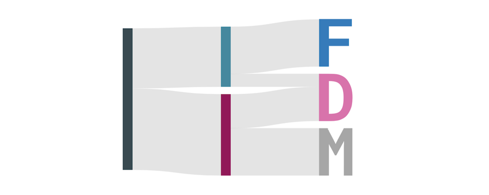
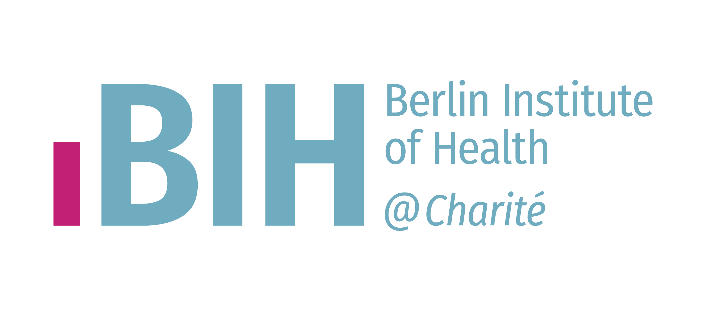

--- 
title: "Auswertung der Bedarfserhebung zum Forschungsdatenmanagement an der Charité 2021/22"
#date: "Letzte Aktualisierung: 2022-08-10"
site: bookdown::bookdown_site
description: |
  Ende 2021/Anfang 2022 wurde eine Umfrage an der Charité zum Thema Forschungsdatenmanagement (FDM) durchgeführt. Diese richtete sich an alle Forschenden der Charité sowie an technisches und Support-Personal. Die Umfrage wurde im Rahmen eines von der Berlin University Alliance (BUA) finanzierten Projektes durchgeführt.
link-citations: yes
cover-image: images/logo.png
github-repo: "quest-bih/bua-rdm-survey"
url: https://s-quest.bihealth.org/bua-fdm/
editor_options:
  chunk_output_type: console
documentclass: book
bibliography: [book.bib, packages.bib]
always_allow_html: true
---

<!-- 
output:
  html_document:
    df_print: paged
    
Render book
bookdown::render_book()

Render all book pages
bookdown::render_book(new_session = TRUE)

OR 

Use own function
render_book()

Render all book pages and pdf
bookdown::render_book(new_session = TRUE, "index.Rmd", "bookdown::pdf_book")

Start a local server to live preview this HTML book
bookdown::serve_book()

To stop the server
servr::daemon_stop(1)

Delete rendered book
bookdown::clean_book(TRUE)

Label the heading: 
# Hello world {#nice-label}

Cross-reference of figures and tables
\@ref(fig:chunk-label)

Cross-reference sections
\@ref(label)

Add section labels
### X-Y-Z {#xyz}

Add a numbered part: 
# (PART) Act one {-} (followed by # A chapter)

# Add logo
# <li class="toc-logo"><a href="./"></a></li>

-->


```r
source("source.R")
```

```
## Loading required package: ggplot2
```

```
## 
## Attaching package: 'janitor'
```

```
## The following objects are masked from 'package:stats':
## 
##     chisq.test, fisher.test
```

```
## 
## Attaching package: 'plotly'
```

```
## The following object is masked from 'package:ggplot2':
## 
##     last_plot
```

```
## The following object is masked from 'package:stats':
## 
##     filter
```

```
## The following object is masked from 'package:graphics':
## 
##     layout
```

```
## ── Attaching packages ─────────────────────────────────────── tidyverse 1.3.2 ──
## ✔ tibble  3.1.8     ✔ dplyr   1.0.9
## ✔ tidyr   1.2.0     ✔ stringr 1.4.0
## ✔ readr   2.1.2     ✔ forcats 0.5.1
## ✔ purrr   0.3.4     
## ── Conflicts ────────────────────────────────────────── tidyverse_conflicts() ──
## ✖ dplyr::filter()     masks plotly::filter(), stats::filter()
## ✖ dplyr::group_rows() masks kableExtra::group_rows()
## ✖ dplyr::lag()        masks stats::lag()
```


# {-}

Letzte Aktualisierung: 10. August 2022





<div style="text-align: justify"> 


## Einleitung {-}


Ende 2021/Anfang 2022 wurde eine **Umfrage an der Charité zum Thema Forschungsdatenmanagement (FDM)** durchgeführt. Diese richtete sich an alle Forschenden der Charité, die die große Mehrheit der Teilnehmenden bildeten, sowie an technisches und Support-Personal. Die Umfrage wurde **im Rahmen eines von der Berlin University Alliance (BUA) finanzierten Projektes** durchgeführt. Ein Teil der Fragen wurde an allen vier BUA-Einrichtungen gestellt und wird in einem Bericht ausgewertet, der im Herbst 2022 veröffentlicht wird. **Der Charité-Fragebogen** ging allerdings deutlich über die BUA-weit gestellten Fragen hinaus. Er **adressierte vorrangig Praktiken und bestehende Bedarfe im FDM**. Darüber hinaus wurden punktuell auch Motivationen und Einstellungen, die Nutzung von Services sowie die Bekanntheit bestehender Regelungen und Inzentivierungsmaßnahmen abgefragt. Die hier vorgestellten Analysen beruhen auf Fragebögen, die durch Mitarbeitende der Charité vollständig ausgefüllt wurden.

**Die vorliegende Analyse fokussiert sich auf sieben zentrale Aussagen, die sich aus den Antworten ableiten lassen.** Die dazugehörigen Abschnitte 1‑7 und darin enthaltenen einzelnen Analysen lassen Rückschlüsse auf Problemfelder und Bedarfe im FDM zu. Diese sind als Grundlage für die Ableitung möglicher Maßnahmen gedacht, die aber kein Teil der Umfrageanalyse sind. Die Analyse nimmt zum größten Teil eine Vogelperspektive ein und betrachtet das FDM in eher groben Kategorien. Bezüge zu konkreten (fachspezifischen) Infrastrukturen, Praktiken oder Bedarfen werden i.d.R. nicht hergestellt. Solche Bezüge sind im Rahmen einer nicht fachspezifischen Umfrage nur sehr schwierig herzustellen und der Versuch führt fast unweigerlich zur (Über‑)Betonung einzelner Stimmen. Die konkrete fachspezifische Implementierung von Services und Infrastrukturen sollte somit idealerweise auf weiteren Umfragen und/oder Interviews basieren, die auf Fachspezifika zugeschnitten sind und eine breitere Abdeckung einer spezifischen Fachcommunity erreichen.

**Die Analyse hat keinen Anspruch auf Vollständigkeit, Neutralität, Validität oder Repräsentativität** Die zentralen Aussagen (Abschnitte 1‑7) stützen sich auf eine Vielzahl von Analysen, die aber dennoch nur einen Teil der Umfrage abdecken. Viele weitere Analysen werden in Abschnitt \@ref(weitere-analysen) 'Weitere Analysen' aufgeführt, es erfolgt aber keine komplette Abdeckung aller Antworten, insb. in den Freitextantworten. Es werden keine Daten bewusst ausgeklammert, die getroffenen Aussagen widersprechen würden. Allerdings sind die Analysen iterativ entstanden und sollen explizit die zentralen Aussagen herausarbeiten, so dass keine völlige Neutralität vorliegt. Entsprechend wurden Analysen, die keine für die zentralen Aussagen relevanten Ergebnisse erbrachten, in den Abschnitten 1-7 überwiegend ausgeklammert. Des Weiteren liegt der Analyse auch kein Anspruch an Validität zu Grunde, auch wenn die Erarbeitung des Fragebogens und seine technische Implementierung unter Einbeziehung von Fachexpertise erfolgten. Diese Einschränkung betrifft insbesondere die Freitextantworten, deren methodisch valide Analyse die Ressourcen überstiegen hätte. Allerdings wurde vor Beginn der Auswertung eine Reihe von Annahmen zu quantitativen Fragen im Sinne eines "Realitätschecks" formuliert, die sich alle ausnahmslos bestätigt haben, was die Validität der verwendeten Konstrukte und ihrer technischen Umsetzung belegt. Schließlich ist auch nicht überprüfbar, inwieweit die untersuchte Stichprobe repräsentativ ist. Es ist davon auszugehen, dass bei >470 Teilnehmenden aus allen adressierten Statusgruppen eine Abdeckung von Meinungen und Praktiken gegeben ist, da die Umfrageteilnahme aber einer Selbstselektion unterliegt, muss dies nicht zwangsläufig ein repräsentatives Bild für die Charité ergeben. Zudem fehlen entsprechende Informationen zur Grundgesamtheit, um eine Repräsentativität nachträglich zu prüfen.

</div>


:::gotcha
471 Teilnehmende (n = 471) haben die Umfrage abgeschlossen. Die etwaige Differenz zu n = 471 bei den Analysen resultiert aus folgenden Gründen: 

- Nicht alle Fragen wurden allen Teilnehmenden gestellt, da bestimmte Antworten den weiteren Umfragepfad beeinflussen konnten.
- Gestellte Fragen konnten von Teilnehmenden übersprungen oder nicht beantwortet werden. 
- Bei einigen Analysen wurden zudem Antwortmöglichkeiten entfernt, wo die Information irrelevant war und es die Verständlichkeit erschwert hätte. Dies konnte z.B. bei Angaben der Fall sein, den Teilnehmern sei etwas unbekannt oder sie seien sich nicht sicher.
:::

\

### Autor\*innen {-}

- Evgeny Bobrov (Fragebogenerstellung, Umfragedurchführung, Analysekonzept, Analysemethodik)

- Jan Taubitz (Analysekonzept, Analysemethodik, statistische und technische Analysedurchführung)

- Angela Ariza de Schellenberger (Fragebogenerstellung, Umfragedurchführung, Analysekonzept, Analysemethodik)

- Ina Frenzel (Fragebogenerstellung, Umfragedurchführung)

- Christiane Wetzel (Fragebogenerstellung, Umfragedurchführung)

\
\


<!-- Add logos -->


<p float="left" align ="center">
  <a href="https://www.charite.de"></a>
  <a href="https://www.bihealth.org"></a>
  <a href="https://www.bihealth.org/de/translation/innovationstreiber/quest-center"></a>
</p>

<p align ="center">
  <a href="https://www.berlin-university-alliance.de"></a>
</p>


